# MongoDB 写入操作详解

## 目录
- [1. 写入基础概念](#1-写入基础概念)
  - [1.1 写入类型](#11-写入类型)
  - [1.2 写入流程](#12-写入流程)
  - [1.3 写入选项](#13-写入选项)
- [2. 单节点写入](#2-单节点写入)
  - [2.1 写入过程](#21-写入过程)
  - [2.2 并发控制](#22-并发控制)
  - [2.3 存储引擎](#23-存储引擎)
- [3. 复制集写入](#3-复制集写入)
  - [3.1 主节点写入](#31-主节点写入)
  - [3.2 复制机制](#32-复制机制)
  - [3.3 写入确认](#33-写入确认)
- [4. 分片集群写入](#4-分片集群写入)
  - [4.1 路由过程](#41-路由过程)
  - [4.2 数据分布](#42-数据分布)
  - [4.3 批量写入](#43-批量写入)
- [5. 写入性能优化](#5-写入性能优化)
  - [5.1 写入策略](#51-写入策略)
  - [5.2 性能监控](#52-性能监控)
  - [5.3 问题诊断](#53-问题诊断)

---

## 1. 写入基础概念

### 1.1 写入类型

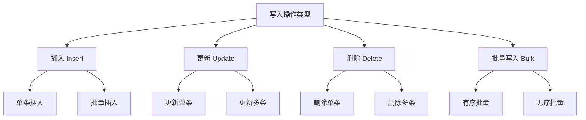

写入操作示例：
```javascript
// 1. 插入操作
// 单条插入
db.users.insertOne({
    name: "张三",
    age: 25,
    created_at: new Date()
})

// 批量插入
db.users.insertMany([
    { name: "李四", age: 30 },
    { name: "王五", age: 35 }
])

// 2. 更新操作
// 更新单条
db.users.updateOne(
    { name: "张三" },
    { 
        $set: { age: 26 },
        $currentDate: { updated_at: true }
    }
)

// 更新多条
db.users.updateMany(
    { age: { $gt: 30 } },
    { $inc: { age: 1 } }
)

// 3. 删除操作
// 删除单条
db.users.deleteOne({ name: "张三" })

// 删除多条
db.users.deleteMany({ age: { $gt: 40 } })

// 4. 批量写入操作
const bulk = db.users.initializeUnorderedBulkOp()
bulk.insert({ name: "赵六", age: 28 })
bulk.find({ age: { $lt: 30 }}).update({ $inc: { age: 1 } })
bulk.find({ name: "王五" }).remove()
await bulk.execute()
```

### 1.2 写入流程

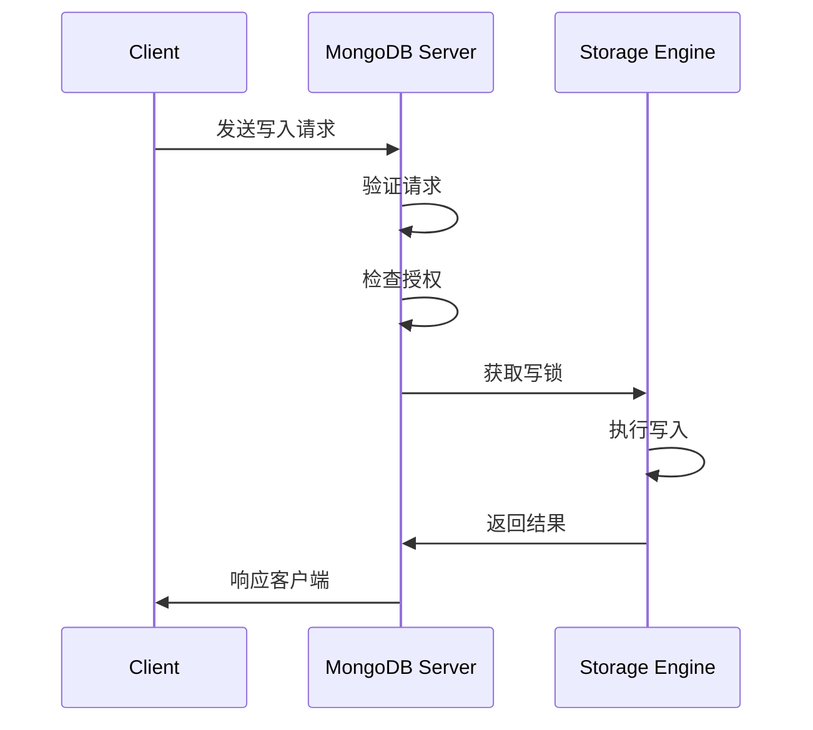

写入流程关键点：
```javascript

// 1. 写入验证
db.runCommand({
    insert: "users",
    documents: [
        { 
            name: "张三",
            age: 25,
            _id: ObjectId()  // 自动生成_id
        }
    ],
    ordered: true,  // 有序写入
    writeConcern: { w: "majority" }  // 写入确认
})

// 2. 写入确认配置
db.users.insertOne(
    { name: "李四", age: 30 },
    {
        writeConcern: {
            w: "majority",
            j: true,
            wtimeout: 5000
        }
    }
)

// 3. 错误处理
try {
    await db.users.insertOne({
        _id: existingId,  // 故意制造重复键错误
        name: "王五"
    })
} catch (error) {
    if (error.code === 11000) {
        console.log("发生重复键错误")
    }
}
```

### 1.3 写入选项

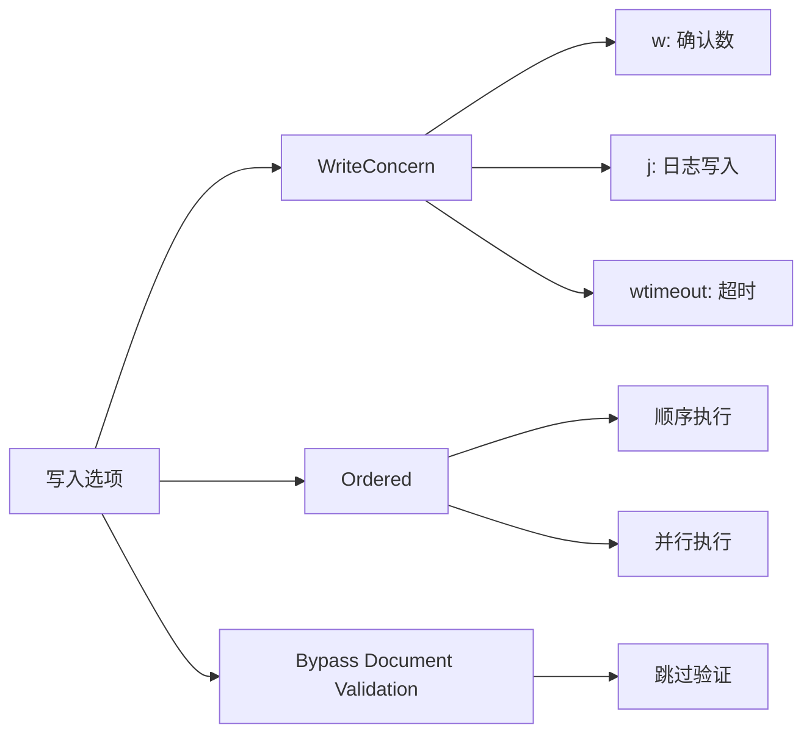

写入选项示例：
```javascript
// 1. WriteConcern配置
db.users.insertOne(
    { name: "张三" },
    {
        writeConcern: {
            w: "majority",  // 多数节点确认
            j: true,        // 写入日志
            wtimeout: 5000  // 超时时间(ms)
        }
    }
)

// 2. 有序/无序写入
// 有序批量写入
const orderedBulk = db.users.initializeOrderedBulkOp()
orderedBulk.insert({ name: "李四" })
orderedBulk.insert({ name: "王五" })
await orderedBulk.execute()

// 无序批量写入
const unorderedBulk = db.users.initializeUnorderedBulkOp()
unorderedBulk.insert({ name: "赵六" })
unorderedBulk.insert({ name: "钱七" })
await unorderedBulk.execute()

// 3. 跳过文档验证
db.users.insertOne(
    { name: "张三", age: "invalid" },  // 类型不匹配
    { bypassDocumentValidation: true }
)
```


## 2. 单节点写入

### 2.1 写入过程

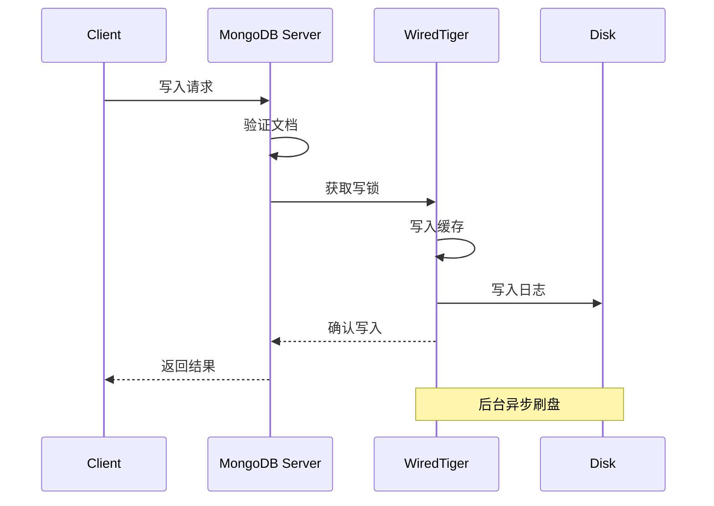

单节点写入示例：
```javascript

// 1. 基本写入操作
db.users.insertOne({
    name: "张三",
    age: 25,
    created_at: new Date()
}, {
    writeConcern: { j: true }  // 确保写入日志
})

// 2. 写入性能监控
db.serverStatus().wiredTiger.cache
db.serverStatus().wiredTiger.transaction

// 3. 日志配置
db.adminCommand({
    setParameter: 1,
    syncdelay: 60  // 设置刷盘间隔(秒)
})
```

### 2.2 并发控制

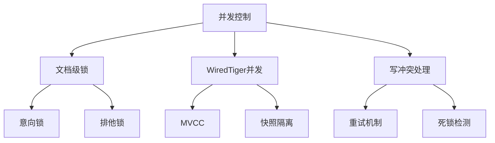

并发控制示例：
``` javascript

// 1. 监控锁状态
db.currentOp({
    "waitingForLock": true
})

// 2. 处理写冲突
const retryWrite = async (operation, maxAttempts = 3) => {
    for (let i = 0; i < maxAttempts; i++) {
        try {
            return await operation();
        } catch (error) {
            if (error.code !== 112) throw error; // 非写冲突错误直接抛出
            if (i === maxAttempts - 1) throw error;
            await new Promise(resolve => setTimeout(resolve, 100 * Math.pow(2, i)));
        }
    }
};

// 使用重试机制
await retryWrite(async () => {
    await db.accounts.updateOne(
        { _id: "account1", version: 1 },
        { 
            $set: { balance: 1000, version: 2 }
        }
    );
});
```

### 2.3 存储引擎

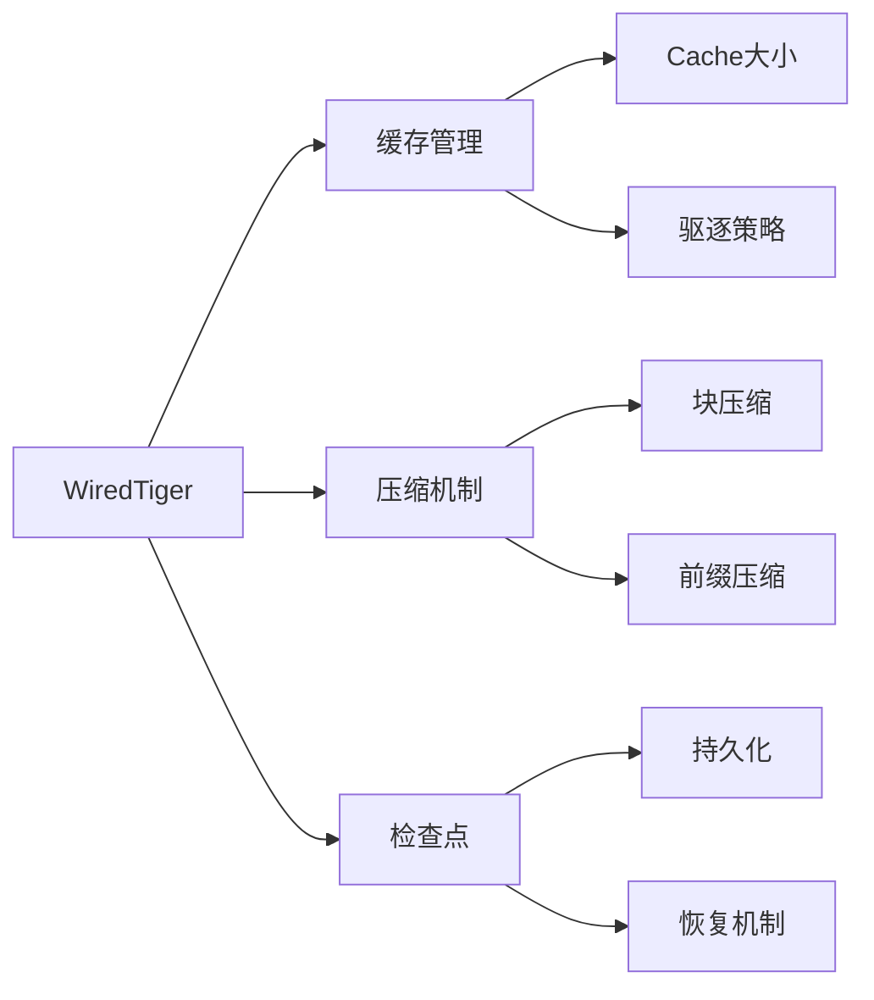

存储引擎配置：
```javascript

// 1. 配置WiredTiger缓存
db.adminCommand({
    setParameter: 1,
    wiredTigerCacheSizeGB: 4
})

// 2. 监控缓存状态
db.serverStatus().wiredTiger.cache

// 3. 检查点配置
db.adminCommand({
    setParameter: 1,
    wiredTigerCheckpointDelaySecs: 60
})

// 4. 压缩配置
db.createCollection("users", {
    storageEngine: {
        wiredTiger: {
            configString: "block_compressor=zstd"
        }
    }
})
```

## 3. 复制集写入

### 3.1 主节点写入

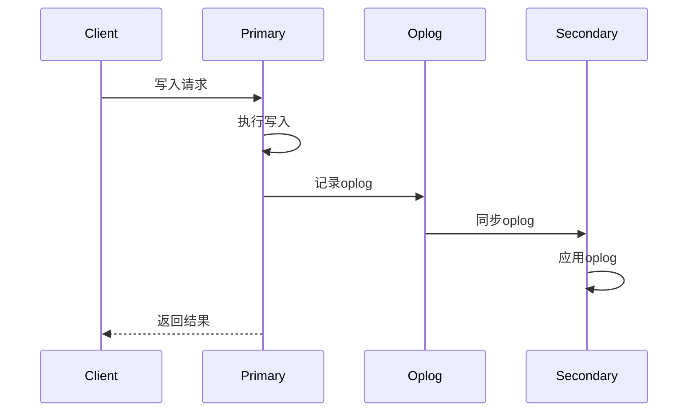

主节点写入示例：
```javascript


// 1. 写入配置
db.users.insertOne(
    { name: "张三" },
    {
        writeConcern: {
            w: "majority",     // 多数节点确认
            j: true,           // 写入日志
            wtimeout: 5000     // 超时时间
        }
    }
)

// 2. 监控复制状态
rs.status()

// 3. 检查oplog大小
db.getReplicationInfo()

// 4. 查看复制延迟
rs.printSecondaryReplicationInfo()
```

### 3.2 复制机制

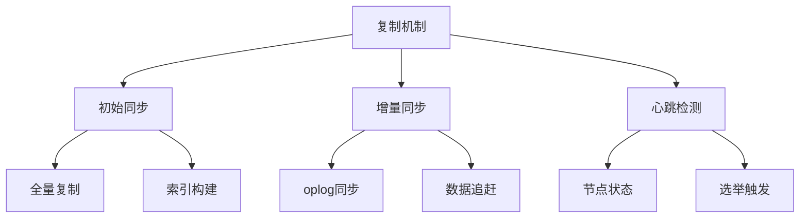

复制配置示例：
```javascript


// 1. 配置oplog大小
db.adminCommand({
    replSetResizeOplog: 1,
    size: 16384  // 16GB
})

// 2. 监控同步状态
db.printSlaveReplicationInfo()

// 3. 复制延迟监控
while (true) {
    const status = rs.status();
    const primary = status.members.find(m => m.state === 1);
    const secondaries = status.members.filter(m => m.state === 2);
    
    secondaries.forEach(s => {
        const delay = (s.optimeDate - primary.optimeDate) / 1000;
        print(`${s.name} 延迟: ${delay}秒`);
    });
    
    sleep(1000);
}
```

### 3.3 写入确认

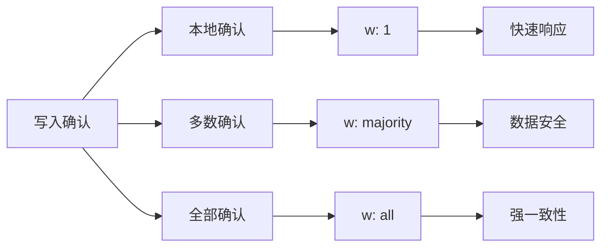

写入确认示例：
```javascript   


// 1. 不同级别的写入确认
// 本地确认
db.users.insertOne(
    { name: "张三" },
    { writeConcern: { w: 1 } }
)

// 多数确认
db.users.insertOne(
    { name: "李四" },
    { writeConcern: { w: "majority" } }
)

// 全部确认
db.users.insertOne(
    { name: "王五" },
    { writeConcern: { w: "all" } }
)

// 2. 写入确认监控
db.getLastError()

// 3. 批量写入确认
const bulk = db.users.initializeOrderedBulkOp();
bulk.insert({ name: "赵六" });
bulk.insert({ name: "钱七" });
bulk.execute({ writeConcern: { w: "majority" } });
```

## 4. 分片集群写入

### 4.1 路由过程

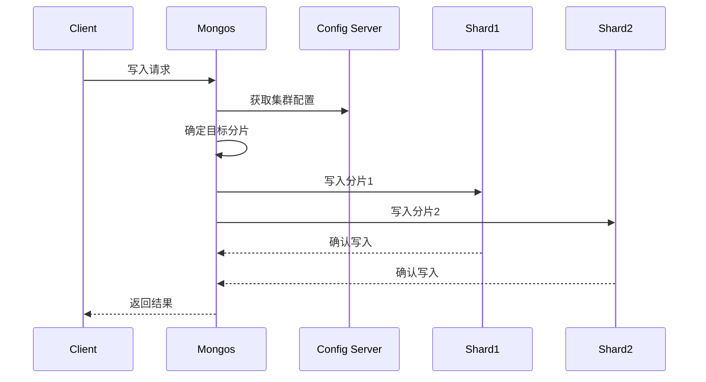

路由配置示例：
```javascript


// 1. 配置分片键
sh.shardCollection(
    "mydb.users",
    { userId: "hashed" }  // 哈希分片
)

// 2. 查看分片分布
db.users.getShardDistribution()

// 3. 监控分片状态
sh.status()

// 4. 写入路由追踪
db.users.insertOne(
    { userId: "user123", name: "张三" },
    { comment: "跟踪写入路由" }
)
```


### 4.2 数据分布

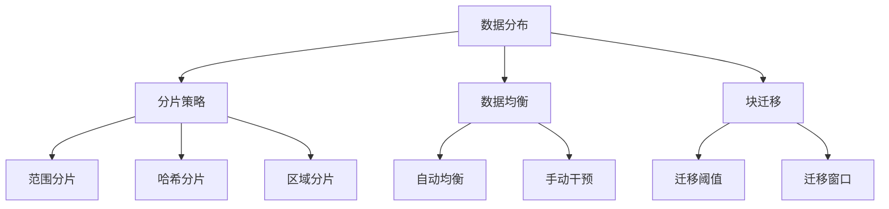

数据分布管理：
```javascript
// 1. 配置分片策略
// 范围分片
sh.shardCollection(
    "mydb.orders",
    { orderDate: 1 }  // 按日期范围分片
)

// 哈希分片
sh.shardCollection(
    "mydb.users",
    { userId: "hashed" }
)

// 区域分片
sh.addShardToZone("shard1", "CN")
sh.updateZoneKeyRange(
    "mydb.users",
    { country: "CN" },
    { country: "CN" },
    "CN"
)

// 2. 均衡器配置
sh.setBalancerState(true)  // 启用均衡器

// 设置均衡窗口
db.settings.update(
    { _id: "balancer" },
    {
        $set: {
            activeWindow: {
                start: "23:00",
                stop: "06:00"
            }
        }
    },
    { upsert: true }
)

// 3. 监控分布状态
db.users.getShardDistribution()
```

### 4.3 批量写入

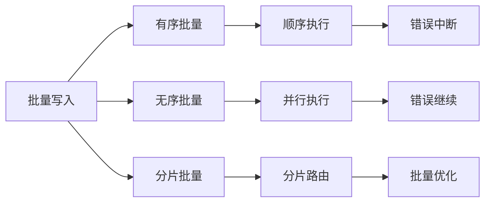

批量写入示例：
```javascript
// 1. 有序批量写入
const orderedBulk = db.users.initializeOrderedBulkOp();
orderedBulk.insert({ name: "张三", age: 25 });
orderedBulk.find({ age: { $lt: 30 }}).update({ $inc: { age: 1 }});
orderedBulk.find({ name: "李四" }).upsert().updateOne({
    $set: { age: 30, status: "active" }
});
const orderedResult = await orderedBulk.execute();

// 2. 无序批量写入
const unorderedBulk = db.users.initializeUnorderedBulkOp();
for (let i = 0; i < 1000; i++) {
    unorderedBulk.insert({
        name: `用户${i}`,
        age: Math.floor(Math.random() * 50) + 20,
        created_at: new Date()
    });
}
const unorderedResult = await unorderedBulk.execute();

// 3. 分片批量写入优化
const batchSize = 1000;
const documents = [];
for (let i = 0; i < 10000; i++) {
    documents.push({
        userId: `user${i}`,
        data: `data${i}`
    });
    
    if (documents.length >= batchSize) {
        await db.users.insertMany(documents, {
            ordered: false,
            writeConcern: { w: "majority" }
        });
        documents.length = 0;
    }
}
```

## 5. 写入性能优化

### 5.1 写入策略

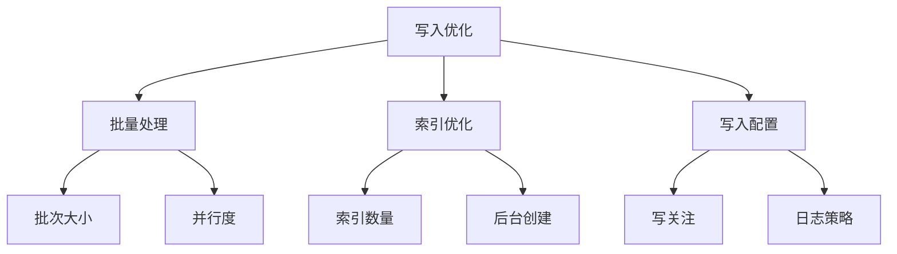

优化策略示例：
```javascript

// 1. 批量写入优化
const optimizedBulkWrite = async (documents, collection) => {
    const batchSize = 1000;
    const batches = [];
    
    // 分批处理
    for (let i = 0; i < documents.length; i += batchSize) {
        batches.push(documents.slice(i, i + batchSize));
    }
    
    // 并行执行
    const results = await Promise.all(
        batches.map(batch => 
            collection.insertMany(batch, {
                ordered: false,
                writeConcern: { w: 1 }
            })
        )
    );
    
    return results.reduce((acc, result) => ({
        insertedCount: acc.insertedCount + result.insertedCount,
        modifiedCount: acc.modifiedCount + (result.modifiedCount || 0)
    }), { insertedCount: 0, modifiedCount: 0 });
};

// 2. 索引优化
// 后台创建索引
db.users.createIndex(
    { lastAccess: 1 },
    { background: true }
)

// 3. 写入配置优化
db.users.insertMany(
    documents,
    {
        writeConcern: { w: 1 },  // 降低写入关注级别
        ordered: false,          // 允许并行写入
        bypassDocumentValidation: true  // 跳过文档验证
    }
)
```

### 5.2 性能监控

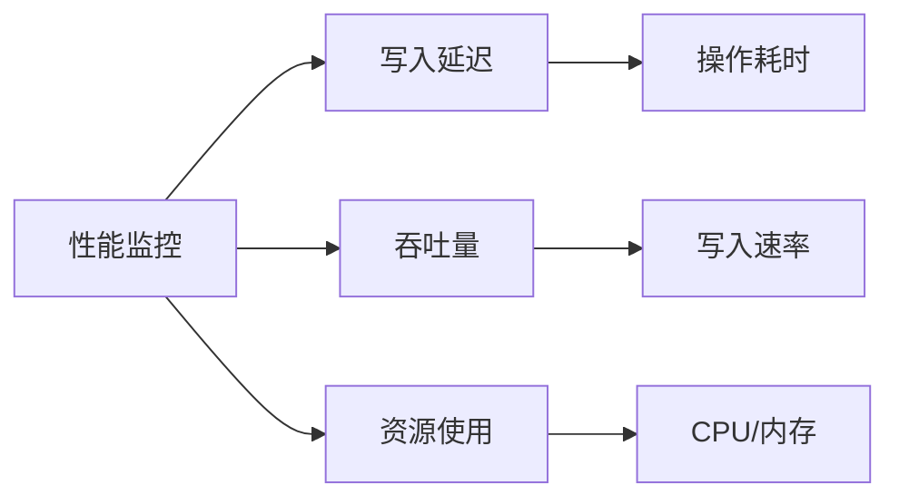

监控示例：
```javascript


// 1. 写入性能监控
db.serverStatus().opLatencies.writes

// 2. 设置慢操作阈值
db.setProfilingLevel(1, { slowms: 100 })

// 3. 监控写入操作
const monitorWrites = async (durationMinutes = 5) => {
    const startTime = new Date();
    const endTime = new Date(startTime.getTime() + durationMinutes * 60000);
    
    while (new Date() < endTime) {
        const stats = db.serverStatus();
        
        console.log({
            time: new Date(),
            writeOps: stats.opcounters.insert + 
                     stats.opcounters.update + 
                     stats.opcounters.delete,
            writeLatency: stats.opLatencies.writes,
            connections: stats.connections
        });
        
        await sleep(1000);
    }
};

// 4. 资源监控
db.serverStatus().wiredTiger
```

### 5.3 问题诊断

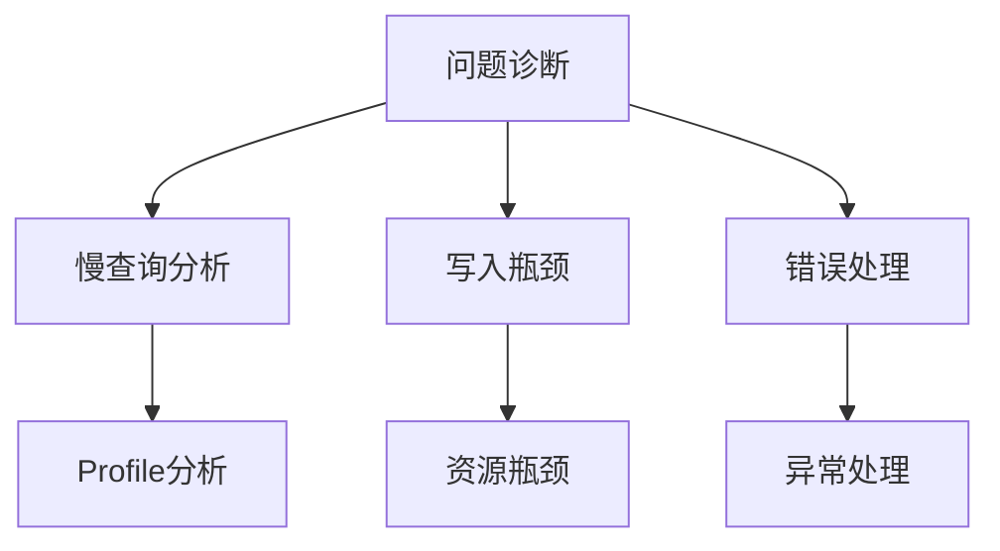

诊断工具示例：
```javascript


// 1. 慢查询分析
db.setProfilingLevel(1, { slowms: 100 })
db.system.profile.find({
    op: { $in: ["insert", "update", "remove"] },
    millis: { $gt: 100 }
}).sort({ ts: -1 })

// 2. 写入错误分析
const analyzeWriteErrors = async (collection, operations) => {
    try {
        const result = await collection.bulkWrite(operations);
        console.log("成功操作:", result);
    } catch (error) {
        if (error.writeErrors) {
            error.writeErrors.forEach(writeError => {
                console.error(`错误代码: ${writeError.code}`);
                console.error(`错误消息: ${writeError.errmsg}`);
                console.error(`错误文档: ${JSON.stringify(writeError.op)}`);
            });
        }
        
        if (error.writeConcernError) {
            console.error("写入关注错误:", error.writeConcernError);
        }
    }
};

// 3. 性能诊断工具
const diagnosePerfIssues = async () => {
    const serverStatus = db.serverStatus();
    const currentOp = db.currentOp();
    
    const issues = [];
    
    // 检查连接数
    if (serverStatus.connections.current > 
        serverStatus.connections.available * 0.8) {
        issues.push("连接数接近上限");
    }
    
    // 检查写入队列
    if (currentOp.inprog.filter(op => 
        op.waitingForLock).length > 0) {
        issues.push("存在等待锁的操作");
    }
    
    // 检查系统资源
    if (serverStatus.mem.resident > 
        serverStatus.mem.mapped * 0.9) {
        issues.push("内存使用率过高");
    }
    
    return issues;
};
```

## 6. 总结

MongoDB写入操作的核心要点：

1. **写入基础**
   - 理解写入类型和流程
   - 合理配置写入选项
   - 正确处理写入确认

2. **复制集写入**
   - 主节点写入流程
   - 数据复制机制
   - 写入确认级别

3. **分片集群写入**
   - 数据分布策略
   - 批量写入优化
   - 分片均衡管理

4. **性能优化**
   - 批量处理策略
   - 监控和诊断
   - 问题排查方法

5. **最佳实践**
   - 根据场景选择写入策略
   - 定期监控性能指标
   - 建立问题诊断流程
```

