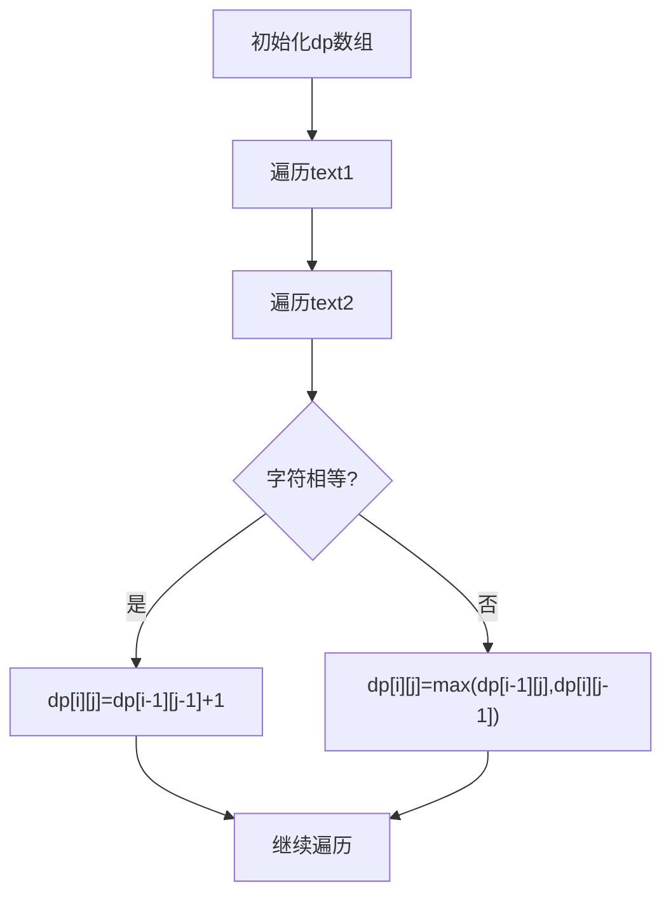

## 问题链接
https://leetcode.cn/problems/longest-common-subsequence/

## 问题描述
给定两个字符串 text1 和 text2，返回这两个字符串的最长 公共子序列 的长度。如果不存在 公共子序列 ，返回 0 。

一个字符串的 子序列 是指这样一个新的字符串：它是由原字符串在不改变字符的相对顺序的情况下删除某些字符（也可以不删除任何字符）后组成的新字符串。

例如，"ace" 是 "abcde" 的子序列，但 "aec" 不是 "abcde" 的子序列。
两个字符串的 公共子序列 是这两个字符串所共同拥有的子序列。

### 示例 1：
输入：text1 = "abcde", text2 = "ace" 
输出：3  
解释：最长公共子序列是 "ace"，它的长度为 3。

### 示例 2：
输入：text1 = "abc", text2 = "abc"
输出：3
解释：最长公共子序列是 "abc"，它的长度为 3。

### 示例 3：
输入：text1 = "abc", text2 = "def"
输出：0
解释：两个字符串没有公共子序列，返回 0。

### 提示：
- 1 <= text1.length, text2.length <= 1000
- text1 和 text2 仅由小写英文字符组成

## 解题思路

### 1. 动态规划（基础解法）
- 定义 dp[i][j] 表示 text1[0...i-1] 和 text2[0...j-1] 的最长公共子序列长度
- 状态转移方程：
  - 当 text1[i-1] == text2[j-1] 时：dp[i][j] = dp[i-1][j-1] + 1
  - 当 text1[i-1] != text2[j-1] 时：dp[i][j] = max(dp[i-1][j], dp[i][j-1])

### 2. 状态压缩（空间优化）
- 由于dp[i][j]只依赖于dp[i-1][j-1], dp[i-1][j], dp[i][j-1]
- 可以使用滚动数组优化空间复杂度
我来通过一个具体的例子详细解释状态压缩的解法。
让我们以 text1 = "abc", text2 = "ac" 为例：
1. 首先理解原始的二维DP数组是什么样的：
```
空 a  c     (text2)
空  0  0  0
a   0  1  1
b   0  1  1
c   0  1  2
```
2. 现在看状态压缩后的解法
* 我们只用一个一维数组dp[n+1]，其中n是text2的长度
* prev变量保存dp[i-1][j-1]的值
* dp[j]在更新前代表dp[i-1][j]的值
* dp[j-1]代表dp[i][j-1]的值
```
初始状态：
dp = [0, 0, 0]  # 对应text2的 空,a,c

第一轮 i=1 (text1的'a'):
prev = 0        # dp[i-1][j-1] = 0
j=1: text1[0]='a' == text2[0]='a'
     temp = dp[1] = 0  # 保存旧的dp[1]值
     dp[1] = prev + 1 = 1
     prev = temp = 0
dp = [0, 1, 0]

j=2: text1[0]='a' != text2[1]='c'
     temp = dp[2] = 0
     dp[2] = max(dp[2], dp[1]) = 1
     prev = temp = 0
dp = [0, 1, 1]

第二轮 i=2 (text1的'b'):
prev = 0
j=1: text1[1]='b' != text2[0]='a'
     temp = dp[1] = 1
     dp[1] = max(dp[1], dp[0]) = 1
     prev = temp = 1
dp = [0, 1, 1]

j=2: text1[1]='b' != text2[1]='c'
     temp = dp[2] = 1
     dp[2] = max(dp[2], dp[1]) = 1
     prev = temp = 1
dp = [0, 1, 1]

第三轮 i=3 (text1的'c'):
prev = 0
j=1: text1[2]='c' != text2[0]='a'
     temp = dp[1] = 1
     dp[1] = max(dp[1], dp[0]) = 1
     prev = temp = 1
dp = [0, 1, 1]

j=2: text1[2]='c' == text2[1]='c'
     temp = dp[2] = 1
     dp[2] = prev + 1 = 2
     prev = temp = 1
dp = [0, 1, 2]
```
关键点解释：
1. prev 变量的作用是保存左上角的值（dp[i-1][j-1]）
2. temp 变量在每次更新前保存当前位置的值，这个值会在下一次迭代中成为新的prev（左上角值）
3. dp[j-1] 代表左边的值（dp[i][j-1]）
4. dp[j] 在更新前代表上边的值（dp[i-1][j]）

这样我们就用一个一维数组实现了二维DP的功能，空间复杂度从O(mn)降到了O(n)。
这种优化之所以可行，是因为我们在计算dp[i][j]时只需要：
- 左上角的值 dp[i-1][j-1]（用prev保存）
- 上方的值 dp[i-1][j]（用temp保存旧值）
- 左边的值 dp[i][j-1]（直接用dp[j-1]）
通过这种方式，我们可以只用一行数组就完成整个动态规划的计算

### 动态规划过程示意图


## 代码实现
```cpp
class Solution {
public:
    // 基础动态规划解法
    int longestCommonSubsequence(string text1, string text2) {
        int m = text1.length(), n = text2.length();
        vector<vector<int>> dp(m + 1, vector<int>(n + 1, 0));
        
        for (int i = 1; i <= m; i++) {
            for (int j = 1; j <= n; j++) {
                if (text1[i-1] == text2[j-1]) {
                    dp[i][j] = dp[i-1][j-1] + 1;
                } else {
                    dp[i][j] = max(dp[i-1][j], dp[i][j-1]);
                }
            }
        }
        return dp[m][n];
    }
    
    // 空间优化解法
    int longestCommonSubsequence_optimized(string text1, string text2) {
        int m = text1.length(), n = text2.length();
        vector<int> dp(n + 1, 0);
        
        for (int i = 1; i <= m; i++) {
            int prev = 0;  // dp[i-1][j-1]
            for (int j = 1; j <= n; j++) {
                int temp = dp[j];  // 保存dp[i-1][j]
                if (text1[i-1] == text2[j-1]) {
                    dp[j] = prev + 1;
                } else {
                    dp[j] = max(dp[j], dp[j-1]);
                }
                prev = temp;
            }
        }
        return dp[n];
    }
};
```

## 复杂度分析
1. **基础动态规划解法**：
   - 时间复杂度：O(mn)，其中 m 和 n 分别是两个字符串的长度
   - 空间复杂度：O(mn)，需要二维dp数组

2. **空间优化解法**：
   - 时间复杂度：O(mn)
   - 空间复杂度：O(n)，只需要一维数组

## 扩展问题

### 1. 最长公共子串
#### 问题描述
与最长公共子序列不同，子串要求连续。

#### 示例
输入：text1 = "abcde", text2 = "abgde"
输出：2
解释：最长公共子串是 "ab" 或 "de"

#### 解题思路
修改状态转移方程：
- 当字符相等时：dp[i][j] = dp[i-1][j-1] + 1
- 当字符不等时：dp[i][j] = 0

### 2. 最短公共超序列
#### 问题描述
找到一个最短的字符串，使得两个输入字符串都是它的子序列。

#### 示例
输入：str1 = "abac", str2 = "cab"
输出："cabac"
解释：
- "abac" 是 "cabac" 的子序列
- "cab" 是 "cabac" 的子序列
- "cabac" 是满足条件的最短字符串

#### 解题思路
1. 先求最长公共子序列(LCS)
   - 使用动态规划求出LCS
   - LCS代表两个字符串中可以共用的字符

2. 构建最短公共超序列
   - 同时遍历两个字符串str1和str2
   - 如果当前字符是LCS中的字符，只添加一次
   - 如果不是LCS中的字符，需要都添加到结果中

3. 具体步骤：
   ```cpp
   string shortestCommonSupersequence(string str1, string str2) {
       // 1. 求LCS的dp数组
       int m = str1.length(), n = str2.length();
       vector<vector<int>> dp(m + 1, vector<int>(n + 1, 0));
       
       for(int i = 1; i <= m; i++) {
           for(int j = 1; j <= n; j++) {
               if(str1[i-1] == str2[j-1])
                   dp[i][j] = dp[i-1][j-1] + 1;
               else
                   dp[i][j] = max(dp[i-1][j], dp[i][j-1]);
           }
       }
       
       // 2. 根据dp数组构建结果
       string result;
       int i = m, j = n;
       while(i > 0 && j > 0) {
           if(str1[i-1] == str2[j-1]) {
               // 当前字符在LCS中
               result = str1[i-1] + result;
               i--; j--;
           }
           // 当我们在dp[i][j]位时，如果字符不相，我们面临两个选择
           // 选择str1的方向（上方dp[i-1][j]）
           // 选择str2的方向（左方dp[i][j-1]）
           // 为什么选大的？
           // dp[i][j]的值代表了到这个位置能获得的最长公共子序列(LCS)的长度
           // 更大的值意味着这个方向包含了更多的公共字符
           // 在构建最短公共超序列时，我们希望尽可能多地利用公共字符，这样最终的结果才会最短
           // 例如，如果：
           // dp[i-1][j] = 2（上方）
           // dp[i][j-1] = 1（左方）
           // 选择上方意味着：
           // 这个方向已经找到了2个公共字符
           // 而左方只找到了1个公共字符
           // 所以选择上方可以保留更多的公共部分，最终得到更短的超序列
           // 如果选择较小的值会怎样？
           
           // 比如在上面的例子中选择值为1的方向：
           // - 我们会丢失一个可能的公共字符
           // - 这样最终构建的序列就不是最短的
           // - 因为我们没有最大化利用公共字符
           else if(dp[i-1][j] > dp[i][j-1]) {
               // str1的字符不在LCS中
               result = str1[i-1] + result;
               i--;
           }
           else {
               // str2的字符不在LCS中
               result = str2[j-1] + result;
               j--;
           }
       }
       
       // 3. 处理剩余字符
       while(i > 0) result = str1[i-1] + result, i--;
       while(j > 0) result = str2[j-1] + result, j--;
       
       return result;
   }
   ```

#### 复杂度分析
- 时间复杂度：O(mn)，其中m和n是两个字符串的长度
- 空间复杂度：O(mn)，需要dp数组存储LCS信息

#### 关键点
1. SCS的长度 = str1.length() + str2.length() - LCS.length()
2. 构建过程中需要同时考虑两个字符串的字符
3. 最终结果包含了两个字符串的所有字符，其中公共部分只出现一次

### 3. 打印最长公共子序列
#### 问题描述
不仅要求最长公共子序列的长度，还要输出具体的序列。

#### 示例
输入：text1 = "abcde", text2 = "ace"
输出："ace"

#### 解题思路
1. 构建dp数组
   - 和求LCS长度的方法相同
   - dp[i][j]表示text1[0...i-1]和text2[0...j-1]的LCS长度

2. 从dp数组回溯构建结果
   - 从dp[m][n]开始向前回溯
   - 如果当前字符相同，将该字符加入结果
   - 如果不同，选择较大的方向移动

3. 具体实现：
```cpp
string printLCS(string text1, string text2) {
    int m = text1.length(), n = text2.length();
    vector<vector<int>> dp(m + 1, vector<int>(n + 1, 0));
    
    // 构建dp数组
    for(int i = 1; i <= m; i++) {
        for(int j = 1; j <= n; j++) {
            if(text1[i-1] == text2[j-1])
                dp[i][j] = dp[i-1][j-1] + 1;
            else
                dp[i][j] = max(dp[i-1][j], dp[i][j-1]);
        }
    }
    
    // 回溯构建LCS
    string lcs;
    int i = m, j = n;
    while(i > 0 && j > 0) {
        if(text1[i-1] == text2[j-1]) {
            // 当前字符是LCS的一部分
            lcs = text1[i-1] + lcs;
            i--; j--;
        }
        else if(dp[i-1][j] > dp[i][j-1]) {
            // 向上移动
            i--;
        }
        else {
            // 向左移动
            j--;
        }
    }
    return lcs;
}
```

#### 示例执行过程
以text1 = "abcde", text2 = "ace"为例：

1. dp数组构建完成后：
```
    空 a  c  e
空  0  0  0  0
a   0  1  1  1
b   0  1  1  1
c   0  1  2  2
d   0  1  2  2
e   0  1  2  3
```

2. 回溯过程：
- 从dp[5][3]开始
- text1[4] == text2[2] == 'e'：添加'e'，i=4,j=2
- text1[3] != text2[1]，向上移动，i=3,j=2
- text1[2] == text2[1] == 'c'：添加'c'，i=2,j=1
- text1[1] != text2[0]，向上移动，i=1,j=1
- text1[0] == text2[0] == 'a'：添加'a'，i=0,j=0
- 结束

最终得到LCS："ace"

#### 复杂度分析
- 时间复杂度：O(mn)，需要构建dp数组并回溯
- 空间复杂度：O(mn)，需要存储dp数组

#### 关键点
1. 回溯时的移动方向选择很重要：
   - 字符相同时，一定是LCS的一部分
   - 字符不同时，选择dp值更大的方向移动
2. 结果字符串需要从后往前构建，或者最后反转
3. 可能存在多个最长公共子序列，这个算法只会返回其中一个

### 4. 最长回文子序列
#### 问题描述
给定一个字符串，找到其中最长的回文子序列。

#### 示例
输入："bbbab"
输出：4
解释：最长回文子序列是 "bbbb"

#### 解题思路
1. **方法一：转化为LCS问题**
   - 将原字符串反转得到新字符串
   - 求原字符串和反转字符串的最长公共子序列
   - 这个LCS一定是原字符串的最长回文子序列

2. **方法二：直接DP（更优）**
   - 定义dp[i][j]表示s[i...j]的最长回文子序列长度
   - 状态转移方程：
     - 当s[i] == s[j]时：dp[i][j] = dp[i+1][j-1] + 2
     - 当s[i] != s[j]时：dp[i][j] = max(dp[i+1][j], dp[i][j-1])

   详细解释：
   1. **dp数组的定义**：
      - dp[i][j]表示字符串s从索引i到j的子串中，最长回文子序列的长度
      - 例如，对于字符串"bbbab"：
        - dp[0][0]表示"b"的最长回文子序列长度为1
        - dp[0][2]表示"bbb"的最长回文子序列长度为3
        - dp[0][4]表示整个字符串"bbbab"的最长回文子序列长度为4
        - dp[0][n-1]表示整个字符串的最长回文子序列长度
   2. **状态转移的理解**：
      - 当s[i] == s[j]时：
        - 找到了一对可以构成回文的字符
        - 这对字符可以添加到子串s[i+1...j-1]的最长回文子序列的两端
        - 所以长度增加2
      - 当s[i] != s[j]时：
        - 这字符不能同时作为回文序列的两端
        - 要么包含左边的字符（s[i]），要么包含右边的字符（s[j]）
        - 取两种情况的最大值

   3. **填表顺序**：
      - 需要按照子串长度从小到大填写
      - 对于每个长度，遍历所有可能的起始位置
      - 这样可以保证计算dp[i][j]时，dp[i+1][j-1], dp[i+1][j], dp[i][j-1]都已经计算好了

   示例："bbbab"的dp数组填充过程：
   ```
   初始化单个字符的情况（长度为1）：
       b  b  b  a  b
   b   1  0  0  0  0
   b   0  1  0  0  0
   b   0  0  1  0  0
   a   0  0  0  1  0
   b   0  0  0  0  1

   处理长度为2的子串：
       b  b  b  a  b
   b   1  2  0  0  0
   b   0  1  2  0  0
   b   0  0  1  1  2
   a   0  0  0  1  2
   b   0  0  0  0  1

   最终的dp数组：
       b  b  b  a  b
   b   1  2  3  3  4
   b   0  1  2  2  3
   b   0  0  1  1  2
   a   0  0  0  1  2
   b   0  0  0  0  1
   ```

   4. **代码实现的关键点**：
      - 外层循环是子串长度，从2到n
      - 内层循环是子串的起始位置，从0到n-len
      - 需要先初始化对角线（长度为1的情况）
      - 最终答案在dp[0][n-1]

   5. **为什么这种方法更优**：
      - 不需要额外的空间来存储反转的字符串
      - 直接在原字符串上操作，逻辑更清晰
      - 便于理解和调试
      - 容易扩展到相关问题（如打印最长回文子序列）

#### 代码实现
```cpp
// 方法一：转化为LCS
class Solution {
public:
    int longestPalindromeSubseq(string s) {
        string r = s;
        reverse(r.begin(), r.end());
        return longestCommonSubsequence(s, r);
    }
    
    int longestCommonSubsequence(string text1, string text2) {
        int m = text1.length(), n = text2.length();
        vector<vector<int>> dp(m + 1, vector<int>(n + 1, 0));
        
        for(int i = 1; i <= m; i++) {
            for(int j = 1; j <= n; j++) {
                if(text1[i-1] == text2[j-1])
                    dp[i][j] = dp[i-1][j-1] + 1;
                else
                    dp[i][j] = max(dp[i-1][j], dp[i][j-1]);
            }
        }
        return dp[m][n];
    }
};

// 方法二：直接DP
class Solution {
public:
    int longestPalindromeSubseq(string s) {
        int n = s.length();
        vector<vector<int>> dp(n, vector<int>(n, 0));
        
        // 初始化长度为1的回文序列
        for(int i = 0; i < n; i++) {
            dp[i][i] = 1;
        }
        
        // 从长度2开始计算
        for(int len = 2; len <= n; len++) {
            for(int i = 0; i < n - len + 1; i++) {
                int j = i + len - 1;
                if(s[i] == s[j]) {
                    dp[i][j] = dp[i+1][j-1] + 2;
                } else {
                    dp[i][j] = max(dp[i+1][j], dp[i][j-1]);
                }
            }
        }
        
        return dp[0][n-1];
    }
};
```

#### 复杂度分析
- 方法一：
  - 时间复杂度：O(n²)
  - 空间复杂度：O(n²)
- 方法二：
  - 时间复杂度：O(n²)
  - 空间复杂度：O(n²)

### 5. 编辑距离
#### 问题描述
给定两个字符串，计算将一个字符串转换成另一个字符串所需的最少操作次数。
允许的操作：插入、删除、替换。

#### 示例
输入：word1 = "horse", word2 = "ros"
输出：3
解释：
horse -> rorse (将 'h' 替换为 'r')
rorse -> rose (删除 'r')
rose -> ros (删除 'e')

#### 解题思路
1. **动态规划定义**
   - dp[i][j] 表示 word1[0...i-1] 转换到 word2[0...j-1] 需要的最少操作次数

2. **状态转移方程**
   - 当word1[i-1] == word2[j-1]时：dp[i][j] = dp[i-1][j-1]
   - 当word1[i-1] != word2[j-1]时：
     - 替换：dp[i-1][j-1] + 1
     - 删除：dp[i-1][j] + 1
     - 插入：dp[i][j-1] + 1
     - dp[i][j] = min(替换, min(删除, 插入))

#### 状态转移方程详细解释

假设我们有 word1 = "horse", word2 = "ros"，考虑dp[i][j]的含义：
- dp[i][j] 表示将 word1 的前i个字符转换为 word2 的前j个字符所需的最少操作次数

1. **当字符相同时** (word1[i-1] == word2[j-1])：
   ```
   dp[i][j] = dp[i-1][j-1]
   ```
   举例说明：
   word1 = "horse", word2 = "ros"
   当我们比较到 word1[2] 和 word2[0] 时：
   - word1[2] = 'r'
   - word2[0] = 'r'
   - 这两个字符相同，不需要任何操作
   - 此时 dp[3][1] 的值应该等于 dp[2][0]
   
   为什么？
   - 因为这两个'r'已经匹配上了
   - **我们只需要考虑之前的子串如何转换**
   - 即"ho"转换到""需要的操作次数
   - 不需要对当前的'r'做任何操作

   dp数组的这一部分：
   ```
       r (word2)
   h   1
   o   2
   r   2 <- dp[3][1] = dp[2][0]
   ```

2. **当字符不同时** (word1[i-1] != word2[j-1])，我们有三种可能的操作：

   a) **替换操作** (dp[i-1][j-1] + 1)：
      - 将word1[i-1]替换为word2[j-1]
      - 例如："horse" -> "rorse"
      - 把'h'替换成'r'
      - 操作数 = 之前子串的操作数 + 1次替换

   b) **删除操作** (dp[i-1][j] + 1)：
      - 删除word1[i-1]
      - 例如："rorse" -> "rose"
      - 删除一个'r'
      - 操作数 = 删除前子串的操作数 + 1次删除

   c) **插入操作** (dp[i][j-1] + 1)：
      - 在word1后插入word2[j-1]
      - 例如："ros" -> "rose"
      - 插入'e'
      - 操作数 = 插入前子串的操作数 + 1次插入

3. **为什么取最小值**：
   ```cpp
   dp[i][j] = min(替换, min(删除, 插入)) + 1
   ```
   - 我们要找最少的操作次数
   - 三种操作都能达到目的，选择代价最小的

4. **具体示例**：
   将"horse"转换为"ros"的某一步：
   ```
   当前位置：dp[1][1]（比较'h'和'r'）
   替换：dp[0][0] + 1 = 1（替换'h'为'r'）
   删除：dp[0][1] + 1 = 2（删除'h'，还需要处理'r'）
   插入：dp[1][0] + 1 = 2（在'h'前插入'r'）
   
   最终dp[1][1] = min(1, 2, 2) = 1
   ```

5. **边界情况的理解**：
   ```cpp
   // 初始化
   for(int i = 0; i <= m; i++) dp[i][0] = i;  // 删除操作
   for(int j = 0; j <= n; j++) dp[0][j] = j;  // 插入操作
   ```
   - dp[i][0]：将word1的前i个字符转换为空串，需要i次删除
   - dp[0][j]：将空串转换为word2的前j个字符，需要j次插入

#### 代码实现
```cpp
class Solution {
public:
    int minDistance(string word1, string word2) {
        int m = word1.length(), n = word2.length();
        vector<vector<int>> dp(m + 1, vector<int>(n + 1, 0));
        
        // 初始化边界
        for(int i = 0; i <= m; i++) dp[i][0] = i;  // 删除操作
        for(int j = 0; j <= n; j++) dp[0][j] = j;  // 插入操作
        
        // 填充dp数组
        for(int i = 1; i <= m; i++) {
            for(int j = 1; j <= n; j++) {
                if(word1[i-1] == word2[j-1]) {
                    dp[i][j] = dp[i-1][j-1];
                } else {
                    dp[i][j] = min(dp[i-1][j-1], min(dp[i-1][j], dp[i][j-1])) + 1;
                }
            }
        }
        
        return dp[m][n];
    }
};
```

#### 示例执行过程
以word1 = "horse", word2 = "ros"为例：

```
    空  r   o   s
空  0   1   2   3
h   1   1   2   3
o   2   2   1   2
r   3   2   2   2
s   4   3   3   2
e   5   4   4   3
```

#### 复杂度分析
- 时间复杂度：O(mn)，需要填充整个dp数组
- 空间复杂度：O(mn)，需要存储dp数组

#### 关键点
1. 初始化很重要：
   - dp[i][0]表示删除操作
   - dp[0][j]表示插入操作
2. 三种操作的理解：
   - 替换：dp[i-1][j-1] + 1
   - 删除：dp[i-1][j] + 1
   - 插入：dp[i][j-1] + 1
3. 当字符相同时不需要操作

## 抽象拓展：动态规划在字符串处理中的应用模式

### 1. 问题特征识别
#### 1.1 输入特征
- 通常涉及一个或两个字符串
- 需要在字符串间寻找某种关系或模式
- 问题要求最优解（最长、最短、最少操作等）

#### 1.2 解题特征
- 问题可以分解为重叠的子问题
- 存在多种选择或决策路径
- 需要记录和利用之前的计算结果

### 2. 通用解题模式
#### 2.1 状态定义模式
1. **单字符串问题**：
   - dp[i] 表示到位置i的最优解
   - dp[i][j] 表示区间[i,j]的最优解
   例如：最长回文子序列

2. **双字符串问题**：
   - dp[i][j] 表示str1前i个字符和str2前j个字符的最优解
   例如：最长公共子序列、编辑距离

#### 2.2 状态转移模式
1. **匹配模式**：
   ```
   if(当前字符匹配) {
       dp[i][j] = dp[i-1][j-1] + value;  // value通常为1
   } else {
       dp[i][j] = 其他状态的最优值;
   }
   ```

2. **选择模式**：
   ```
   dp[i][j] = min/max(多个可能的选择);
   ```

### 3. 优化思路
#### 3.1 空间优化模式
1. **滚动数组**：
   - 当前状态只依赖于前一行/列的状态
   - 可以使用一维数组循环利用
   - 典型应用：LCS的空间优化

2. **状态压缩**：
   - 使用位运算记录状态
   - 适用于状态较少的情况

#### 3.2 时间优化模式
1. **预处理**：
   - 提前计算和存储常用信息
   - 使用哈希表加速查找

2. **剪枝**：
   - 提前结束无效分支
   - 设置边界条件

### 4. 扩展应用
#### 4.1 问题变形
1. **长度问题**：
   - 最长公共子序列/子串
   - 最长回文子序列/子串
   - 最短公共超序列

2. **距离问题**：
   - 编辑距离
   - Hamming距离
   - Levenshtein距离

#### 4.2 实际应用
1. **生物信息学**：
   - DNA序列比对
   - 蛋白质序列相似度分析

2. **文本处理**：
   - 拼写检查
   - 文本相似度计算
   - 版本差异比较

3. **自然语言处理**：
   - 机器翻译
   - 文本摘要
   - 语音识别后处理

### 5. 解题要点
1. **边界处理**：
   - 空字符串的处理
   - 长度为1的特殊情况
   - 初始化的正确性

2. **状态设计**：
   - 状态的完备性
   - 状态转移的正确性
   - 状态压缩的可行性

3. **代码实现**：
   - 避免数组越界
   - 注意更新顺序
   - 考虑空间优化

### 6. 常见陷阱
1. **初始化错误**：
   - 忘记处理边界情况
   - 初始值设置不正确

2. **状态转移不完整**：
   - 遗漏某些状态转移情况
   - 转移顺序错误

3. **空间优化风险**：
   - 数据覆盖导致结果错误
   - 回溯路径丢失

### 7. 性能优化建议
1. **时间效率**：
   - 使用适当的数据结构
   - 避免重复计算
   - 合理剪枝

2. **空间效率**：
   - 考虑状态压缩
   - 使用滚动数组
   - 及时释放内存

3. **代码质量**：
   - 清晰的变量命名
   - 完善的注释
   - 模块化设计