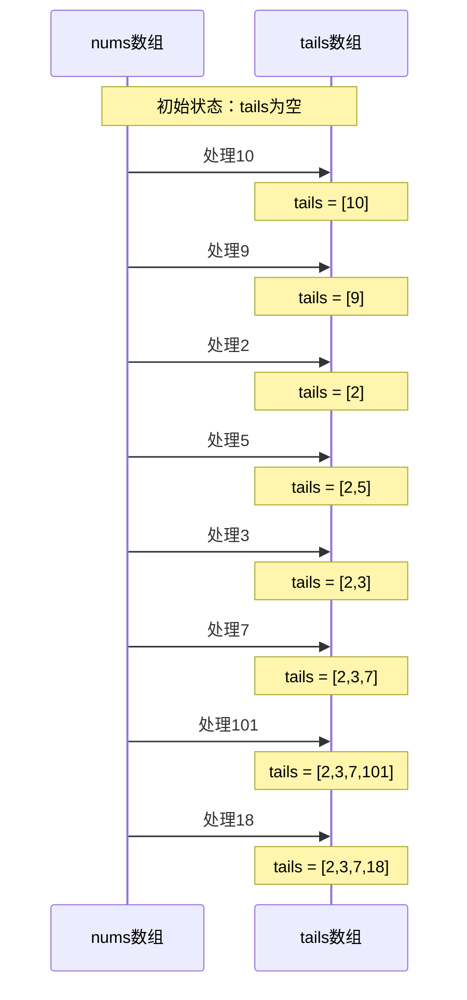

## 问题链接
https://leetcode.cn/problems/longest-increasing-subsequence/

## 问题描述
给你一个整数数组 nums ，找到其中最长严格递增子序列的长度。

子序列 是由数组派生而来的序列，删除（或不删除）数组中的元素而不改变其余元素的顺序。例如，[3,6,2,7] 是数组 [0,3,1,6,2,7] 的子序列。

### 示例 1：
输入：nums = [10,9,2,5,3,7,101,18]
输出：4
解释：最长递增子序列是 [2,3,7,101]，因此长度为 4 。

### 示例 2：
输入：nums = [0,1,0,3,2,3]
输出：4

### 示例 3：
输入：nums = [7,7,7,7,7,7,7]
输出：1

### 提示：
- 1 <= nums.length <= 2500
- -104 <= nums[i] <= 104

## 解题思路

### 1. 传统动态规划（O(n²)）
- 定义 dp[i] 表示以 nums[i] 结尾的最长上升子序列的长度
- 对于每个位置 i，遍历它前面的所有位置 j
- 如果 nums[i] > nums[j]，则可以将 nums[i] 接在以 nums[j] 结尾的上升子序列后面

### 2. 贪心 + 二分查找（O(nlogn)）
#### 核心思想
维护一个数组tails，其中tails[i]表示长度为i+1的递增子序列的末尾元素的最小值。

#### 执行流程


#### 详细步骤说明
1. **处理10**：
   - tails为空，直接加入：[10]

2. **处理9**：
   - 9 < 10，替换10：[9]
   - 这意味着如果要构建长度为1的递增序列，以9结尾比以10结尾更有潜力

3. **处理2**：
   - 2 < 9，替换9：[2]
   - 同理，以2结尾更有潜力

4. **处理5**：
   - 5 > 2，追加：[2,5]
   - 表示现在有长度为1的子序列末尾最小值是2，长度为2的子序列末尾最小值是5

5. **处理3**：
   - 2 < 3 < 5，替换5：[2,3]
   - 这说明长度为2的递增序列可以用3结尾而不是5，这样更有潜力接更多的数

6. **处理7**：
   - 7 > 3，追加：[2,3,7]

7. **处理101**：
   - 101 > 7，追加：[2,3,7,101]

8. **处理18**：
   - 7 < 18 < 101，替换101：[2,3,7,18]

#### 算法正确性
1. **tails数组的性质**：
   - tails数组一定是严格递增的
   - 每个位置存储的都是可能的最小值
   - tails[i]表示长度为i+1的所有递增子序列中，末尾元素最小的值
2. **贪心的正确性**：
   - 对于每个位置，我们总是希望用更小的数字来替换，这样后面能接的数字就更多
   - 如果能追加，说明找到了一个更长的递增子序列

#### 示例分析
```cpp
// 示例1
vector<int> nums = {3,1,4,2,5};
// 处理过程：
// [3]
// [1]
// [1,4]
// [1,2]
// [1,2,5]

// 示例2
vector<int> nums = {2,6,4,8,10};
// 处理过程：
// [2]
// [2,6]
// [2,4]
// [2,4,8]
// [2,4,8,10]
```

## 代码实现
```cpp
class Solution {
public:
    // 方法一：动态规划 O(n²)
    int lengthOfLIS(vector<int>& nums) {
        int n = nums.size();
        vector<int> dp(n, 1);
        int maxLen = 1;
        
        for (int i = 1; i < n; i++) {
            for (int j = 0; j < i; j++) {
                if (nums[i] > nums[j]) {
                    dp[i] = max(dp[i], dp[j] + 1);
                }
            }
            maxLen = max(maxLen, dp[i]);
        }
        
        return maxLen;
    }
    
    // 方法二：贪心 + 二分查找 O(nlogn)
    int lengthOfLIS_binary(vector<int>& nums) {
        vector<int> tails;
        for (int num : nums) {
            auto it = lower_bound(tails.begin(), tails.end(), num);
            if (it == tails.end()) {
                tails.push_back(num);
            } else {
                *it = num;
            }
        }
        return tails.size();
    }
};
```

## 复杂度分析
1. **动态规划解法**：
   - 时间复杂度：O(n²)，其中 n 是数组长度
   - 空间复杂度：O(n)，用于存储 dp 数组

2. **贪心 + 二分查找解法**：
   - 时间复杂度：O(nlogn)，其中 n 是数组长度
   - 空间复杂度：O(n)，用于存储 tails 数组

## 优化思路
1. **使用二分查找优化**：
   - 将原始的 O(n²) 动态规划优化为 O(nlogn)
   - 维护一个有序数组，使用二分查找加速查找过程

2. **空间优化**：
   - 对于动态规划解法，dp 数组是必须的，无法进行空间优化
   - 对于二分查找解法，tails 数组也是必须的

3. **特殊情况处理**：
   - 数组长度为 1 时直接返回 1
   - 处理数组中有重复元素的情况

## 扩展问题及解题思路

## 扩展问题

### 1. 最长递减子序列
#### 问题链接
https://leetcode.cn/problems/longest-decreasing-subsequence/

#### 问题描述
给你一个整数数组 nums ，找到其中最长严格递减子序列的长度。

#### 示例
输入：nums = [10,9,2,5,3,7,101,18]
输出：2
解释：最长递减子序列是 [10,9]

#### 解题思路
1. 将原数组中的元素取相反数，转化为最长递增子序列问题
2. 或者修改比较条件，将大于改为小于

#### 代码实现
```cpp
int lengthOfLDS(vector<int>& nums) {
    vector<int> reversed;
    for (int num : nums) {
        reversed.push_back(-num);
    }
    return lengthOfLIS(reversed);
}
```

### 2. 最长上升子序列的个数
#### 问题链接
https://leetcode.cn/problems/number-of-longest-increasing-subsequence/

#### 问题描述
给定一个未排序的整数数组 nums，返回最长递增子序列的个数。

#### 示例
输入: [1,3,5,4,7]
输出: 2
解释: 有两个最长递增子序列，分别是 [1,3,4,7] 和 [1,3,5,7]

#### 解题思路
1. 维护两个数组：
   - dp[i]: 以nums[i]结尾的最长上升子序列的长度
   - count[i]: 以nums[i]结尾的最长上升子序列的个数
2. 当找到一个更长的子序列时，更新count[i]为count[j]
3. 当找到一个相同长度的子序列时，累加count[j]到count[i]
比如对于输入 [1,3,5,4,7]
dp数组最终为：[1,2,3,3,4]（表示以每个位置结尾的LIS长度）
count数组最终为：[1,1,1,1,2]（表示以每个位置结尾的LIS个数）
maxLen = 4
最后返回 count[4] = 2，表示有2个长度为4的最长上升子序列
#### 代码实现
```cpp
int numberOfLIS(vector<int>& nums) {
    int n = nums.size();
    if (n <= 1) return n;
    
    vector<int> dp(n, 1);  // 长度
    vector<int> count(n, 1);  // 个数
    int maxLen = 1;
    
    for (int i = 1; i < n; i++) {
        for (int j = 0; j < i; j++) {
            if (nums[i] > nums[j]) {
                if (dp[j] + 1 > dp[i]) {
                    dp[i] = dp[j] + 1;
                    count[i] = count[j];
                } else if (dp[j] + 1 == dp[i]) {
                    count[i] += count[j];
                }
            }
        }
        maxLen = max(maxLen, dp[i]);
    }
    
    int result = 0;
    for (int i = 0; i < n; i++) {
        if (dp[i] == maxLen) {
            result += count[i];
        }
    }
    return result;
}
```

### 3. 最长上升子序列的具体方案
#### 问题描述
给定一个未排序的整数数组，找到最长递增子序列，并返回这个序列。

#### 示例
输入: [10,9,2,5,3,7,101,18]
输出: [2,5,7,101]

#### 解题思路
1. 在动态规划过程中记录前驱节点
2. 使用prev数组记录每个位置的前一个节点
3. 从最大长度的位置开始回溯，重建序��

#### 代码实现
```cpp
vector<int> getLIS(vector<int>& nums) {
    int n = nums.size();
    if (n <= 1) return nums;
    
    vector<int> dp(n, 1);
    vector<int> prev(n, -1);  // 记录前驱节点
    int maxLen = 1;
    int endIndex = 0;
    
    for (int i = 1; i < n; i++) {
        for (int j = 0; j < i; j++) {
            if (nums[i] > nums[j] && dp[j] + 1 > dp[i]) {
                dp[i] = dp[j] + 1;
                prev[i] = j;
            }
        }
        if (dp[i] > maxLen) {
            maxLen = dp[i];
            endIndex = i;
        }
    }
    
    // 重建序列
    vector<int> result;
    while (endIndex != -1) {
        result.push_back(nums[endIndex]);
        endIndex = prev[endIndex];
    }
    reverse(result.begin(), result.end());
    return result;
}
```

### 4. 最长公共上升子序列
#### 问题链接
https://leetcode.cn/problems/longest-common-subsequence/

#### 问题描述
给定两个整数序列，找到它们的最长公共上升子序列的长度。

#### 示例
输入: A = [1,2,3,4,5], B = [3,4,5,1,2]
输出: 3
解释: 最长公共上升子序列是 [3,4,5]

#### 解题思路
1. 结合LCS和LIS的思想
2. 使用二维动态规划
3. dp[i][j]表示以A[i]和B[j]结尾的最长公共上升子序列的长度

#### 代码实现
```cpp
int findLCIS(vector<int>& A, vector<int>& B) {
    int m = A.size(), n = B.size();
    vector<vector<int>> dp(m + 1, vector<int>(n + 1, 0));
    int maxLen = 0;
    
    for (int i = 1; i <= m; i++) {
        for (int j = 1; j <= n; j++) {
            if (A[i-1] == B[j-1]) {
                dp[i][j] = dp[i-1][j-1] + 1;
                maxLen = max(maxLen, dp[i][j]);
            } else {
                dp[i][j] = max(dp[i-1][j], dp[i][j-1]);
            }
        }
    }
    return maxLen;
}
```

### 5. 俄罗斯套娃信封问题
#### 问题链接
https://leetcode.cn/problems/russian-doll-envelopes/

#### 问题描述
给你一个二维整数数组 envelopes ，其中 envelopes[i] = [wi, hi] ，表示第 i 个信封的宽度和高度。
当另一个信封的宽度和高度都比这个信封大时，这个信封就可以放进另一个信封里，如同俄罗斯套娃一样。
请计算 最多能有多少个 信封能组成一组"俄罗斯套娃"信封（即可以把一个信封放到另一个信封里面）。

#### 示例
输入：envelopes = [[5,4],[6,4],[6,7],[2,3]]
输出：3
解释：最优的套娃信封组合是 [2,3] => [5,4] => [6,7]

#### 解题思路
1. 先按宽度升序排序，宽度相同时按高度降序排序
   - 这样可以保证在宽度相同时，高度高的信封不会被选中
   - 原因：
     1. 假设有两个宽度相同的信封 [w,h1] 和 [w,h2]，其中 h1 > h2
     2. 如果按高度升序排序，可能会同时选择这两个信封，这是错误的，因为宽度相同的信封不能互相嵌套
     3. 按高度降序排序后，在求 LIS 时，由于 h1 > h2，h2 永远不可能接在 h1 后面
     4. 这就保证了宽度相同的信封最多只能选择一个

2. 为什么之后直接对高度数组求 LIS 就可以了？
   - 核心原理：将二维问题转化为一维问题
   - 排序后的性质：
     1. 宽度已经严格递增（相同宽度的信封中最多只能选一个）
     2. 在此基础上，只需要保证高度也是递增的，就能确保信封可以嵌套
   
3. 深层原理解析：
   - 维度转化：
     * 原问题是在二维空间中找递增序列
     * 通过特殊的排序方式，我们将宽度维度"消除"
     * 转化为纯粹的高度维度上的 LIS 问题
   
   - 约束转化：
     * 原问题的约束：宽度递增且高度递增
     * 排序后：宽度自动满足递增（相同宽度最多取一个）
     * 剩余约束：仅需考虑高度递增
   
   - 贪心思想：
     * 对于相同宽度的信封，选择高度较大的会限制后续选择
     * 通过降序排列高度，自然地实现了贪心选择

示例详解：
```
原始信封: [[5,4], [6,4], [6,7], [2,3]]
排序后:   [[2,3], [5,4], [6,7], [6,4]]
高度数组:  [3,    4,    7,    4   ]
                        ↑     ↑
                        7 > 4，在LIS中4永远不可能接在7后面
                        这就保证了宽度为6的信封最多选一个
```

这种解法的优雅之处在于：
1. 通过巧妙的排序，将复杂的二维约束转化为简单的一维问题
2. 不需要显式处理宽度相同的特殊情况
3. 复用了经典的 LIS 算法，降低了问题的复杂度

#### 代码实现
```cpp
int maxEnvelopes(vector<pair<int, int>>& envelopes) {
    // 按宽度升序排序，宽度相同时按高度降序排序
    sort(envelopes.begin(), envelopes.end(), 
        [](const pair<int, int>& a, const pair<int, int>& b) {
            return a.first < b.first || (a.first == b.first && a.second > b.second);
        });
    
    // 对高度数组求最长上升子序列
    vector<int> heights;
    for (const auto& env : envelopes) {
        heights.push_back(env.second);
    }
    return lengthOfLIS(heights);
}
```
