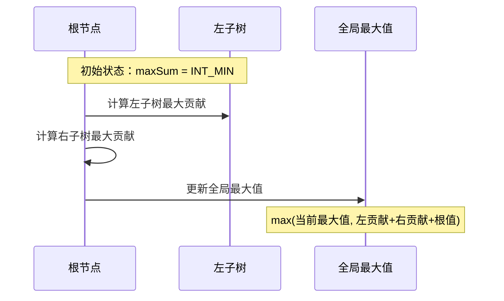

## 问题链接
https://leetcode.cn/problems/binary-tree-maximum-path-sum/

## 问题描述
路径 被定义为一条从树中任意节点出发，沿父节点-子节点连接，达到任意节点的序列。同一个节点在一条路径序列中 至多出现一次 。该路径 至少包含一个 节点，且不一定经过根节点。

路径和 是路径中各节点值的总和。

给你一个二叉树的根节点 root ，返回其 最大路径和 。

### 示例 1：
```
输入：root = [1,2,3]
输出：6
解释：最优路径是 2 -> 1 -> 3 ，路径和为 2 + 1 + 3 = 6
```

### 示例 2：
```
输入：root = [-10,9,20,null,null,15,7]
输出：42
解释：最优路径是 15 -> 20 -> 7 ，路径和为 15 + 20 + 7 = 42
```

### 提示：
- 树中节点数目范围是 [1, 3 * 104]
- -1000 <= Node.val <= 1000

## 解题思路

### 1. 递归 + 后序遍历（O(n)）
- 对于每个节点，计算以该节点为根的最大路径和
- 需要维护两个值：
  * 全局最大路径和（可以是任意路径）
  * 单边最大路径和（只能选择一条边向下）
- 考虑负数节点的影响

### 2. 执行流程


#### 详细步骤说明
1. **后序遍历**：
   - 先计算左右子树的最大贡献值
   - 贡献值可以为负数时取0（放弃这条路径）

2. **处理当前节点**：
   - 计算当前节点的最大路径和 = 左贡献 + 右贡献 + 当前节点值
   - 更新全局最大值
   - 返回节点的最大贡献值 = max(左贡献, 右贡献) + 当前节点值

#### 算法正确性
1. **后序遍历的必要性**：
   - 需要先知道子树的信息
   - 再决定当前节点的贡献值
   - 自底向上构建解

2. **最大贡献值的定义**：
   - 表示从当前节点向下延伸的最大路径和
   - 只能选择一条路径（左或右）
   - 如果贡献为负，可以选择不取这条路径

#### 示例分析
```cpp
// 示例1: [1,2,3]
//    1
//   / \
//  2   3

// 处理过程：
// 节点2贡献：2
// 节点3贡献：3
// 节点1处理：max(6, 全局最大值)
// 节点1贡献：4 (1 + max(2,3))

// 示例2: [-10,9,20,null,null,15,7]
//    -10
//    /  \
//   9   20
//      /  \
//     15   7

// 处理过程：
// 节点9贡献：9
// 节点15贡献：15
// 节点7贡献：7
// 节点20处理：max(42, 全局最大值)
// 节点20贡献：35 (20 + max(15,7))
// 节点-10处理：max(42, 9+35-10)
// 节点-10贡献：35
```

## 代码实现
```cpp
class Solution {
private:
    int maxSum = INT_MIN;  // 全局最大路径和
    
    // 计算节点的最大贡献值
    int maxGain(TreeNode* node) {
        if (!node) return 0;
        
        // 递归计算左右子节点的最大贡献值
        // 只有在最大贡献值大于 0 时，才会选取对应子节点
        int leftGain = max(maxGain(node->left), 0);
        int rightGain = max(maxGain(node->right), 0);
        
        // 节点的最大路径和取决于该节点的值与该节点的左右子节点的最大贡献值
        int priceNewPath = node->val + leftGain + rightGain;
        
        // 更新全局最大值
        maxSum = max(maxSum, priceNewPath);
        
        // 返回节点的最大贡献值
        return node->val + max(leftGain, rightGain);
    }
    
public:
    int maxPathSum(TreeNode* root) {
        maxGain(root);
        return maxSum;
    }
};
```

## 复杂度分析
1. **时间复杂度**：
   - O(n)，其中 n 是二叉树中的节点个数
   - 每个节点只会被访问一次

2. **空间复杂度**：
   - O(h)，其中 h 是二叉树的高度
   - 递归调用的栈空间取决于树的高度
   - 最坏情况下为 O(n)，最好情况下为 O(logn)

## 优化思路
1. **预处理优化**：
   - 如果只有一个节点，直接返回其值
   - 可以预先判断负数节点

2. **空间优化**：
   - 可以考虑使用Morris遍历
   - 将空间复杂度优化到 O(1)

3. **特殊情况处理**：
   - 处理全负数的情况
   - 处理单边树的情况

## 扩展问题

### 1. 二叉树的直径
#### 问题描述
给定一棵二叉树，计算该树的直径长度。一棵二叉树的直径长度是任意两个结点路径长度中的最大值。这条路径可能穿过也可能不穿过根结点。

**注意**：两结点之间的路径长度是以它们之间边的数目表示。

##### 示例：
```
输入：
     1
    / \
   2   3
  / \     
 4   5    

输出：3

解释：
最长的路径是 [4,2,1,3] 或 [5,2,1,3]，路径长度都是 3
```

##### 约束条件：
- 二叉树的节点数量范围为 [1, 10^4]
- 每个节点的值的范围为 [-100, 100]

#### 解题思路
1. **核心思想**：
   - 树的直径是任意两个节点之间的最长路径
   - 这条路径一定会通过某个节点及其左右子树
   - 可以转化为求每个节点左右子树的最大深度之和

2. **算法步骤**：
   - 递归计算每个节点的左右子树深度
   - 用左右子树深度之和更新全局最大直径
   - 返回该节点为根的子树的最大深度

3. **复杂度分析**：
   - 时间复杂度：O(n)，每个节点只访问一次
   - 空间复杂度：O(h)，h为树的高度，递归栈的开销
### 2. 最小路径和
#### 问题描述
给定一个包含非负整数的 m × n 网格 grid ，请找出一条从左上角到右下角的路径，使得路径上的数字总和为最小。

**说明**：每次只能向下或者向右移动一步。

##### 示例：
```
输入：grid = [
  [1,3,1],
  [1,5,1],
  [4,2,1]
]
输出：7
解释：路径 1→3→1→1→1 的总和最小，为 7
```

##### 约束条件：
- m == grid.length
- n == grid[i].length
- 1 <= m, n <= 200
- 0 <= grid[i][j] <= 100

#### 解题思路
1. **核心思想**：
   - 典型的动态规划问题
   - 每个位置只能从上方或左方到达
   - 当前位置的最小路径和依赖于上方和左方的最小路径和

2. **状态转移方程**：
   ```
   dp[i][j] = min(dp[i-1][j], dp[i][j-1]) + grid[i][j]
   ```

3. **边界条件**：
   - 第一行：只能从左方到达
   - 第一列：只能从上方到达
   - 起点：dp[0][0] = grid[0][0]

4. **复杂度分析**：
   - 时间复杂度：O(m×n)，需要填充整个dp数组
   - 空间复杂度：O(m×n)，可以优化到O(n)

### 3. 路径总和 III
#### 问题描述
给定一个二叉树的根节点 root 和一个整数 targetSum ，求该二叉树里节点值之和等于 targetSum 的 路径 的数目。

**路径定义**：从树中任意节点出发，沿父节点-子节点连接，达到任意节点。同一个节点在一条路径序列中 至多出现一次 。路径方向必须是向下的（只能从父节点到子节点）。

##### 示例：
```
输入：root = [10,5,-3,3,2,null,11,3,-2,null,1], targetSum = 8
输出：3
解释：和等于 8 的路径有：
1. 5 -> 3
2. 5 -> 2 -> 1
3. -3 -> 11
```

##### 约束条件：
- 二叉树的节点个数在范围 [0, 1000] 内
- -10^9 <= Node.val <= 10^9
- -1000 <= targetSum <= 1000

#### 解题思路
1. **核心思想**：
   - 路径可以从任意节点开始，但必须向下延伸
   - 需要考虑以每个节点为起点的所有可能路径
   - 使用双重递归解决

2. **算法步骤**：
   - 外层递归：遍历每个节点作为起点
   - 内层递归：计算以当前节点开始的满足条件的路径数
   - 路径和使用减法避免溢出

3. **优化方案**：
   - 可以使用前缀和 + 哈希表优化
   - 将时间复杂度从O(n²)优化到O(n)

4. **复杂度分析**：
   - 时间复杂度：O(n²)，最坏情况下每个节点都需要遍历其所有祖先
   - 空间复杂度：O(h)，h为树的高度

### 4. 路径总和 IV
#### 问题描述
在一棵二叉树中，每个节点都有一个三位整数作为标识：
- 百位表示层级 D，1 <= D <= 4
- 十位和个位表示在当前层中从左到右的位置 P，1 <= P <= 8

给定一个包含三位整数的数组 nums，请计算从根到所有叶子节点的路径总和。

##### 示例：
```
输入：nums = [113, 215, 221]
输出：12
解释：
    3
   / \
  5   1
路径和 = (3 + 5) + (3 + 1) = 12
```

##### 约束条件：
- 1 <= nums.length <= 20
- nums[i] 是一个三位整数
- nums 中的所有数字都是唯一的
- 树中的每个节点值的范围是 [1, 9]
#### 解题思路
1. **核心思想**：
   - 使用哈希表存储树的结构
   - 位置编码包含层级和位置信息
   - 只需计算所有从根到叶子的路径

2. **关键技巧**：
   - 使用整数除法和取模提取深度和位置信息
   - 利用完全二叉树的性质计算父子节点关系
   - 判断叶子节点：没有子节点的节点

3. **算法步骤**：
   - 构建树的哈希表映射
   - 找到所有叶子节点
   - 对每个叶子节点回溯到根计算路径和

4. **复杂度分析**：
   - 时间复杂度：O(n)，n为节点数
   - 空间复杂度：O(n)，哈希表存储所有节点
