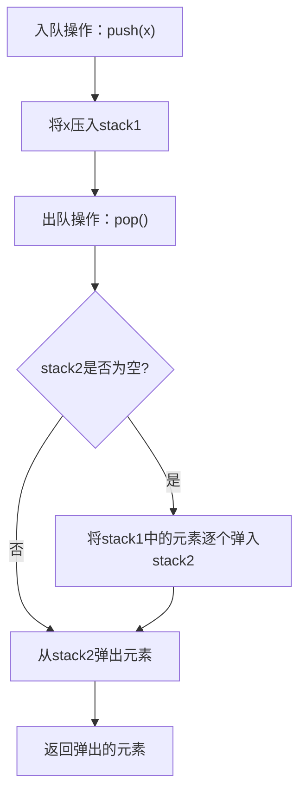

## 问题链接
https://leetcode.cn/problems/implement-queue-using-stacks/

## 问题描述
使用栈实现队列的下列操作：
- push(x) -- 将元素 x 追加到队列的末尾。
- pop() -- 从队列的开头移除并返回元素。
- peek() -- 返回队列开头的元素。
- empty() -- 返回队列是否为空。

说明：
- 你必须使用栈来实现这些操作。

### 示例
输入：
```
MyQueue queue = new MyQueue();
queue.push(1);
queue.push(2);
queue.peek(); // 返回 1
queue.pop();  // 返回 1
queue.empty(); // 返回 false
```

### 提示
- 1 <= x <= 100
- 最多调用 100 次 push、pop、peek 和 empty 方法。

## 解题思路

### 1. 使用两个栈实现队列
- 使用两个栈 `stack1` 和 `stack2` 来实现队列的功能。
- `stack1` 用于存储入队的元素，`stack2` 用于存储出队的元素。

### 2. 入队操作
- 当调用 `push(x)` 时，直接将元素 x 压入 `stack1`。

### 3. 出队操作
- 当调用 `pop()` 时：
  - 如果 `stack2` 为空，则将 `stack1` 中的所有元素逐个弹出并压入 `stack2`，这样 `stack2` 的栈顶元素就是队列的头部元素。
  - 然后从 `stack2` 中弹出元素。

### 4. 查看队头元素
- 当调用 `peek()` 时：
  - 如果 `stack2` 为空，则同样将 `stack1` 中的所有元素逐个弹出并压入 `stack2`。
  - 返回 `stack2` 的栈顶元素。

### 5. 判断队列是否为空
- 当调用 `empty()` 时，检查 `stack1` 和 `stack2` 是否都为空。

### 动态过程示意图


## 代码实现
```cpp
class MyQueue {
public:
    stack<int> stack1;
    stack<int> stack2;

    /** Initialize your data structure here. */
    MyQueue() {}

    /** Push element x to the back of queue. */
    void push(int x) {
        stack1.push(x);
    }

    /** Removes the element from in front of queue and returns that element. */
    int pop() {
        if (stack2.empty()) {
            while (!stack1.empty()) {
                stack2.push(stack1.top());
                stack1.pop();
            }
        }
        int front = stack2.top();
        stack2.pop();
        return front;
    }

    /** Get the front element. */
    int peek() {
        if (stack2.empty()) {
            while (!stack1.empty()) {
                stack2.push(stack1.top());
                stack1.pop();
            }
        }
        return stack2.top();
    }

    /** Returns whether the queue is empty. */
    bool empty() {
        return stack1.empty() && stack2.empty();
    }
};
```

## 复杂度分析
1. **时间复杂度**：
   - `push(x)`：O(1)
   - `pop()` 和 `peek()`：在最坏情况下，O(n)，当 `stack2` 为空时需要将 `stack1` 中的所有元素转移到 `stack2`。
   - `empty()`：O(1)

2. **空间复杂度**：
   - O(n)，需要存储队列中的所有元素。

## 扩展问题

### 1. 用队列实现栈
#### 问题描述
使用队列实现栈的下列操作：
- push(x) -- 将元素 x 追加到栈的顶部。
- pop() -- 移除栈顶元素并返回。
- top() -- 返回栈顶元素。
- empty() -- 返回栈是否为空。

#### 解题思路
- 使用一个队列 `queue` 来实现栈的功能。
- 每次入栈时，将新元素添加到队列的尾部，然后将队列中的所有元素移到新元素的后面，以保持新元素在队首。
- 出栈和查看栈顶元素时，直接从队首弹出元素。

#### 代码实现
```cpp
class MyStack {
public:
    queue<int> queue;

    /** Initialize your data structure here. */
    MyStack() {}

    /** Push element x onto stack. */
    void push(int x) {
        queue.push(x);
        for (int i = 0; i < queue.size() - 1; i++) {
            queue.push(queue.front());
            queue.pop();
        }
    }

    /** Removes the element on the top of the stack and returns that element. */
    int pop() {
        int top = queue.front();
        queue.pop();
        return top;
    }

    /** Get the top element. */
    int top() {
        return queue.front();
    }

    /** Returns whether the stack is empty. */
    bool empty() {
        return queue.empty();
    }
};
```

#### 复杂度分析
1. **时间复杂度**：
   - `push(x)`：O(n)，需要将队列中的所有元素移动。
   - `pop()` 和 `top()`：O(1)
   - `empty()`：O(1)

2. **空间复杂度**：
   - O(n)，需要存储栈中的所有元素。
</rewritten_file> 