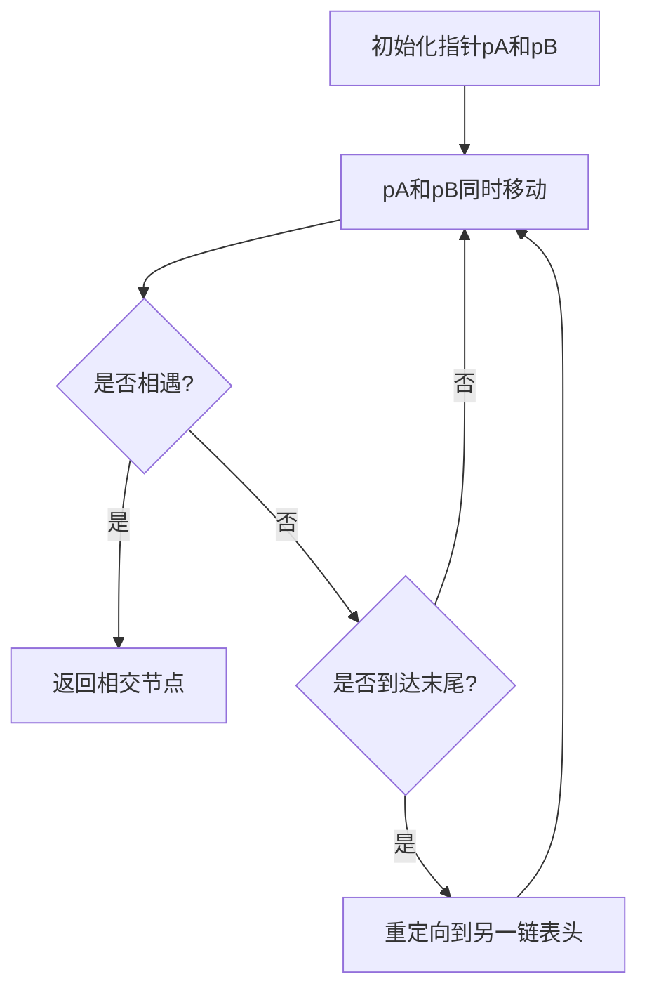

## 问题链接
https://leetcode.cn/problems/intersection-of-two-linked-lists/

## 问题描述
给你两个单链表的头节点 headA 和 headB ，请你找出并返回两个单链表相交的起始节点。如果两个链表不存在相交节点，返回 null 。

题目数据 保证 整个链式结构中不存在环。

注意，函数返回结果后，链表必须 保持其原始结构 。

### 示例 1：
```
       a1 -> a2
                \
                  c1 -> c2 -> c3
                /
       b1 -> b2
```
输入：intersectVal = 8, listA = [4,1,8,4,5], listB = [5,6,1,8,4,5], skipA = 2, skipB = 3
输出：Intersected at '8'
解释：相交节点的值为 8 （注意，如果两个链表相交则不能为 0）。
从各自的表头开始算起，链表 A 为 [4,1,8,4,5]，链表 B 为 [5,6,1,8,4,5]。
在 A 中，相交节点前有 2 个节点；在 B 中，相交节点前有 3 个节点。

### 示例 2：
```
       a1 -> a2 -> a3
       b1 -> b2 -> b3
```
输入：intersectVal = 0, listA = [2,6,4], listB = [1,5], skipA = 3, skipB = 2
输出：null
解释：从各自的表头开始算起，链表 A 为 [2,6,4]，链表 B 为 [1,5]。
由于这两个链表不相交，所以 intersectVal 必须为 0，而 skipA 和 skipB 可以是任意值。
这两个链表不相交，因此返回 null 。

### 提示：
- listA 中节点数目为 m
- listB 中节点数目为 n
- 1 <= m, n <= 3 * 10^4
- 1 <= Node.val <= 10^5
- 0 <= skipA <= m
- 0 <= skipB <= n
- 如果 listA 和 listB 没有交点，intersectVal 为 0
- 如果 listA 和 listB 有交点，intersectVal == listA[skipA + 1] == listB[skipB + 1]

## 解题思路

### 1. 哈希表法（基础解法）
- 遍历链表A，将所有节点存入哈希表
- 遍历链表B，检查每个节点是否在哈希表中
- 第一个在哈希表中的节点即为相交节点

### 2. 双指针法（优化解法）
- 创建两个指针 pA 和 pB，分别指向链表 A 和链表 B 的头节点
- 当 pA 到达链表 A 的末尾时，将其重定向到链表 B 的头节点
- 当 pB 到达链表 B 的末尾时，将其重定向到链表 A 的头节点
- 如果存在相交节点，两个指针会在相交节点相遇

### 双指针法原理解释
假设：
- 链表A长度为a + c，其中c为公共部分长度
- 链表B长度为b + c
- 指针pA走过的路径：a + c + b
- 指针pB走过的路径：b + c + a
由于两个路径长度相等，如果有相交，指针必然会相遇

### 算法流程示意图


## 代码实现
```cpp
class Solution {
public:
    // 哈希表解法
    ListNode *getIntersectionNode_hash(ListNode *headA, ListNode *headB) {
        unordered_set<ListNode*> visited;
        ListNode* temp = headA;
        while (temp != nullptr) {
            visited.insert(temp);
            temp = temp->next;
        }
        
        temp = headB;
        while (temp != nullptr) {
            if (visited.count(temp)) {
                return temp;
            }
            temp = temp->next;
        }
        return nullptr;
    }
    
    // 双指针解法
    ListNode *getIntersectionNode(ListNode *headA, ListNode *headB) {
        if (headA == nullptr || headB == nullptr) return nullptr;
        
        ListNode* pA = headA;
        ListNode* pB = headB;
        
        while (pA != pB) {
            pA = pA == nullptr ? headB : pA->next;
            pB = pB == nullptr ? headA : pB->next;
        }
        
        return pA;
    }
};
```

## 复杂度分析
1. **哈希表解法**：
   - 时间复杂度：O(m + n)，其中 m 和 n 分别是两个链表的长度
   - 空间复杂度：O(m)，需要存储链表A中的所有节点

2. **双指针解法**：
   - 时间复杂度：O(m + n)
   - 空间复杂度：O(1)，只需要两个指针

## 扩展问题

### 1. 如何判断链表是否有环？
#### 问题描述
给定一个链表，判断链表中是否有环。

#### 解题思路
使用快慢指针（Floyd判圈算法）：
- 快指针每次移动两步
- 慢指针每次移动一步
- 如果有环，两个指针必然相遇

```cpp
bool hasCycle(ListNode *head) {
    if (head == nullptr || head->next == nullptr) return false;
    
    ListNode* slow = head;
    ListNode* fast = head->next;
    
    while (slow != fast) {
        if (fast == nullptr || fast->next == nullptr) {
            return false;
        }
        slow = slow->next;
        fast = fast->next->next;
    }
    
    return true;
}
```

### 2. 如何找到环的入口节点？
#### 问题描述
如果链表有环，找到环的入口节点。

#### 解题思路
1. 使用快慢指针找到相遇点
2. 将其中一个指针重置到头节点
3. 两个指针同速前进，相遇点即为环的入口

```cpp
ListNode *detectCycle(ListNode *head) {
    if (head == nullptr || head->next == nullptr) return nullptr;
    
    ListNode* slow = head;
    ListNode* fast = head;
    
    // 找到相遇点
    do {
        if (fast == nullptr || fast->next == nullptr) {
            return nullptr;
        }
        slow = slow->next;
        fast = fast->next->next;
    } while (slow != fast);
    
    // 找到环的入口
    slow = head;
    while (slow != fast) {
        slow = slow->next;
        fast = fast->next;
    }
    
    return slow;
}
```

### 3. Y型链表相交的变形问题
#### 问题描述
如果两个链表可能包含环，如何判断它们是否相交？

#### 解题思路
1. 分别判断两个链表是否有环
2. 根据不同情况分类讨论：
   - 两个都无环：使用原始的相交判断方法
   - 一个有环一个无环：不可能相交
   - 两个都有环：
     - 判断是否共用同一个环
     - 如果共用环，找到相交点

```cpp
ListNode* getIntersectionNodeWithCycle(ListNode* headA, ListNode* headB) {
    // 获取A的环入口
    ListNode* cycleA = detectCycle(headA);
    // 获取B的环入口
    ListNode* cycleB = detectCycle(headB);
    
    // 情况1：都无环
    if (cycleA == nullptr && cycleB == nullptr) {
        return getIntersectionNode(headA, headB);
    }
    
    // 情况2：一个有环一个无环
    if ((cycleA == nullptr) != (cycleB == nullptr)) {
        return nullptr;
    }
    
    // 情况3：都有环
    // 判断是否是同一个环
    ListNode* temp = cycleA->next;
    while (temp != cycleA) {
        if (temp == cycleB) {
            return cycleA; // 返回任一环入口即可
        }
        temp = temp->next;
    }
    
    return nullptr;
}
```

## 总结
1. 链表相交问题的关键是理解：
   - 如果两个链表相交，那么从相交点到末尾的部分是完全相同的
   - 可以利用这个特性设计算法

2. 双指针技巧在链表问题中非常有用：
   - 可以用来检测环
   - 可以用来找到相交点
   - 可以优化空间复杂度

3. 实际应用中需要注意：
   - 边界条件的处理
   - 空指针的检查
   - 环的处理