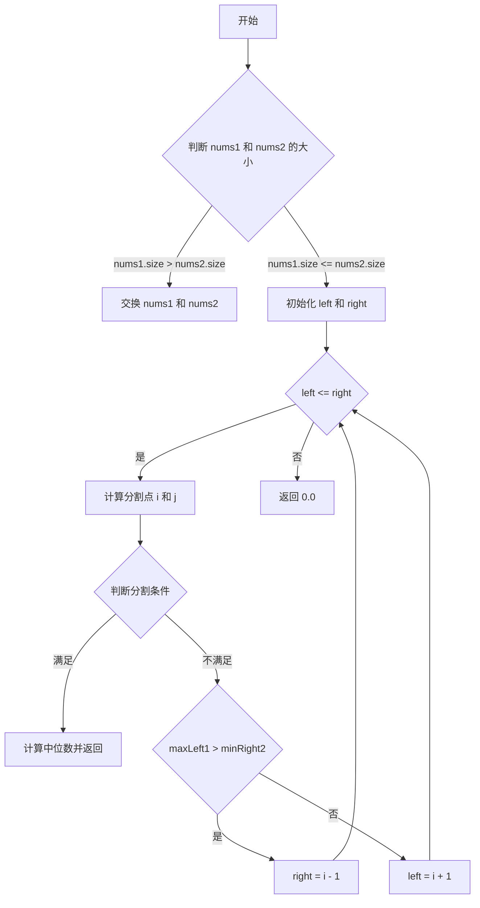

## 问题链接
[LeetCode - Median of Two Sorted Arrays](https://leetcode.cn/problems/median-of-two-sorted-arrays/)

## 问题描述
给定两个大小分别为 m 和 n 的正序数组 nums1 和 nums2。请你找出这两个正序数组的中位数，并且要求算法的时间复杂度为 O(log (m+n))。

中位数是有序数组中间的数。如果数组的长度是偶数，则中位数是中间两个数的平均值。

### 示例 1：
输入：nums1 = [1, 3], nums2 = [2]  
输出：2.00000  
解释：合并数组 = [1, 2, 3]，中位数是 2。

### 示例 2：
输入：nums1 = [1, 2], nums2 = [3, 4]  
输出：2.50000  
解释：合并数组 = [1, 2, 3, 4]，中位数是 (2 + 3) / 2 = 2.5。

### 示例 3：
输入：nums1 = [0, 0], nums2 = [0, 0]  
输出：0.00000  

### 示例 4：
输入：nums1 = [1, 2, 3], nums2 = [4, 5]  
输出：3.00000  
解释：合并数组 = [1, 2, 3, 4, 5]，中位数是 3。

### 示例 5：
输入：nums1 = [1], nums2 = [2, 3, 4]  
输出：2.50000  
解释：合并数组 = [1, 2, 3, 4]，中位数是 (2 + 3) / 2 = 2.5。

### 提示：
- nums1.length == m
- nums2.length == n
- 0 <= m <= 1000
- 0 <= n <= 1000
- 1 <= nums1[i], nums2[i] <= 10^6
- nums1 和 nums2 均为正序数组

## 解题思路

### 1. 暴力解法
- 将两个数组合并成一个有序数组，然后找到中位数。
- 时间复杂度为 O(m+n)，空间复杂度为 O(m+n)。

### 2. 二分查找（高效解法）
- 由于要求时间复杂度为 O(log (m+n))，我们可以使用二分查找来解决这个问题。
- 设定 nums1 为较短的数组，确保 m <= n。
- 通过二分查找在 nums1 中找到合适的分割点，使得左边的元素都小于等于右边的元素。

#### 1. 基本思路
我们需要将两个数组分成左右两部分，使得：
- 左部分的长度等于右部分（或比右部分多1个元素，当总长度为奇数时）
- 左部分的所有元素都小于等于右部分的所有元素

#### 2. 具体步骤举例

假设有两个数组：
```
nums1 = [1, 3, 5]
nums2 = [2, 4, 6]
```

我们需要找到合适的分割点，将这两个数组分成左右两部分：

```
nums1 左边: [1, 3] | 右边: [5]
nums2 左边: [2]    | 右边: [4, 6]

组合后：
左边: [1, 2, 3]  右边: [4, 5, 6]
```

#### 3. 为什么要在较短数组上二分查找？
- 假设较短数组长度为 m，较长数组长度为 n
- 在较短数组上二分查找可以确保 j = (m+n+1)/2 - i 始终有效
- 这样可以保证不会出现数组越界的情况

#### 4. 分割点的判断条件
假设在 nums1 中的分割点为 i，在 nums2 中的分割点为 j：
```
nums1: [.... nums1[i-1] | nums1[i] ....]
nums2: [.... nums2[j-1] | nums2[j] ....]
```

要满足的条件是：
1. nums1[i-1] <= nums2[j]   // 左1 <= 右2
2. nums2[j-1] <= nums1[i]   // 左2 <= 右1

#### 5. 具体例子分析

以 nums1 = [1, 3], nums2 = [2, 4] 为例：

第一次尝试：
```
i = 1, j = 2
nums1: [1 | 3]
nums2: [2, 4 |]

左部分：1, 2, 4
右部分：3
不满足条件，因为左部分的 4 > 右部分的 3
```

第二次尝试：
```
i = 2, j = 1
nums1: [1, 3 |]
nums2: [2 | 4]

左部分：1, 2, 3
右部分：4
满足条件！
```

#### 6. 中位数的计算
找到合适的分割点后：
- 如果总长度为奇数：中位数 = max(左部分的最大值)
- 如果总长度为偶数：中位数 = (max(左部分的最大值) + min(右部分的最小值)) / 2

#### 7. 边界情况处理
- 当分割点在数组边界时，需要使用 INT_MIN 或 INT_MAX 作为哨兵值
- 当一个数组为空时，直接从另一个数组中取中位数
- 当两个数组都为空时，返回 0.0

#### 8. 时间复杂度分析
- 在较短数组(长度为 m)上进行二分查找
- 每次二分都会将搜索范围减半
- 因此时间复杂度为 O(log m)，符合题目要求的 O(log (m+n))

#### 9. 代码中的关键变量含义
```cpp
int i = 分割点在 nums1 中的位置
int j = (m + n + 1) / 2 - i  // 分割点在 nums2 中的位置
int maxLeft1 = nums1[i-1]    // nums1 左部分的最大值
int minRight1 = nums1[i]     // nums1 右部分的最小值
int maxLeft2 = nums2[j-1]    // nums2 左部分的最大值
int minRight2 = nums2[j]     // nums2 右部分的最小值
```

### 流程图
#### 二分查找过程


### 代码实现
```cpp
class Solution {
public:
    double findMedianSortedArrays(std::vector<int>& nums1, std::vector<int>& nums2) {
        if (nums1.size() > nums2.size()) {
            std::swap(nums1, nums2);
        }
        
        int m = nums1.size();
        int n = nums2.size();
        int left = 0, right = m;
        
        while (left <= right) {
            int i = left + (right - left) / 2; // nums1 的分割点
            int j = (m + n + 1) / 2 - i; // nums2 的分割点
            
            int maxLeft1 = (i == 0) ? INT_MIN : nums1[i - 1];
            int minRight1 = (i == m) ? INT_MAX : nums1[i];
            
            int maxLeft2 = (j == 0) ? INT_MIN : nums2[j - 1];
            int minRight2 = (j == n) ? INT_MAX : nums2[j];
            
            if (maxLeft1 <= minRight2 && maxLeft2 <= minRight1) {
                // 找到合适的分割点
                if ((m + n) % 2 == 0) {
                    return (std::max(maxLeft1, maxLeft2) + std::min(minRight1, minRight2)) / 2.0;
                } else {
                    return std::max(maxLeft1, maxLeft2);
                }
            } else if (maxLeft1 > minRight2) {
                // nums1 的分割点太大，向左移动
                right = i - 1;
            } else {
                // nums1 的分割点太小，向右移动
                left = i + 1;
            }
        }
        
        throw std::invalid_argument("Input arrays are not sorted.");
    }
};
```

## 复杂度分析
1. **暴力解法**：
   - 时间复杂度：O(m+n)
   - 空间复杂度：O(m+n)

2. **二分查找解法**：
   - 时间复杂度：O(log(min(m, n)))
   - 空间复杂度：O(1)

## 扩展问题

### 1. 寻找第 k 小的元素
#### 问题描述
给定两个正序数组，寻找它们的第 k 小元素。

#### 示例
输入：nums1 = [1, 3], nums2 = [2], k = 2  
输出：2

#### 详细解题思路
1. 基本思想
- 每次比较两个数组中第 k/2 个元素
- 较小的那部分元素一定在前k小的范围内
- 排除较小的那部分,递归处理剩余元素

#### 代码实现
```cpp
class Solution {
public:
    int findKthElement(std::vector<int>& nums1, std::vector<int>& nums2, int k) {
        int m = nums1.size(), n = nums2.size();
        int left = 0, right = m;

        while (left <= right) {
            int i = (right - left) / 2 + left;
            int j = k - i;

            if (j > n) {
                left = i + 1; // nums1的分割点太小
            } else if (i < 0) {
                right = i - 1; // nums1的分割点太大
            } else {
                int maxLeft1 = (i == 0) ? INT_MIN : nums1[i - 1];
                int minRight1 = (i == m) ? INT_MAX : nums1[i];
                int maxLeft2 = (j == 0) ? INT_MIN : nums2[j - 1];
                int minRight2 = (j == n) ? INT_MAX : nums2[j];

                if (maxLeft1 <= minRight2 && maxLeft2 <= minRight1) {
                    return std::max(maxLeft1, maxLeft2);
                } else if (maxLeft1 > minRight2) {
                    right = i - 1; // nums1的分割点太大
                } else {
                    left = i + 1; // nums1的分割点太小
                }
            }
        }
        return 0; // 如果输入数组不是有序的，返回0
    }
};
```

#### 额外测试用例
- 输入：nums1 = [1, 5], nums2 = [2, 3, 4], k = 3  
  输出：3
- 输入：nums1 = [1, 2], nums2 = [3, 4, 5], k = 4  
  输出：4

### 2. 合并两个有序数组
#### 问题描述
将两个有序数组合并成一个新的有序数组。

#### 示例
输入：nums1 = [1, 2, 3], nums2 = [2, 5, 6]  
输出：[1, 2, 2, 3, 5, 6]

#### 解题思路
- 使用双指针法，遍历两个数组，比较当前元素，依次放入结果数组中。
- 处理其中一个数组遍历完的情况，直接将另一个数组的剩余元素添加到结果中。

#### 代码实现
```cpp
class Solution {
public:
    std::vector<int> mergeSortedArrays(std::vector<int>& nums1, std::vector<int>& nums2) {
        std::vector<int> result;
        int i = 0, j = 0;

        while (i < nums1.size() && j < nums2.size()) {
            if (nums1[i] <= nums2[j]) {
                result.push_back(nums1[i++]);
            } else {
                result.push_back(nums2[j++]);
            }
        }

        while (i < nums1.size()) {
            result.push_back(nums1[i++]);
        }
        while (j < nums2.size()) {
            result.push_back(nums2[j++]);
        }

        return result;
    }
};
```

#### 额外测试用例
- 输入：nums1 = [1, 3], nums2 = [2, 4]  
  输出：[1, 2, 3, 4]
- 输入：nums1 = [5, 6], nums2 = [1, 2, 3, 4]  
  输出：[1, 2, 3, 4, 5, 6]

### 3. 中位数的变化
#### 问题描述
如果数组是动态变化的，如何实时计算中位数？

#### 解题思路
- 使用两个堆（最大堆和最小堆）来维护当前的中位数。
- 最大堆存储较小的一半数字，最小堆存储较大的一半数字。
- 保持最大堆的大小等于或比最小堆大1，以便在查找中位数时能够快速返回。

#### 代码实现
```cpp
class MedianFinder {
public:
    priority_queue<int> maxHeap; // 最大堆
    priority_queue<int, vector<int>, greater<int>> minHeap; // 最小堆

    void addNum(int num) {
        maxHeap.push(num);
        minHeap.push(maxHeap.top());
        maxHeap.pop();

        if (maxHeap.size() < minHeap.size()) {
            maxHeap.push(minHeap.top());
            minHeap.pop();
        }
    }

    double findMedian() {
        if (maxHeap.size() > minHeap.size()) {
            return maxHeap.top();
        } else {
            return (maxHeap.top() + minHeap.top()) / 2.0;
        }
    }
};
```

#### 额外测试用例
- 输入：addNum(1), addNum(2), addNum(3)  
  输出：2.0
- 输入：addNum(5), addNum(4), addNum(6)  
  输出：4.0

## 复杂度分析
- 添加数字的时间复杂度：O(log n)
- 查找中位数的时间复杂度：O(1)
- 空间复杂度：O(n)
