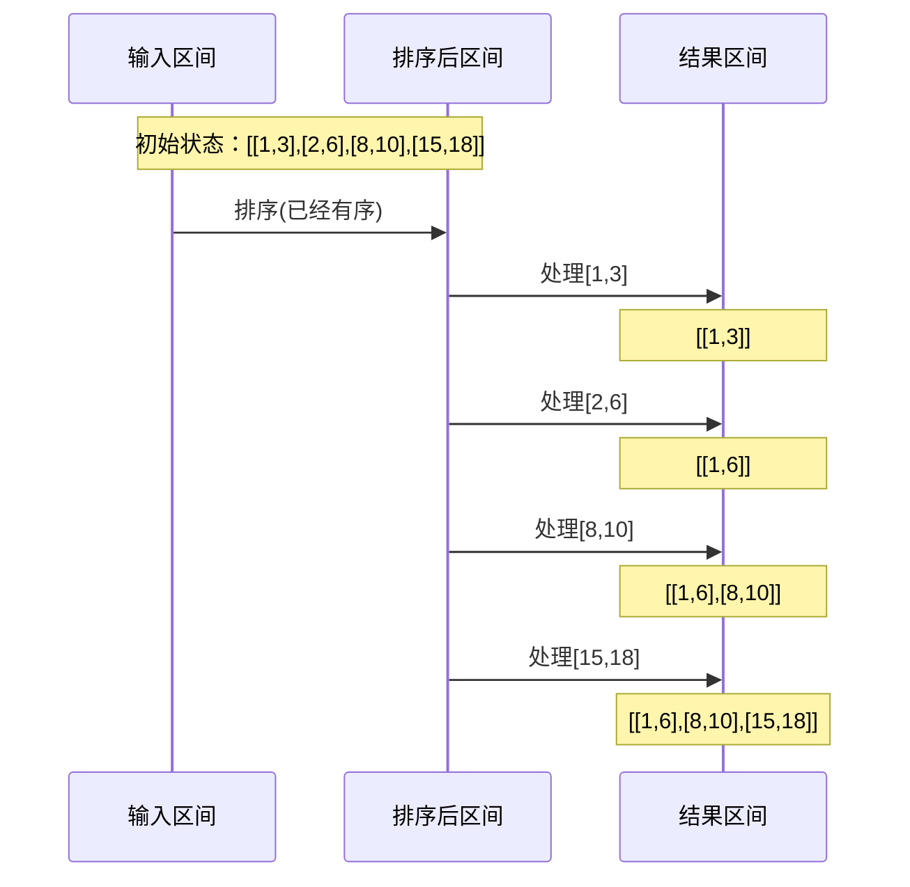

## 问题链接
https://leetcode.cn/problems/merge-intervals/

## 问题描述
以数组 intervals 表示若干个区间的集合，其中单个区间为 intervals[i] = [starti, endi] 。请你合并所有重叠的区间，并返回 一个不重叠的区间数组，该数组需恰好覆盖输入中的所有区间 。

### 示例 1：
输入：intervals = [[1,3],[2,6],[8,10],[15,18]]
输出：[[1,6],[8,10],[15,18]]
解释：区间 [1,3] 和 [2,6] 重叠, 将它们合并为 [1,6].

### 示例 2：
输入：intervals = [[1,4],[4,5]]
输出：[[1,5]]
解释：区间 [1,4] 和 [4,5] 可被视为重叠区间。

### 提示：
- 1 <= intervals.length <= 104
- intervals[i].length == 2
- 0 <= starti <= endi <= 104

## 解题思路

### 1. 排序 + 遍历（O(nlogn)）
- 首先按照区间的起始位置进行排序
- 然后遍历排序后的区间，判断相邻区间是否重叠
- 如果重叠则合并，不重叠则将当前区间加入结果集

### 2. 执行流程


#### 详细步骤说明
1. **排序**：
   - 按区间起点排序：[[1,3],[2,6],[8,10],[15,18]]

2. **处理[1,3]**：
   - 结果为空，直接加入：[[1,3]]

3. **处理[2,6]**：
   - 2 <= 3，区间重叠
   - 合并为[1,6]：[[1,6]]

4. **处理[8,10]**：
   - 8 > 6，无重叠
   - 直接加入：[[1,6],[8,10]]

5. **处理[15,18]**：
   - 15 > 10，无重叠
   - 直接加入：[[1,6],[8,10],[15,18]]

#### 算法正确性
1. **排序的必要性**：
   - 保证区间按起点有序
   - 只需要和前一个区间比较
   - 避免多余的比较操作

2. **合并的正确性**：
   - 如果当前区间起点小于等于前一区间终点，说明有重叠
   - 合并后的区间终点取两个区间终点的较大值

#### 示例分析
```cpp
// 示例1
vector<vector<int>> intervals = {{1,4},{0,2},{3,5}};
// 处理过程：
// 排序后：[[0,2],[1,4],[3,5]]
// [[0,2]]
// [[0,4]]
// [[0,5]]

// 示例2
vector<vector<int>> intervals = {{1,4},{5,6}};
// 处理过程：
// [[1,4]]
// [[1,4],[5,6]]
```

## 代码实现
```cpp
class Solution {
public:
    vector<vector<int>> merge(vector<vector<int>>& intervals) {
        if (intervals.empty()) return {};
        
        // 按区间起点排序
        sort(intervals.begin(), intervals.end());
        
        vector<vector<int>> result;
        result.push_back(intervals[0]);
        
        for (int i = 1; i < intervals.size(); i++) {
            // 当前区间的起点小于等于结果中最后一个区间的终点，说明有重叠
            if (intervals[i][0] <= result.back()[1]) {
                result.back()[1] = max(result.back()[1], intervals[i][1]);
            } else {
                result.push_back(intervals[i]);
            }
        }
        
        return result;
    }
};
```

## 复杂度分析
1. **时间复杂度**：
   - O(nlogn)，其中 n 是区间的数量
   - 主要开销在排序上
   - 遍历部分是 O(n)

2. **空间复杂度**：
   - O(n)，用于存储结果数组
   - 如果不考虑结果数组，额外空间是 O(1)

## 优化思路
1. **预处理优化**：
   - 如果区间数量小于2，直接返回
   - 可以预先分配结果数组的空间

2. **排序优化**：
   - 如果已知区间部分有序，可以使用更高效的排序算法
   - 可以考虑使用基数排序等线性时间的排序算法

3. **特殊情况处理**：
   - 处理空区间
   - 处理退化为点的区间（起点等于终点）

## 扩展问题

### 1. 插入区间
#### 问题链接
https://leetcode.cn/problems/insert-interval/

#### 问题描述
给你一个 无重叠的 ，按照区间起始端点排序的区间列表。在列表中插入一个新的区间，你需要确保列表中的区间仍然有序且不重叠。

#### 示例
输入：intervals = [[1,3],[6,9]], newInterval = [2,5]
输出：[[1,5],[6,9]]

#### 解题思路
1. 找到新区间应该插入的位置
2. 合并可能重叠的区间
3. 保持其他区间不变

#### 代码实现
```cpp
vector<vector<int>> insert(vector<vector<int>>& intervals, vector<int>& newInterval) {
    vector<vector<int>> result;
    int i = 0;
    
    // 添加所有在新区间之前的区间
    while (i < intervals.size() && intervals[i][1] < newInterval[0]) {
        result.push_back(intervals[i++]);
    }
    
    // 合并所有与新区间重叠的区间
    while (i < intervals.size() && intervals[i][0] <= newInterval[1]) {
        newInterval[0] = min(newInterval[0], intervals[i][0]);
        newInterval[1] = max(newInterval[1], intervals[i][1]);
        i++;
    }
    result.push_back(newInterval);
    
    // 添加剩余的区间
    while (i < intervals.size()) {
        result.push_back(intervals[i++]);
    }
    
    return result;
}
```

### 2. 会议室
#### 问题描述
给定一个会议时间安排的数组，每个会议时间都会包括开始和结束的时间 [[s1,e1],[s2,e2],...] (si < ei)，请你判断一个人是否能够参加所有的会议。

#### 示例
输入: [[0,30],[5,10],[15,20]]
输出: false
解释: 存在重叠区间，一个人在同一时间只能参加一个会议。

#### 解题思路
1. 按照会议开始时间排序
2. 检查相邻会议是否重叠
3. 如果有重叠则返回false

#### 代码实现
```cpp
bool canAttendMeetings(vector<vector<int>>& intervals) {
    sort(intervals.begin(), intervals.end());
    
    for (int i = 1; i < intervals.size(); i++) {
        if (intervals[i][0] < intervals[i-1][1]) {
            return false;
        }
    }
    return true;
}
```

### 3. 会议室 II
#### 问题描述
给你一个会议时间安排的数组 intervals ，每个会议时间都会包括开始和结束的时间 [[s1,e1],[s2,e2],...] ，为避免会议冲突，同时要考虑充分利用会议室资源，请你计算至少需要多少间会议室，才能满足这些会议安排。

#### 示例
输入：intervals = [[0,30],[5,10],[15,20]]
输出：2
解释：需要两个会议室
     会议室1：[0,30]
     会议室2：[5,10],[15,20]

#### 解题思路
1. 使用优先队列（最小堆）记录当前正在进行的会议的结束时间
2. 按开始时间排序
3. 遍历每个会议，更新会议室数量
##### 为什么使用优先队列？
1. **数据结构选择原因**：
   - 优先队列（最小堆）能够自动维护最早结束的会议时间
   - O(logn)的插入和删除效率
   - 堆顶始终是当前最早结束的会议时间

2. **算法思路说明**：
   - 我们需要知道当前正在进行的会议中，哪个会议最早结束
   - 当新会议开始时，需要检查是否有会议已经结束
   - 优先队列能高效地维护这个"最早结束时间"

3. **具体工作流程**：
   ```
   输入: [[0,30],[5,10],[15,20]]
   
   处理[0,30]:
   堆: [30]        需要会议室: 1
   
   处理[5,10]:
   堆: [30,10]     需要会议室: 2（因为0,30还未结束）
   
   处理[15,20]:
   堆: [30,20]     需要会议室: 2（10已结束被移除）
   ```

4. **效率分析**：
   - 每个会议时间最多入堆和出堆一次
   - 堆操作的时间复杂度是O(logn)
   - 总体时间复杂度维持在O(nlogn)

5. **相比其他方法的优势**：
   - 不需要遍历所有正在进行的会议
   - 动态维护会议结束时间
   - 空间效率好，只存要的信息

#### 代码实现
```cpp
int minMeetingRooms(vector<vector<int>>& intervals) {
    sort(intervals.begin(), intervals.end());
    priority_queue<int, vector<int>, greater<int>> pq; // 最小堆
    
    for (const auto& interval : intervals) {
        // 移除已经结束的会议
        while (!pq.empty() && pq.top() <= interval[0]) {
            pq.pop();
        }
        // 添加新会议的结束时间
        pq.push(interval[1]);
    }
    
    return pq.size();
}
```

### 4. 区间列表的交集
#### 问题描述
给定两个由一些 闭区间 组成的列表，firstList 和 secondList ，其中 firstList[i] = [starti, endi] 而 secondList[j] = [startj, endj] 。每个区间列表都是成对 不相交 的，并且 已经排序 。

返回这 两个区间列表的交集 。

#### 示例
输入：firstList = [[0,2],[5,10],[13,23],[24,25]], secondList = [[1,5],[8,12],[15,24],[25,26]]
输出：[[1,2],[5,5],[8,10],[15,23],[24,24],[25,25]]

#### 详细解题思路
1. **双指针技巧**
   - 使用两个指针 i 和 j 分别遍历两个列表
   - i 指向 firstList 当前处理的区间
   - j 指向 secondList 当前处理的区间

2. **判断重叠**
   - 两个区间的交集起点 = max(firstList[i][0], secondList[j][0])
   - 两个区间的交集终点 = min(firstList[i][1], secondList[j][1])
   - 当 起点 <= 终点 时，说明存在交集

3. **指针移动规则**
   - 移动结束位置较小的区间的指针
   - 因为结束位置更大的区间可能还会和下一个区间有交集

#### 图解示例
以输入：firstList = [[0,2],[5,10]], secondList = [[1,5],[8,12]] 为例

```
Step 1: i=0, j=0
firstList[0] = [0,2], secondList[0] = [1,5]
交集起点 = max(0,1) = 1
交集终点 = min(2,5) = 2
添加交集 [1,2]
移动 i 因为 2 < 5

Step 2: i=1, j=0
firstList[1] = [5,10], secondList[0] = [1,5]
交集起点 = max(5,1) = 5
交集终点 = min(10,5) = 5
添加交集 [5,5]
移动 j 因为 5 < 10

Step 3: i=1, j=1
firstList[1] = [5,10], secondList[1] = [8,12]
交集起点 = max(5,8) = 8
交集终点 = min(10,12) = 10
添加交集 [8,10]
移动 i 因为 10 < 12
```

#### 代码实现（带注释）
```cpp
vector<vector<int>> intervalIntersection(vector<vector<int>>& A, vector<vector<int>>& B) {
    vector<vector<int>> result;
    int i = 0, j = 0;  // 双指针初始化
    
    while (i < A.size() && j < B.size()) {
        // 计算可能的交集区间的起点和终点
        int start = max(A[i][0], B[j][0]);  // 取两个区间起点的较大值
        int end = min(A[i][1], B[j][1]);    // 取两个区间终点的较小值
        
        // 如果是有效的交集（起点小于等于终点），则加入结果集
        if (start <= end) {
            result.push_back({start, end});
        }
        
        // 移动指针：将结束位置较小的区间的指针向前移动
        // 因为结束位置更大的区间可能还会和下一个区间有交集
        if (A[i][1] < B[j][1]) {
            i++;
        } else {
            j++;
        }
    }
    
    return result;
}
```

#### 复杂度分析
1. **时间复杂度**: O(M + N)
   - M 和 N 分别是两个列表的长度
   - 每个指针最多移动一次

2. **空间复杂度**: O(M + N)
   - 用于存储结果的空间
   - 最坏情况下，所有区间都有交集

#### 特殊情况处理
1. 空列表情况
2. 无交集情况
3. 区间退化为点的情况（起点等于终点）

### 5. 用最少数量的箭引爆气球
#### 问题描述
有一些球形气球贴在一堵墙上。每个气球都标有一个数对 (xstart, xend)，表示水平直径的开始和结束坐标。你需要射出尽可能少的箭，使得所有气球都被引爆。

#### 示例
输入：points = [[10,16],[2,8],[1,6],[7,12]]
输出：2
解释：气球可以用2支箭来引爆:
- 在x = 6处发射箭可以引爆[2,8]和[1,6]两个气球
- 在x = 11处发射箭可以引爆[10,16]和[7,12]两个气球

#### 详细解题思路
1. **为什么按照结束位置排序？**
   - 如果按照开始位置排序，我们无法确保用当前箭能引爆最多的气球
   - 按照结束位置排序可以保证：如果当前气球能被引爆，那么所有结束位置更早的、与当前箭重叠的气球一定也能被引爆
   - 这样保证了贪心策略的正确性

   **反例说明**：
   考虑气球：[[1,2], [2,3], [3,4], [1,4]]
   
   ```
   按开始位置排序后：
   [1,2], [1,4], [2,3], [3,4]
   
   如果按开始位置贪心：
   1. 遇到[1,2]和[1,4]时，不知道应该在哪个位置射箭
   2. 如果选择在x=2处射箭（为了引爆[1,2]），会错过最优解
   
   而按结束位置排序后：
   [1,2], [2,3], [3,4], [1,4]
   
   按结束位置贪心：
   1. 在x=2处射第一箭，引爆[1,2]
   2. 在x=3处射第二箭，引爆[2,3]
   3. 在x=4处射第三箭，引爆[3,4]和[1,4]
   总共需要3支箭，这是最优解
   ```

   这个例子说明：
   - 按开始位置排序时，遇到开始位置相同但长度不同的区间，无法决定应该射箭的位置
   - 而按结束位置排序后，我们总是可以在当前气球的结束位置射箭，这样能保证当前决策是最优的
   - 因为如果把箭往后移，可能会错过当前气球；如果往前移，则可能需要更多的箭

2. **贪心策略详解**
   - 对于已排序的气球，我们总是将箭射在当前未被引爆的气球中最早的结束位置
   - 这样可以保证：
     * 当前箭一定能引爆这个气球
     * 同时也能引爆所有与之重叠且结束位置更晚的气球
     * 不会错过任何可能的重叠机会

#### 详细示例
以输入：points = [[10,16],[2,8],[1,6],[7,12]] 为例

```
Step 1: 按结束位置排序
[1,6], [2,8], [7,12], [10,16]

Step 2: 处理第一组气球
- 选择第一个气球的结束位置 6 作为射箭位置
- 可以引爆 [1,6]
- [2,8] 无法被这支箭引爆，因为 8 > 6
arrows = 1, pos = 6

Step 3: 处理剩余气球
- [2,8] 的开始位置 2 <= 6，但结束位置 8 > 6，需要新箭
- 在位置 8 射出第二支箭
- 可以引爆 [2,8]
arrows = 2, pos = 8

Step 4: 继续处理
- [7,12] 的开始位置 7 <= 8，结束位置 12 > 8，需要新箭
- 在位置 12 射出第三支箭
- 可以引爆 [7,12] 和 [10,16]（因为 10 <= 12 且 16 > 12）
arrows = 3, pos = 12
```

#### 贪心策略的正确性证明
1. **最优子结构**
   - 如果我们找到了前k个气球的最优解，那么添加第k+1个气球时：
     * 要么可以用现有的箭引爆
     * 要么需要新增一支箭

2. **贪心选择性质**
   - 在结束位置最早的气球上射箭是最优的，因为：
     * 如果选择在更晚的位置射箭，可能会错过当前气球
     * 如果选择在更早的位置射箭，会引爆更少的气球

#### 代码实现（带详细注释）
```cpp
int findMinArrowShots(vector<vector<int>>& points) {
    if (points.empty()) return 0;
    
    // 按照气球的结束位置排序
    sort(points.begin(), points.end(), 
         [](const vector<int>& a, const vector<int>& b) {
             return a[1] < b[1];
         });
    
    int arrows = 1;  // 至少需要一支箭
    int pos = points[0][1];  // 第一支箭射在第一个气球的结束位置
    
    // 遍历所有气球
    for (int i = 1; i < points.size(); i++) {
        // 如果当前气球的开始位置大于上一支箭的位置
        // 说明当前气球无法被上一支箭引爆，需要新箭
        if (points[i][0] > pos) {
            arrows++;  // 增加一支箭
            pos = points[i][1];  // 新箭射在当前气球的结束位置
        }
        // 否则当前气球可以被上一支箭引爆，不需要新增箭
    }
    
    return arrows;
}
```

#### 复杂度分析
1. **时间复杂度**: O(nlogn)
   - 排序需要 O(nlogn)
   - 遍历数组需要 O(n)
   - 总体复杂度由排序决定：O(nlogn)

2. **空间复杂度**: O(1)
   - 只使用了常数额外空间
   - 排序可能需要 O(logn) 的栈空间

#### 特殊情况处理
1. 空数组：直接返回0
2. 单个气球：返回1
3. 所有气球重叠：返回1
4. 没有任何气球重叠：返回气球数量
