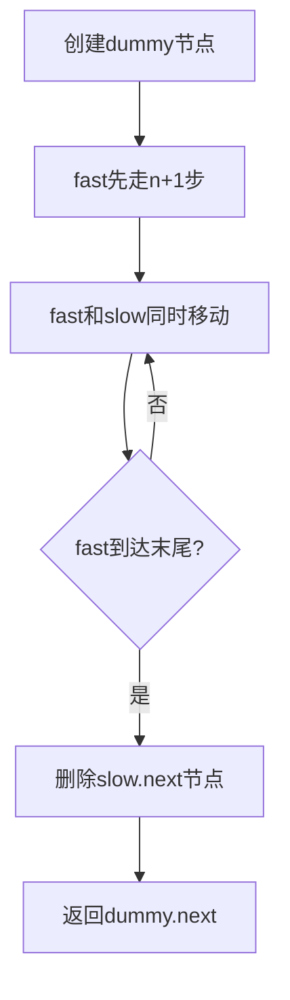

## 问题链接
https://leetcode.cn/problems/remove-nth-node-from-end-of-list/

## 问题描述
给你一个链表，删除链表的倒数第 n 个结点，并且返回链表的头结点。

### 示例 1：
```
   1 -> 2 -> 3 -> 4 -> 5
   删除倒数第2个节点后:
   1 -> 2 -> 3 -> 5
```
输入：head = [1,2,3,4,5], n = 2
输出：[1,2,3,5]

### 示例 2：
```
   1
   删除倒数第1个节点后:
   []
```
输入：head = [1], n = 1
输出：[]

### 示例 3：
```
   1 -> 2
   删除倒数第1个节点后:
   1
```
输入：head = [1,2], n = 1
输出：[1]

### 提示：
- 链表中结点的数目为 sz
- 1 <= sz <= 30
- 0 <= Node.val <= 100
- 1 <= n <= sz

## 解题思路

### 1. 两次遍历法（基础解法）
- 第一次遍历计算链表长度 L
- 第二次遍历到第 (L-n) 个节点
- 执行删除操作

### 2. 双指针法（优化解法）
- 使用快慢指针，快指针比慢指针超前n个节点
- 当快指针到达末尾时，慢指针正好在倒数第n+1个位置
- 执行删除操作

### 双指针法原理解释
- 设置dummy节点指向head，简化删除头节点的情况
- fast指针先走n+1步
- slow和fast同时走，直到fast到达末尾
- 此时slow指向要删除节点的前一个节点
- 执行删除操作：slow.next = slow.next.next

### 算法流程示意图


## 代码实现
```cpp
class Solution {
public:
    ListNode* removeNthFromEnd(ListNode* head, int n) {
        // 创建dummy节点
        ListNode* dummy = new ListNode(0);
        dummy->next = head;
        
        // 初始化快慢指针
        ListNode* fast = dummy;
        ListNode* slow = dummy;
        
        // fast先走n+1步
        for (int i = 0; i <= n; i++) {
            fast = fast->next;
        }
        
        // fast和slow同时移动
        while (fast != nullptr) {
            fast = fast->next;
            slow = slow->next;
        }
        
        // 删除目标节点
        ListNode* temp = slow->next;
        slow->next = slow->next->next;
        delete temp;
        
        // 获取结果并释放dummy节点
        ListNode* result = dummy->next;
        delete dummy;
        return result;
    }
};
```

## 复杂度分析
1. **两次遍历法**：
   - 时间复杂度：O(L)，其中L是链表长度
   - 空间复杂度：O(1)

2. **双指针法**：
   - 时间复杂度：O(L)，只需要一次遍历
   - 空间复杂度：O(1)，只需要两个指针

## 关键点解析
1. **为什么要用dummy节点？**
   - 简化删除头节点的情况
   - 避免单独处理边界条件
   - 使代码更加统一和简洁

2. **为什么fast要先走n+1步？**
   - 需要找到倒数第n+1个节点（要删除节点的前一个节点）
   - fast走n+1步后，与slow的距离为n+1
   - 当fast到达末尾时，slow正好在倒数第n+1个位置

3. **内存管理注意事项**
   - 需要释放被删除的节点
   - 需要释放dummy节点
   - 注意避免内存泄漏

## 常见错误
1. 没有处理链表为空的情况
2. 没有处理n大于链表长度的情况
3. 忘记释放被删除的节点
4. 忘记释放dummy节点
5. 删除节点时指针操作顺序错误

## 相关题目
1. 链表的中间节点
2. 环形链表
3. 相交链表

## 总结
1. 双指针技巧的应用：
   - 快慢指针可以用来解决很多链表问题
   - 通过控制指针间距离可以找到特定位置

2. 代码技巧：
   - dummy节点的使用可以简化边界情况
   - 指针操作时注意顺序
   - 注意内存管理

3. 实际应用注意事项：
   - 边界条件的处理
   - 指针操作的安全性
   - 代码的健壮性 