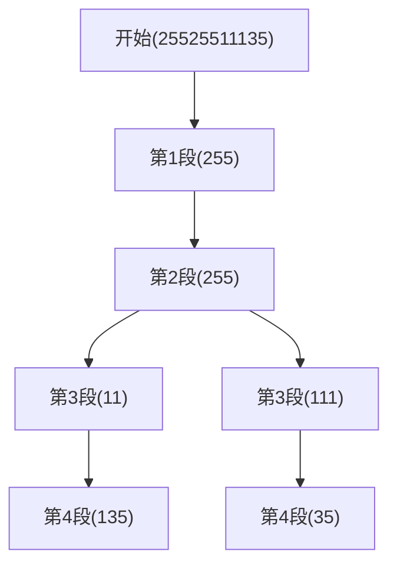

## 问题链接
https://leetcode.cn/problems/restore-ip-addresses/

## 问题描述
给定一个只包含数字的字符串 s ，用以表示一个 IP 地址，返回所有可能的有效 IP 地址，这些地址可以通过在 s 中插入 '.' 来形成。你 不能 重新排序或删除 s 中的任何数字。你可以按 任何 顺序返回答案。

有效 IP 地址 正好由四个整数（每个整数位于 0 到 255 之间组成，且不能含有前导 0），整数之间用 '.' 分隔。

例如："0.1.2.201" 和 "192.168.1.1" 是 有效 IP 地址，但是 "0.011.255.245"、"192.168.1.312" 和 "192.168@1.1" 是 无效 IP 地址。

### 示例 1：
输入：s = "25525511135"
输出：["255.255.11.135","255.255.111.35"]

### 示例 2：
输入：s = "0000"
输出：["0.0.0.0"]

### 示例 3：
输入：s = "101023"
输出：["1.0.10.23","1.0.102.3","10.1.0.23","10.10.2.3","101.0.2.3"]

### 提示：
- 1 <= s.length <= 20
- s 仅由数字组成

## 解题思路

### 1. 回溯法（基础解法）
这是一个典型的回溯问题,我们需要:
1. 将字符串分成4段
2. 每段都是有效的IP地址段(0-255之间的数字,且不能有前导0)
3. 找出所有可能的分割方案

关键点:
1. **状态定义**:
   - 当前处理到的字符串位置
   - 已经分割出的IP段数
   - 当前构建的IP地址

2. **回溯过程**:
   - 选择:在当前位置尝试截取1-3个字符作为新的IP段
   - 约束:截取的段必须是有效的IP地址段
   - 结束:找到4段且用完所有字符/无法找到有效方案

3. **剪枝条件**:
   - 剩余字符数不足以构成剩余的IP段
   - 剩余字符数过多,无法构成有效的IP段
   - 当前截取的段不是有效的IP地址段

### 回溯过程示意图


## 代码实现
```cpp
class Solution {
public:
    vector<string> restoreIpAddresses(string s) {
        vector<string> result;
        string current;
        backtrack(s, 0, 0, current, result);
        return result;
    }
    
private:
    // s: 输入字符串
    // pos: 当前处理的位置
    // segment: 已经分割出的段数
    // current: 当前构建的IP地址
    // result: 存储所有有效的IP地址
    void backtrack(const string& s, int pos, int segment, string current, vector<string>& result) {
        // 找到一个有效方案
        if (segment == 4 && pos == s.length()) {
            result.push_back(current.substr(0, current.length()-1));  // 去掉最后的点
            return;
        }
        
        // 剪枝：段数超过4或已处理完所有字符
        if (segment == 4 || pos == s.length()) {
            return;
        }
        
        // 剪枝：剩余字符数过多或过少
        int remainLen = s.length() - pos;
        if (remainLen > (4 - segment) * 3 || remainLen < (4 - segment)) {
            return;
        }
        
        // 尝试截取1-3个字符作为新的IP段
        int num = 0;
        for (int i = 0; i < 3 && pos + i < s.length(); i++) {
            num = num * 10 + (s[pos + i] - '0');
            
            // 检查是否是有效的IP段
            if (num <= 255 && (i == 0 || s[pos] != '0')) {
                backtrack(s, pos + i + 1, segment + 1, 
                         current + s.substr(pos, i + 1) + ".", result);
            }
            
            // 剪枝：大于255的数字无需继续尝试
            if (num > 255) {
                break;
            }
        }
    }
};
```

## 复杂度分析
1. **时间复杂度**: O(3^4)
   - 每个位置可以选择截取1、2或3个字符
   - 总共需要截取4段
   - 实际复杂度会低于这个上界,因为有剪枝优化

2. **空间复杂度**: O(4)
   - 递归深度最多为4
   - 不考虑存储结果的空间

## 优化思路

### 1. 字符串预处理
可以在开始前检查字符串的一些基本条件:
```cpp
bool isValid(const string& s) {
    // 长度检查
    if (s.length() < 4 || s.length() > 12) return false;
    
    // 字符检查
    for (char c : s) {
        if (!isdigit(c)) return false;
    }
    
    return true;
}
```

### 2. 段验证优化
将IP段的验证逻辑独立出来:
```cpp
bool isValidSegment(const string& s, int start, int len) {
    // 长度为0或超过3的段无效
    if (len == 0 || len > 3) return false;
    
    // 有前导0的段无效
    if (len > 1 && s[start] == '0') return false;
    
    // 计算段的值
    int val = 0;
    for (int i = 0; i < len; i++) {
        val = val * 10 + (s[start + i] - '0');
    }
    
    return val <= 255;
}
```

### 3. 迭代实现
除了递归回溯,也可以使用迭代方式实现:
```cpp
vector<string> restoreIpAddresses(string s) {
    vector<string> result;
    int n = s.length();
    
    // i,j,k表示三个点的位置
    for (int i = 1; i < 4 && i < n-2; i++) {
        for (int j = i+1; j < i+4 && j < n-1; j++) {
            for (int k = j+1; k < j+4 && k < n; k++) {
                string s1 = s.substr(0, i);
                string s2 = s.substr(i, j-i);
                string s3 = s.substr(j, k-j);
                string s4 = s.substr(k);
                
                if (isValidSegment(s1) && isValidSegment(s2) &&
                    isValidSegment(s3) && isValidSegment(s4)) {
                    result.push_back(s1 + "." + s2 + "." + s3 + "." + s4);
                }
            }
        }
    }
    
    return result;
}

bool isValidSegment(string s) {
    if (s.length() > 3 || s.empty() || 
        (s.length() > 1 && s[0] == '0')) return false;
    int val = stoi(s);
    return val <= 255;
}
```

## 扩展问题

### 1. IP地址验证
#### 问题描述
给定一个字符串,判断是否是有效的IP地址。

#### 解题思路
1. 分割字符串
2. 验证每个段的有效性
3. 检查段数是否为4

```cpp
bool isValidIP(string IP) {
    // 分割字符串
    vector<string> segments;
    string segment;
    stringstream ss(IP);
    while (getline(ss, segment, '.')) {
        segments.push_back(segment);
    }
    
    // 检查段数
    if (segments.size() != 4) return false;
    
    // 验证每个段
    for (const string& s : segments) {
        if (!isValidSegment(s)) return false;
    }
    
    return true;
}
```

### 2. IPv6地址复原
#### 问题描述
类似的问题也可以扩展到IPv6地址的复原。

#### 主要区别
1. IPv6有8个段
2. 每段是16进制数
3. 每段固定4位
4. 可以省略前导0
5. 可以用::表示一组0

#### 示例实现
```cpp
class Solution {
public:
    string validIPv6(string IP) {
        vector<string> segments;
        string segment;
        stringstream ss(IP);
        
        // 分割字符串
        while (getline(ss, segment, ':')) {
            segments.push_back(segment);
        }
        
        // 基本检查
        if (segments.size() != 8) return "Neither";
        
        // 验证每个段
        for (const string& s : segments) {
            if (!isValidIPv6Segment(s)) return "Neither";
        }
        
        return "IPv6";
    }
    
private:
    bool isValidIPv6Segment(const string& s) {
        if (s.empty() || s.length() > 4) return false;
        
        for (char c : s) {
            if (!isxdigit(c)) return false;
        }
        
        return true;
    }
};
```

### 3. CIDR地址块计算
#### 问题描述
给定一个IP地址和子网掩码,计算该网段包含的所有IP地址。

#### 解题思路
1. 将IP地址转换为32位整数
2. 根据子网��码计算网段范围
3. 生成范围内的所有IP地址

```cpp
class Solution {
public:
    vector<string> ipRange(string ip, int mask) {
        vector<string> result;
        
        // 将IP转换为整数
        unsigned int ipInt = ipToInt(ip);
        
        // 计算网段范围
        unsigned int netmask = 0xFFFFFFFF << (32 - mask);
        unsigned int network = ipInt & netmask;
        unsigned int broadcast = network | (~netmask);
        
        // 生成范围内的IP
        for (unsigned int i = network + 1; i < broadcast; i++) {
            result.push_back(intToIp(i));
        }
        
        return result;
    }
    
private:
    unsigned int ipToInt(const string& ip) {
        unsigned int result = 0;
        vector<string> segments;
        string segment;
        stringstream ss(ip);
        
        while (getline(ss, segment, '.')) {
            result = (result << 8) + stoi(segment);
        }
        
        return result;
    }
    
    string intToIp(unsigned int ip) {
        return to_string(ip >> 24) + "." +
               to_string((ip >> 16) & 0xFF) + "." +
               to_string((ip >> 8) & 0xFF) + "." +
               to_string(ip & 0xFF);
    }
};
```

## 总结

### 1. 关键要点
1. **问题分析**
   - 理解IP地址的格式要求
   - 识别回溯法的适用性
   - 明确约束条件

2. **解题技巧**
   - 合理使用剪枝优化
   - 注意边界情况处理
   - 灵活运用字符串操作

3. **代码实现**
   - 模块化设计
   - 清晰的变量命名
   - 完善的注释

### 2. 常见错误
1. **边界处理**
   - 忽略空字符串
   - 未处理前导零
   - 段长度判断错误

2. **剪枝条件**
   - 剪枝条件不完整
   - 剪枝条件过于严格
   - 剪枝位置不当

3. **结果处理**
   - 未去除最后的点
   - 重复结果未去重
   - 结果格式错误

### 3. 扩展思考
1. **算法扩展**
   - 其他进制的IP地址
   - 更一般的字符串分割问题
   - 网络地址转换问题

2. **实际应用**
   - IP地址池管理
   - 网络配置验证
   - 防火墙规则设置

3. **性能优化**
   - 预处理优化
   - 内存使用优化
   - 并行处理可能性

### 4. 代码质量建议
1. **可读性**
   - 使用有意义的变量名
   - 添加必要的注释
   - 保持代码结构清晰

2. **可维护性**
   - 模块化设计
   - 避免代码重复
   - 考虑代码复用

3. **健壮性**
   - 完善的输入验证
   - 异常情况处理
   - 边界条件测试 