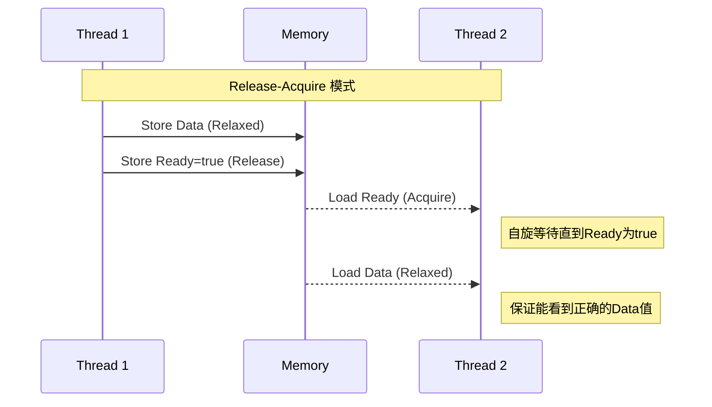
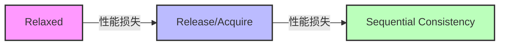
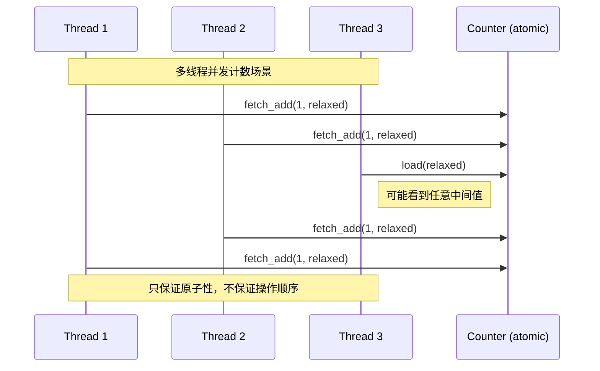
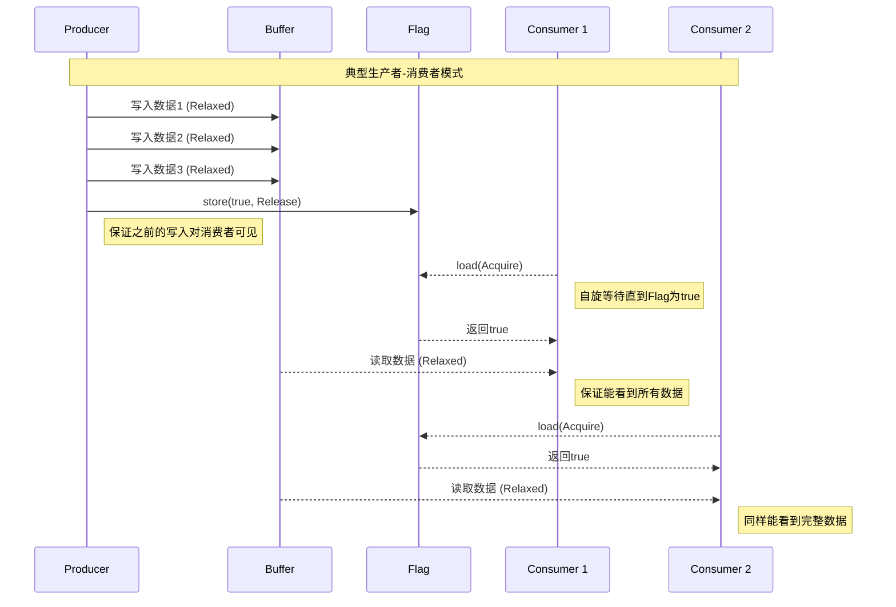
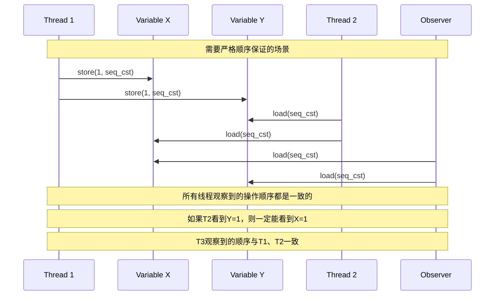

# C++内存序（Memory Order）详解

## 1. 基本概念

内存序（Memory Order）定义了多线程程序中共享变量的访问规则，主要用于控制原子操作的执行顺序。C++提供了6种内存序：

1. `memory_order_relaxed`: 最宽松的内存序，只保证原子性
2. `memory_order_consume`: 保证当前线程中依赖于该原子变量的操作不会重排
3. `memory_order_acquire`: 读取操作，保证后续读写不会重排到这个操作之前
4. `memory_order_release`: 写入操作，保证之前的读写不会重排到这个操作之后
5. `memory_order_acq_rel`: 组合了acquire和release的语义
6. `memory_order_seq_cst`: 最严格的内存序，保证全序关系

## 2. 示例代码

### 2.1 Relaxed序示例

```cpp
#include <atomic>
#include <thread>
#include <iostream>

std::atomic<int> x{0};
std::atomic<int> y{0};

void thread1() {
    x.store(1, std::memory_order_relaxed);  // A
    y.store(2, std::memory_order_relaxed);  // B
}

void thread2() {
    int y_val = y.load(std::memory_order_relaxed);  // C
    int x_val = x.load(std::memory_order_relaxed);  // D
    std::cout << "y=" << y_val << ", x=" << x_val << std::endl;
}
```

### 2.2 Release-Acquire序示例

```cpp
#include <atomic>
#include <thread>
#include <iostream>

std::atomic<int> data{0};
std::atomic<bool> ready{false};

void producer() {
    data.store(42, std::memory_order_relaxed);  // 准备数据
    ready.store(true, std::memory_order_release);  // 发布
}

void consumer() {
    while (!ready.load(std::memory_order_acquire)) {}  // 获取
    assert(data.load(std::memory_order_relaxed) == 42);  // 一定成功
}
```

### 2.3 Sequential Consistency示例

```cpp
#include <atomic>
#include <thread>
#include <iostream>

std::atomic<int> counter{0};

void increment() {
    counter.fetch_add(1, std::memory_order_seq_cst);
}

void read() {
    int value = counter.load(std::memory_order_seq_cst);
    std::cout << "Counter value: " << value << std::endl;
}
```

## 3. 不同内存序的时序图



## 4. 常见使用场景

1. Relaxed序：
   - 计数器累加
   - 不需要同步的状态标志

2. Release-Acquire序：
   - 生产者-消费者模式
   - 线程间通信
   - 数据发布

3. Sequential Consistency：
   - 需要严格顺序保证的场景
   - 调试和验证
   - 简单但性能要求不高的场景

## 5. 性能考虑

内存序从松到严的性能开销：
1. Relaxed (最快)
2. Release/Acquire
3. Sequential Consistency (最慢)



## 6. 详细场景时序图

### 6.1 Relaxed序 - 多线程计数器场景



### 6.2 Release-Acquire序 - 生产者消费者场景



### 6.3 Sequential Consistency - 严格顺序场景



### 说明：

1. **Relaxed序场景**：
   - 适用于简单的计数器场景
   - 多个线程可以并发递增计数器
   - 不保证读取操作能看到最新值
   - 但保证每次递增操作是原子的

2. **Release-Acquire序场景**：
   - 生产者写入多个数据后，通过flag发布
   - 消费者首先获取flag状态
   - 一旦flag为true，保证能看到之前写入的所有数据
   - 多个消费者都能正确看到完整数据

3. **Sequential Consistency序场景**：
   - 所有操作都有严格的全局顺序
   - 所有线程观察到的顺序是一致的
   - 适合需要严格同步的场景
   - 性能开销最大，但最容易推理
