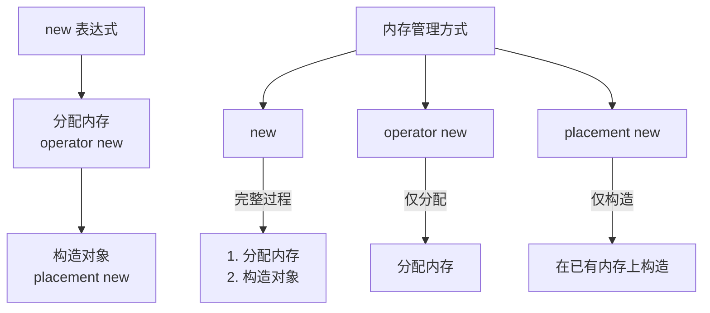
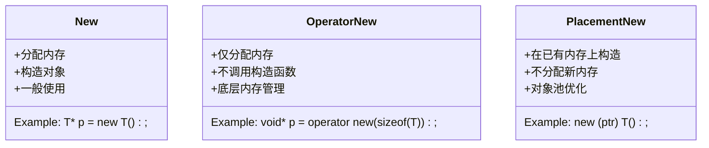
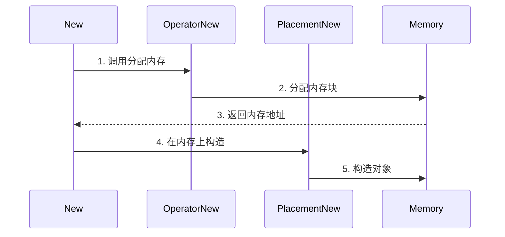
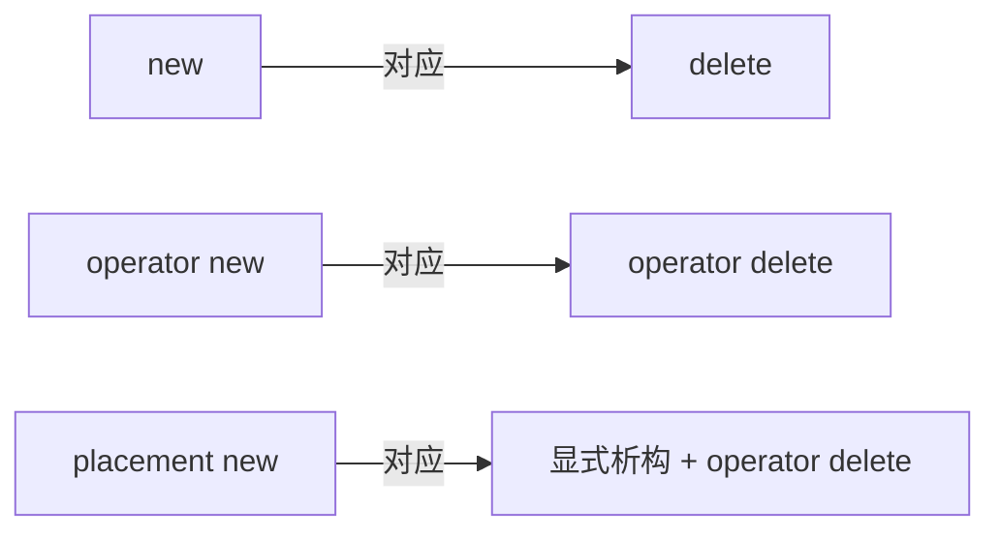

### 10.1 new 相关操作对比



### 10.2 三种方式的使用场景



### 10.3 内存管理流程



### 10.4 主要特点对比：

1. **new 表达式**
   - 完整的对象创建过程
   - 自动处理内存分配和构造
   - 最常用的对象创建方式

2. **operator new**
   - 仅负责内存分配
   - 类似于 malloc
   - 可以重载以自定义内存分配策略

3. **placement new**
   - 在已分配的内存上构造对象
   - 不进行内存分配
   - 用于优化内存管理和对象池实现

### 10.5 使用示例：

```cpp
// new 表达式
T* p1 = new T();

// operator new
void* memory = operator new(sizeof(T));

// placement new
T* p2 = new (memory) T();
```

### 10.6 析构对应关系：

