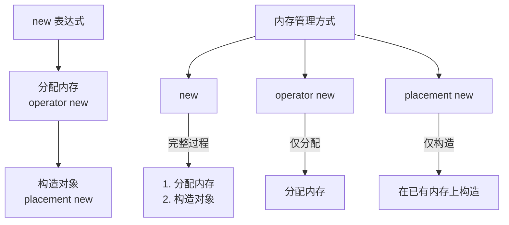
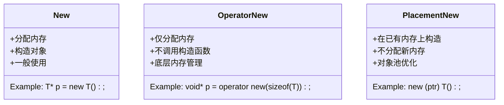
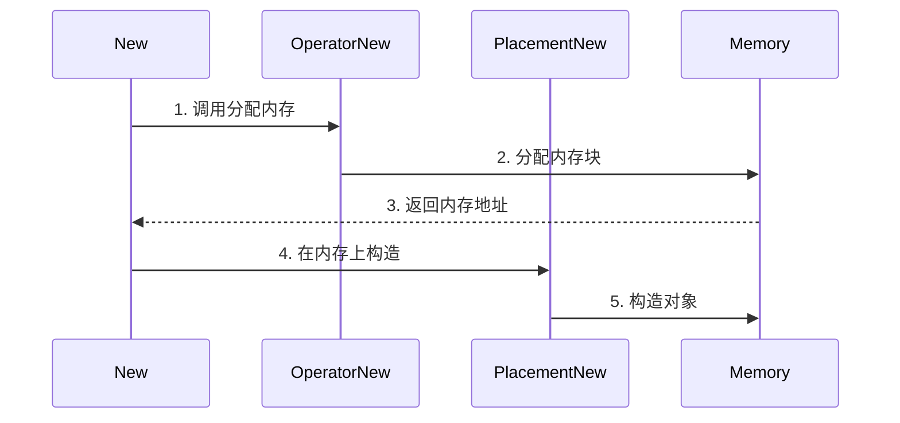
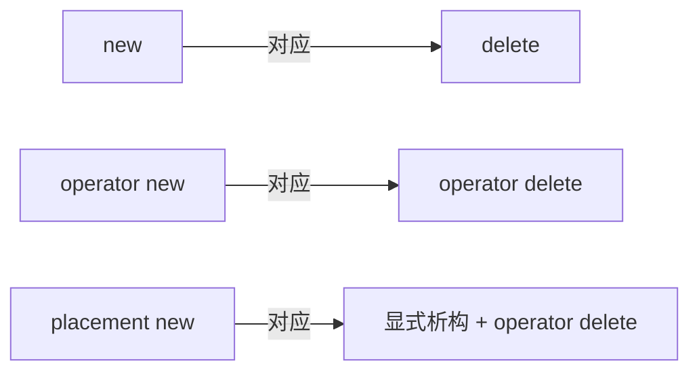

# Stack 容器设计文档

## 1. 基础结构设计

### 1.1 节点设计
```cpp
private:
struct Node {
    T data;
    Node* next;
    Node(const T& value) : data(value), next(nullptr) {}
};
```
- 采用链表实现，避免动态扩容问题
- 节点包含数据和下一节点指针
- 节点构造函数确保 next 指针初始化为 nullptr

### 1.2 成员变量
```cpp
private:
    Node top; // 栈顶指针
    size_t size_; // 当前栈大小
```
- 维护栈顶指针，支持 O(1) 的压栈和出栈操作
- 显式维护大小信息，避免遍历计算

## 2. 资源管理

### 2.1 析构函数
```cpp
~Stack() {
    while (!empty()) {
        pop();
    }
}
```
- 确保所有节点被正确释放
- 使用已有的 pop 操作简化实现
- 符合 RAII 原则

## 3. 拷贝语义

### 3.1 拷贝构造函数
```cpp
Stack(const Stack& other) : top_(nullptr), size_(0) {
    if (!other.empty()) {
    // ... 深拷贝实现
    }
}
```
- 实现深拷贝，创建新的节点链
- 保持原有栈的顺序
- 正确处理空栈情况

### 3.2 拷贝赋值运算符
```cpp
Stack& operator=(const Stack& other) {
    if (this != &other) {
        Stack temp(other); // 拷贝构造
        // 并交换习语
        std::swap(top_, temp.top_);
        std::swap(size_, temp.size_);
    }
    return this;
}
```
- 使用拷贝并交换习语
- 保证异常安全性
- 处理自赋值情况

## 4. 移动语义

### 4.1 移动构造函数
```cpp
Stack(Stack&& other) noexcept
: top_(other.top_), size_(other.size_) {
    other.top_ = nullptr;
    other.size_ = 0;
}
```
- 直接转移资源所有权
- 将源对象置于有效但空的状态
- noexcept 保证

### 4.2 移动赋值运算符
```cpp
Stack& operator=(Stack&& other) noexcept {
    if (this != &other) {
        // ... 移动实现
    }
    return this;
}

```
- 确保资源正确转移
- 处理自赋值情况
- 提供 noexcept 保证

## 5. 核心操作

### 5.1 压栈操作
```cpp
void push(const T& value) {
    Node new_node = new Node(value);
    new_node->next = top_;
    top_ = new_node;
    ++size_;
}
```
- O(1) 时间复杂度
- 维护 size_ 计数
- 异常安全

### 5.2 出栈操作
```cpp
void pop() {
    if (empty()) {
        throw std::runtime_error("Stack is empty");
    }
    Node temp = top_;
    top_ = top_->next;
    delete temp;
    --size_;
}
```
- 包含边界检查
- 正确释放内存
- 维护 size_ 计数

## 6. 访问操作

### 6.1 栈顶元素访问
```cpp
T& top();
const T& top() const;
```
- 提供 const 和非 const 重载
- 返回引用避免拷贝
- 包含空栈检查

### 6.2 状态查询
```cpp
bool empty() const;
size_t size() const;
```
- 提供基本的状态查询功能
- const 限定确保不修改栈状态

## 7. 设计特点

### 7.1 异常安全性
- 基本操作提供强异常安全保证
- 资源管理遵循 RAII 原则
- 适当的错误检查和异常抛出

### 7.2 性能特征
- 主要操作 O(1) 时间复杂度
- 避免不必要的内存分配
- 高效的移动语义支持

### 7.3 接口设计
- 符合 STL 容器的一般规范
- 提供完整的值语义支持
- 清晰的资源所有权管理

## 8. 使用示例
```cpp
Stack<int> s;
s.push(1);
s.push(2);
std::cout << s.top(); // 输出: 2
s.pop();
std::cout << s.top(); // 输出: 1
```

## 9. 未来改进方向

1. 添加迭代器支持
2. 实现更多标准容器接口
3. 考虑添加 emplace 操作
4. 优化内存分配策略
5. 添加更多异常安全保证

## 10. 内存管理机制

### 10.1 new 相关操作对比



### 10.2 三种方式的使用场景



### 10.3 内存管理流程



### 10.4 主要特点对比：

1. **new 表达式**
   - 完整的对象创建过程
   - 自动处理内存分配和构造
   - 最常用的对象创建方式

2. **operator new**
   - 仅负责内存分配
   - 类似于 malloc
   - 可以重载以自定义内存分配策略

3. **placement new**
   - 在已分配的内存上构造对象
   - 不进行内存分配
   - 用于优化内存管理和对象池实现

### 10.5 使用示例：

```cpp
// new 表达式
T* p1 = new T();

// operator new
void* memory = operator new(sizeof(T));

// placement new
T* p2 = new (memory) T();
```

### 10.6 析构对应关系：

