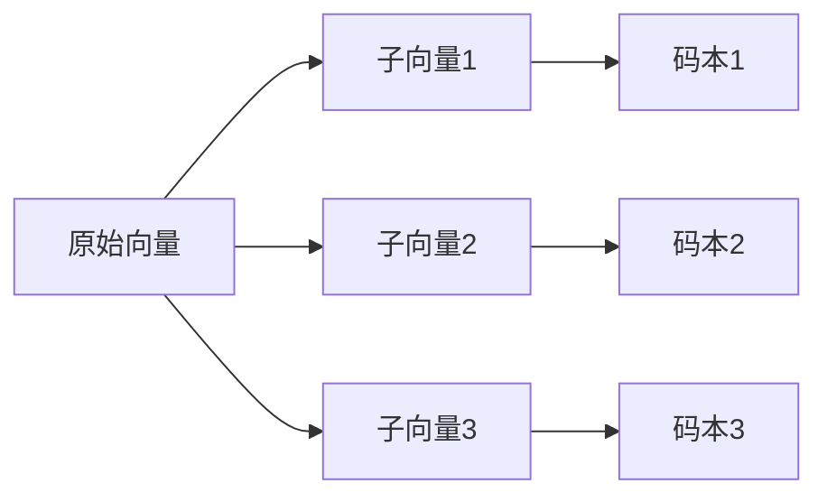
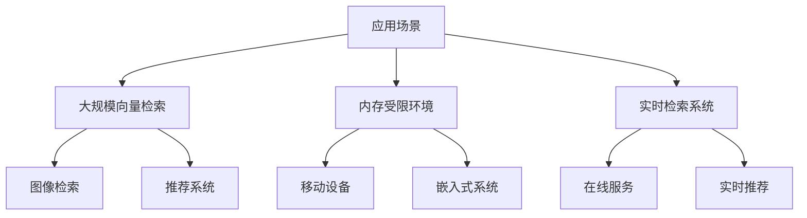

```thinking
让我深入思考一下这两种量化方式的具体实现细节...

标量量化相对简单,主要是线性映射的过程。但乘积量化涉及到更复杂的向量空间划分和聚类。

需要从以下几个方面展开:
1. 基本原理和数学表达
2. 具体实现步骤
3. 优缺点分析
4. 实际应用场景
5. 代码示例说明

对于标量量化:
- 需要确定映射范围
- 计算量化步长
- 处理边界情况
- 考虑精度损失

对于乘积量化:
- 子空间划分策略
- 聚类中心的选择
- 码本的构建和存储
- 距离计算的加速

让我系统地组织这些内容...
```

# 向量量化详解

## 1. 标量量化(Scalar Quantization)

### 1.1 基本原理
标量量化是将浮点数映射到整数的过程,主要通过线性映射实现。

```python
# 基本映射公式
quantized = round((x - min_val) * (2^bits - 1) / (max_val - min_val))
```

### 1.2 实现步骤

1. 确定数值范围
```python
def find_range(vectors):
    min_val = np.min(vectors)
    max_val = np.max(vectors)
    return min_val, max_val
```

2. 计算量化参数
```python
def compute_scale(min_val, max_val, bits=8):
    # 计算缩放因子
    scale = (2**bits - 1) / (max_val - min_val)
    # 计算零点偏移
    zero_point = round(-min_val * scale)
    return scale, zero_point
```

3. 执行量化
```python
def quantize(x, scale, zero_point, bits=8):
    # 量化到整数
    qx = np.clip(round(x * scale + zero_point), 0, 2**bits - 1)
    return qx.astype(np.uint8)
```

4. 反量化
```python
def dequantize(qx, scale, zero_point):
    # 还原浮点数
    return (qx - zero_point) / scale
```

### 1.3 特点分析

优点:
- 实现简单
- 计算开销小
- 压缩比固定(32位→8位,压缩率75%)

缺点:
- 精度损失较大
- 不考虑向量维度间的相关性
- 压缩率有限

## 2. 乘积量化(Product Quantization)

### 2.1 基本原理

乘积量化将高维向量分成多个子向量,对每个子向量独立进行量化。



### 2.2 实现步骤

1. 向量分段
```python
def split_vectors(vectors, n_subvectors):
    # 将向量分成n_subvectors段
    d = vectors.shape[1]
    d_sub = d // n_subvectors
    return np.split(vectors, n_subvectors, axis=1)
```

2. 训练码本
```python
def train_codebook(sub_vectors, n_clusters=256):
    # 对每个子空间进行K-means聚类
    kmeans = KMeans(n_clusters=n_clusters)
    kmeans.fit(sub_vectors)
    return kmeans.cluster_centers_
```

3. 编码向量
```python
def encode_vectors(sub_vectors, codebook):
    # 找到最近的聚类中心
    distances = cdist(sub_vectors, codebook)
    codes = np.argmin(distances, axis=1)
    return codes.astype(np.uint8)
```

4. 计算距离
```python
def compute_distance(query, codes, codebooks):
    # 预计算距离表
    tables = [cdist([q], cb) for q, cb in zip(query, codebooks)]
    # 查表计算距离
    distances = sum(table[0][code] for table, code in zip(tables, codes))
    return distances
```

### 2.3 优化技巧

1. 子空间划分
```python
# 均匀划分
d_sub = d // n_subvectors

# 基于方差的自适应划分
def adaptive_split(vectors):
    variances = np.var(vectors, axis=0)
    # 根据方差大小划分子空间
    return split_points
```

2. 码本训练
```python
# 分批训练大规模数据
def train_codebook_batch(vectors, batch_size=10000):
    for batch in get_batches(vectors, batch_size):
        update_codebook(batch)
```

3. 距离计算加速
```python
# 使用SIMD指令加速
def fast_distance(query, codes, codebooks):
    # 使用numpy的向量化操作
    tables = np.array([cdist([q], cb) for q, cb in zip(query, codebooks)])
    return np.sum(tables[np.arange(len(tables)), codes], axis=0)
```

### 2.4 特点分析

优点:
- 压缩率高(可达1/8或更高)
- 保留向量间的相似关系
- 支持快速距离计算

缺点:
- 实现复杂
- 训练时间长
- 需要存储码本

### 2.5 应用场景



## 3. 实际应用建议

### 3.1 选择建议
- 数据量小,精度要求高: 使用标量量化
- 数据量大,内存受限: 使用乘积量化
- 需要快速检索: 优先考虑乘积量化

### 3.2 参数调优
- 标量量化: 主要调整bits参数
- 乘积量化: 
  - 子空间数量
  - 聚类中心数
  - 训练样本量

### 3.3 性能优化
- 使用numpy向量化操作
- 利用GPU加速训练
- 实现缓存友好的数据结构
