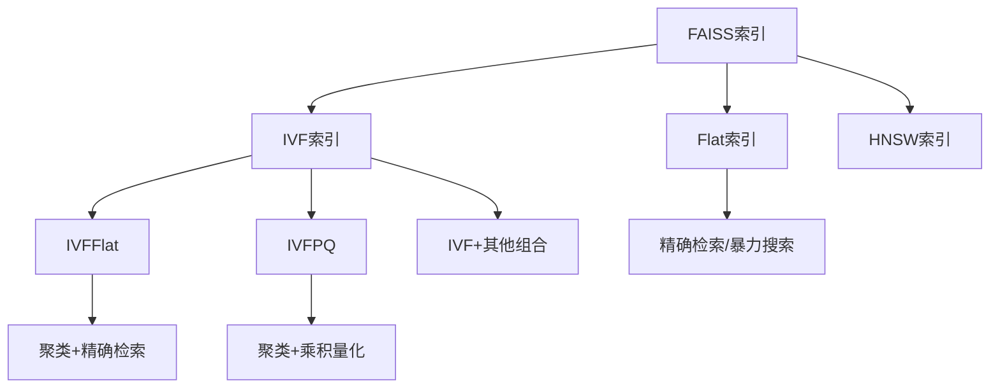
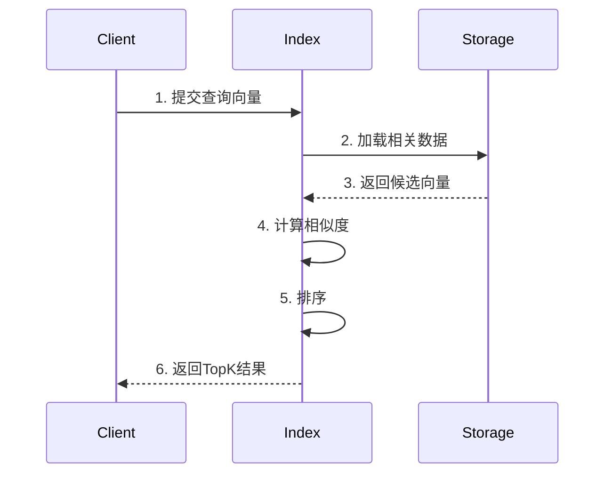
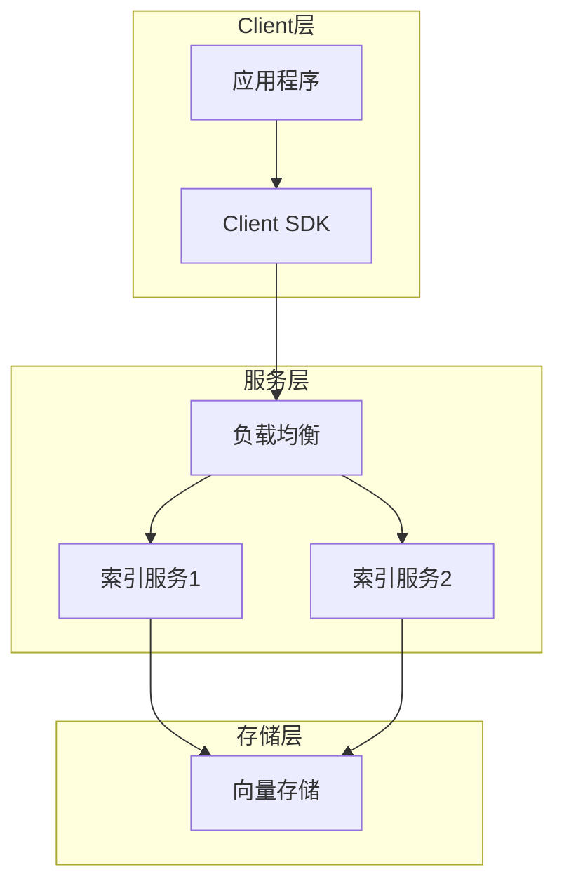
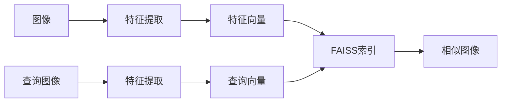
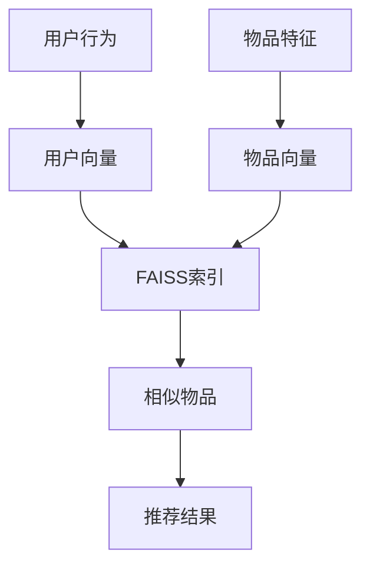

```thinking
让我思考一下如何更系统地组织FAISS基础概念的文档...

首先需要从最基本的向量检索问题出发:
1. 什么是向量检索?为什么需要它?
2. 向量检索面临的主要挑战是什么?

然后是核心概念:
1. 向量相似度计算方法需要详细解释
2. 各种索引结构的基本原理
3. 量化压缩的概念
4. 评估指标的定义

文档结构应该是:
1. 先介绍问题背景
2. 再讲解基础概念
3. 然后是核心技术
4. 最后是实际应用

需要加入一些图示来帮助理解。
每个概念都要有清晰的定义和示例。
要突出重点和难点。

让我来组织这个文档...
```

# FAISS基础概念

## 1. 向量检索简介

### 1.1 什么是向量检索
向量检索(Vector Search)是在向量空间中找到与给定查询向量最相似的向量的过程。在现代机器学习应用中,图像、文本、音频等数据通常被编码为高维向量,因此高效的向量检索成为一个关键技术。

### 1.2 应用场景
- 图像检索:查找相似图片
- 推荐系统:基于物品或用户向量的相似度推荐
- 语义搜索:基于文本向量的相似度匹配
- 人脸识别:特征向量匹配

### 1.3 主要挑战
- 维度灾难:向量维度增加导致计算复杂度指数增长
- 计算开销:海量向量的相似度计算非常耗时
- 存储开销:原始向量占用大量内存
- 召回精度:需要在查询速度和结果准确性之间权衡

## 2. 向量相似度计算

### 2.1 欧氏距离(L2 Distance)
- 定义:两个向量各维度差值的平方和的平方根
- 公式: d(x,y) = sqrt(∑(xi-yi)²)
- 特点:反映向量间的绝对距离,值越小表示越相似
- 适用场景:向量元素是实数,且数值大小有实际意义

### 2.2 内积(Inner Product)
- 定义:两个向量对应维度乘积的和
- 公式: d(x,y) = ∑(xi*yi)
- 特点:反映向量方向的相似度,值越大表示越相似
- 适用场景:向量已经归一化的情况

### 2.3 余弦相似度(Cosine Similarity)
- 定义:两个向量夹角的余弦值
- 公式: cos(θ) = (x·y)/(|x|*|y|)
- 特点:只关注向量方向,不考虑大小,取值范围[-1,1]
- 适用场景:需要忽略向量模长的影响时

## 3. FAISS核心特性

### 3.1 索引类型



- **Flat索引**:暴力搜索,无损索引
  - 原理:直接计算查询向量与所有向量的距离
  - 优点:结果准确
  - 缺点:计算量大,适合小规模数据
  
- **IVF索引**:基于聚类的倒排索引
  - 原理:将向量空间划分为多个聚类,搜索时只需检索部分聚类
  - 优点:大幅提升搜索速度
  - 缺点:召回率可能下降

- **HNSW索引**:层次化可导航小世界图
  - 原理:构建多层图结构,实现对数复杂度的搜索
  - 优点:高速搜索,高召回率
  - 缺点:内存占用较大

#### 向量检索基本流程


### 3.2 向量压缩
- **标量量化(Scalar Quantization)**
  - 将每个维度的浮点数映射到整数
  - 可以将32位浮点数压缩到8位
  
- **乘积量化(Product Quantization)**
  - 将向量分成多个子向量分别量化
  - 显著降低存储空间和距离计算开销

### 3.3 硬件加速
- CPU优化:使用SIMD指令集加速计算
- GPU支持:可利用GPU并行计算能力
- 多GPU支持:支持多GPU分布式计算
### 3.4 训练过程

#### 索引训练流程


- 数据预处理
  - 向量归一化
  - 降维处理
  - 异常值处理
  
- 聚类训练
  - 选择聚类中心数量
  - K-means聚类
  - 更新聚类中心

- 量化器训练
  - 子空间划分
  - 码本学习
  - 量化参数优化

### 3.5 系统架构



## 4. 性能评估指标

### 4.1 准确性指标
- **Recall@K**: TopK结果中的正确结果比例
- **Precision@K**: 检索到的K个结果中正确的比例
- **平均精度(mAP)**: 不同K值下准确率的平均值

### 4.2 效率指标
- **QPS(Queries Per Second)**: 每秒处理的查询数
- **延迟(Latency)**: 单次查询的响应时间
- **内存占用**: 索引结构的内存使用量
- **索引大小**: 磁盘存储空间占用

## 5. 最佳实践

### 5.1 索引选择建议
- 数据量<1M: 可以使用Flat索引 100w级别
- 数据量1M-10M: 推荐IVF索引 1000w级别
- 数据量>10M: 考虑IVF+PQ或HNSW 1亿级别
- 对精度要求高: 优先考虑HNSW
- 内存受限: 使用带PQ的索引类型
让我计算一下具体的存储空间:

假设一个常见场景:
- 每个向量是768维(比如BERT的输出)
- 每个维度用float32存储(4字节)

那么:
- 单个向量大小 = 768 * 4 = 3072字节 ≈ 3KB
- 100万个向量总大小 = 3KB * 1,000,000 = 3GB

再看看其他常见维度:
- 128维(小型embedding): 512字节/向量,100万个约500MB
- 256维(中型embedding): 1024字节/向量,100万个约1GB 
- 512维(大型embedding): 2048字节/向量,100万个约2GB

所以当FAISS文档说1M时,指的是:
1. 向量数量级:100万条向量
2. 存储空间:根据维度不同,从几百MB到几GB不等

### 5.2 参数调优要点
- nlist: 聚类中心数,通常设置为sqrt(N)
- nprobe: 搜索聚类数,权衡速度和召回率
- M: HNSW图的连接数,影响索引质量
- efConstruction: HNSW建图质量参数

## 6. 常见问题与解决方案

### 6.1 性能问题
- **问题**: 查询延迟高
  - 原因: 数据量大,维度高
  - 解决: 使用IVF索引,调整nprobe
  
- **问题**: 内存占用大
  - 原因: 原始向量存储
  - 解决: 使用PQ压缩

- **问题**: 召回率低
  - 原因: nprobe值过小
  - 解决: 增加nprobe,使用更精确的索引

### 6.2 实现问题
- **问题**: 索引训练慢
  - 原因: 训练数据量大
  - 解决: 使用采样训练

- **问题**: GPU内存不足
  - 原因: batch_size过大
  - 解决: 减小batch_size,使用多GPU

## 7. 与其他系统对比

### 7.1 功能对比
| 特性 | FAISS | Milvus | Elasticsearch |
|------|-------|--------|---------------|
|向量索引|丰富|丰富|基础|
|分布式|支持|原生支持|原生支持|
|存储方式|内存|混合|混合|
|易用性|一般|好|好|
|成熟度|高|中|高|

### 7.2 性能对比
- FAISS: 
  - 优点: 性能最优
  - 缺点: 部署复杂
  
- Milvus:
  - 优点: 易用性好
  - 缺点: 资源占用大
  
- Elasticsearch:
  - 优点: 生态完善
  - 缺点: 向量检索性能一般

## 8. 应用案例

### 8.1 图像检索系统


### 8.2 推荐系统


## 9. 未来发展方向

### 9.1 技术趋势
- 支持更大规模数据
- 更高效的压缩算法
- 更好的分布式支持
- 与深度学习框架深度集成

### 9.2 应用趋势
- 多模态检索
- 实时检索
- 联邦学习支持
- 隐私保护检索

## 10. 参考资源

### 10.1 官方资源
- [FAISS GitHub](https://github.com/facebookresearch/faiss)
- [FAISS Wiki](https://github.com/facebookresearch/faiss/wiki)
- [API文档](https://github.com/facebookresearch/faiss/wiki/API-documentation)

### 10.2 学习资源
- 论文: [Billion-scale similarity search with GPUs](https://arxiv.org/abs/1702.08734)
- 教程: [FAISS Tutorials](https://github.com/facebookresearch/faiss/wiki/Tutorials)
- 示例: [FAISS Examples](https://github.com/facebookresearch/faiss/tree/main/tutorial/python)