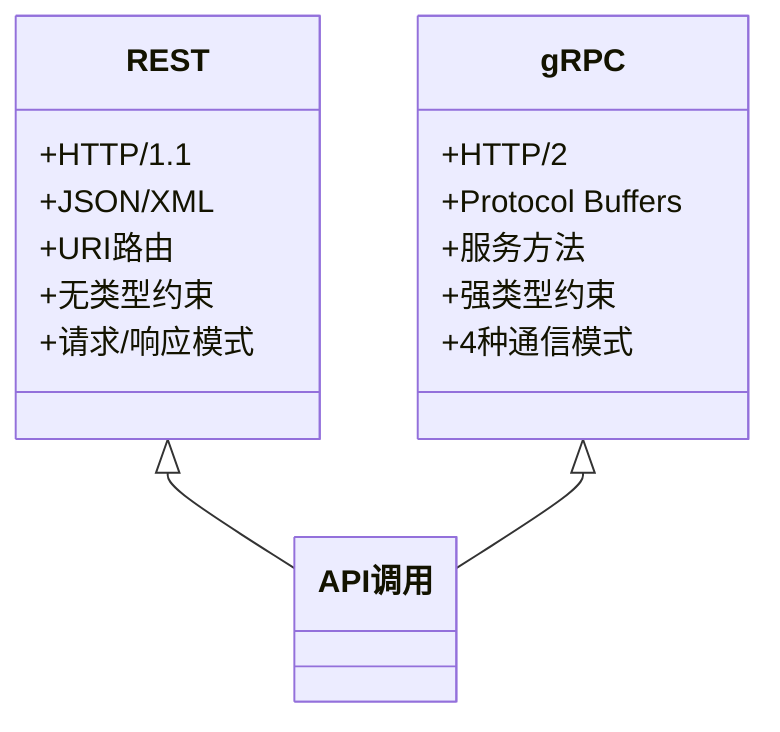
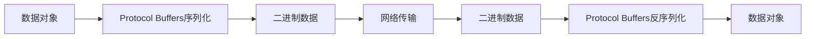
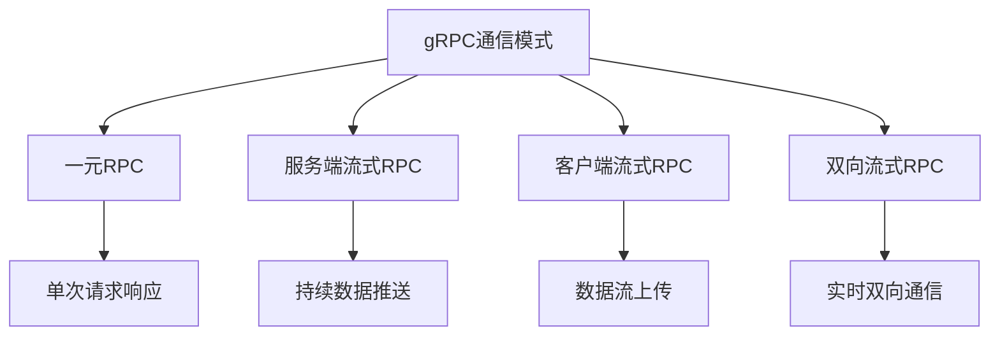
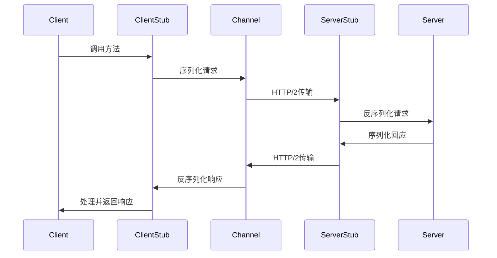
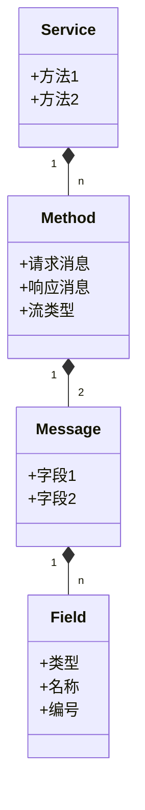

```thinking
好的,让我来仔细思考这5个基础但重要的gRPC问题的答案。

首先是内容组织:
1. 每个问题都需要详细且准确的解答
2. 使用mermaid图表来可视化关键流程
3. 需要突出重点和优势
4. 要有实际的例子来说明

对于mermaid图:
1. RPC调用流程 - 可以用sequence diagram
2. gRPC vs REST - 可以用class diagram对比架构
3. 通信模式 - 可以用flowchart展示4种模式
4. Protocol Buffers - 可以用flowchart展示序列化流程
5. 服务定义 - 可以用class diagram展示结构

让我来详细组织每个问题的答案...
```

以下是这5个gRPC基础问题的详细解答:

### 1. 什么是RPC? gRPC相比传统REST API有什么优势?

RPC(Remote Procedure Call)是一种允许程序调用另一个地址空间(通常是网络上的另一台机器)的程序的技术,使得开发人员能像调用本地函数一样调用远程服务。

gRPC vs REST API的主要优势:

1. 性能更好
- 使用HTTP/2作为传输协议,支持多路复用
- Protocol Buffers二进制序列化,数据更小
- 压缩效率更高

2. 接口约束更强
- 基于.proto文件严格定义接口
- 自动生成客户端和服务端代码
- 类型安全,编译时即可发现错误

3. 功能更丰富
- 支持4种通信模式(一元、服务端流、客户端流、双向流)
- 内置连接池和负载均衡
- 支持拦截器机制

4. 跨语言和平台
- 支持多种编程语言
- 统一的接口定义
- 跨平台兼容性好



### 2. Protocol Buffers的作用和优势

Protocol Buffers(protobuf)是Google开发的一种轻量级、高效的结构化数据序列化格式。

主要作用:
1. 定义数据结构和服务接口
2. 序列化和反序列化数据
3. 生成多语言代码

核心优势:
1. 性能
- 序列化后数据体积小(比JSON小3-10倍)
- 序列化和反序列化速度快
- 压缩效率高

2. 跨语言
- 支持多种编程语言
- 统一的数据定义格式
- 自动生成代码

3. 向后兼容
- 字段编号不变即可兼容
- 支持可选字段
- 易于版本演进



### 3. gRPC支持哪些通信模式?每种模式的应用场景是什么?

gRPC支持4种通信模式:

1. 一元(Unary) RPC
- 客户端发送单个请求,服务端返回单个响应
- 最简单的RPC模式,类似HTTP REST
- 适用场景:简单的CRUD操作

2. 服务端流式(Server streaming) RPC
- 客户端发送单个请求,服务端返回一个数据流
- 服务端可以持续发送多个响应
- 适用场景:订阅推送、大数据分批返回

3. 客户端流式(Client streaming) RPC
- 客户端发送数据流,服务端返回单个响应
- 客户端可以持续发送多个请求
- 适用场景:文件上传、传感器数据上报

4. 双向流式(Bidirectional streaming) RPC
- 客户端和服务端都可以发送数据流
- 两个流独立运行
- 适用场景:实时聊天、游戏数据交互



### 4. gRPC的调用流程是怎样的?

gRPC的完整调用流程如下:



详细步骤说明:
1. 客户端调用生成的Stub代码中的方法
2. Stub将请求参数序列化为Protocol Buffers格式
3. gRPC Channel将序列化后的请求通过HTTP/2发送到服务端
4. 服务端的Stub接收请求并反序列化
5. 服务端处理请求并返回响应
6. 服务端Stub将响应序列化
7. 响应通过HTTP/2返回给客户端
8. 客户端Stub反序列化响应并返回给调用方

### 5. 什么是服务定义(.proto文件)?如何定义服务?

.proto文件是使用Protocol Buffers语法定义的服务接口文件,它定义了:
- 服务接口(Service)
- 方法(Method)
- 消息类型(Message)
- 字段类型和编号

基本语法示例:
```protobuf
syntax = "proto3";  // 指定语法版本

package helloworld;  // 定义包名

// 定义服务
service Greeter {
    // 定义方法
    rpc SayHello (HelloRequest) returns (HelloResponse) {}
    rpc SayHelloStream (HelloRequest) returns (stream HelloResponse) {}
}

// 定义请求消息
message HelloRequest {
    string name = 1;  // 字段编号为1
    int32 age = 2;    // 字段编号为2
}

// 定义响应消息
message HelloResponse {
    string message = 1;
}
```

服务定义结构:



```protobuf
syntax = "proto3";

service StreamService {
    // 一元RPC
    rpc SimpleCall (DataRequest) returns (DataResponse) {}
    
    // 服务端流式RPC
    rpc ServerStreamCall (DataRequest) returns (stream DataResponse) {}
    
    // 客户端流式RPC
    rpc ClientStreamCall (stream DataRequest) returns (DataResponse) {}
    
    // 双向流式RPC
    rpc BidirectionalCall (stream DataRequest) returns (stream DataResponse) {}
}

message DataRequest {
    string data = 1;
}

message DataResponse {
    string result = 1;
}
```