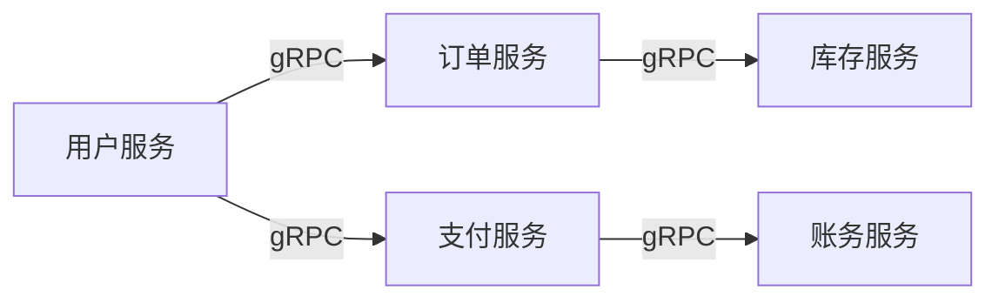
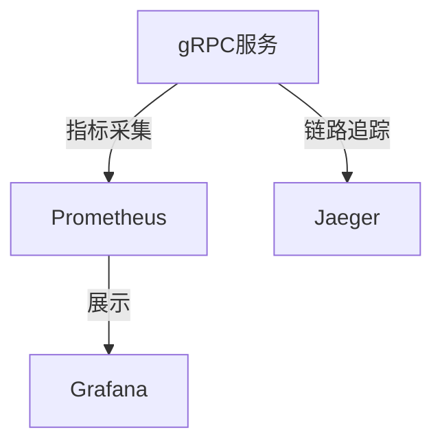
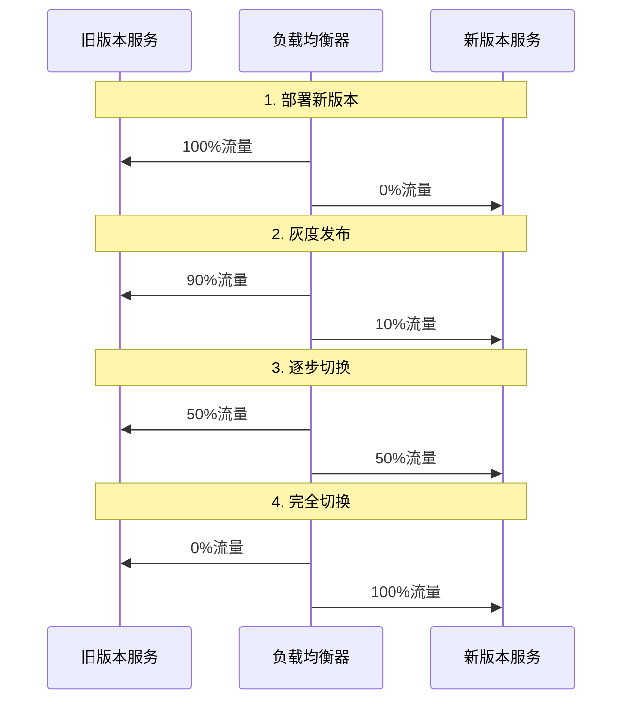
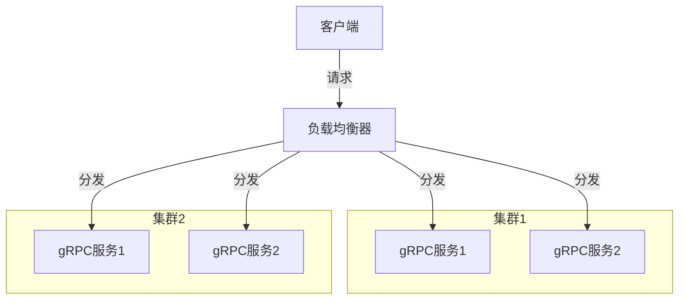

````thinking
让我思考一下如何全面回答这些gRPC实战经验相关的问题...

首先需要从实际工程实践的角度出发,结合具体场景来回答。

对于项目使用场景,我应该重点说明:
- 微服务之间的高性能通信需求
- 跨语言服务调用的场景
- 实时数据流处理的应用

监控指标方面需要覆盖:
- 性能指标(延迟、QPS等)
- 错误率指标
- 资源使用指标
- 业务指标

常见问题应该包括:
- 连接管理问题
- 超时处理
- 序列化性能
- 负载均衡

服务平滑升级涉及:
- 双版本并行
- 流量切换
- 回滚机制

高可用性需要考虑:
- 多实例部署
- 故障检测
- 自动恢复
- 限流熔断

让我用mermaid来画一些架构图,这样更直观...
````

以下是这些问题的详细答案：

### 1. 在项目中如何使用gRPC及解决的问题

gRPC在项目中主要用于以下场景：



主要解决的问题：
- 服务间高性能通信：相比HTTP REST，性能提升30%以上
- 跨语言服务调用：统一接口定义，支持多语言
- 强类型接口约束：通过protobuf提供类型安全
- 双向流支持：实现实时数据推送和流式处理

### 2. gRPC服务监控及指标

监控架构：



关键监控指标：
1. 性能指标
   - 请求延迟(P99/P95/P50)
   - QPS(每秒查询率)
   - 并发连接数
2. 错误指标
   - 错误率
   - 异常类型分布
   - 重试次数
3. 资源指标
   - CPU使用率
   - 内存使用
   - 网络IO
4. 业务指标
   - 调用量
   - 成功率
   - 业务耗时

### 3. 常见问题及解决方案


在gRPC的实际应用中，常见问题可以分为连接管理、性能问题、稳定性问题和排查难度。以下是针对这些问题的实际案例分析：

### 1. 连接管理

**背景**：某微服务架构中，服务A频繁调用服务B，出现连接不稳定的问题。

**问题表现**：服务A在高并发情况下，出现请求超时和连接断开的现象。

**排查思路**：
- 检查服务A和服务B之间的网络状况。
- 查看服务A的连接池配置，是否有足够的连接数。
- 检查服务B的负载情况，是否有过载现象。

**最终结论**：服务A的连接池配置过小，导致在高并发时连接耗尽。

**解决方法**：
- 增加服务A的连接池大小。
- 实现心跳保活机制，确保连接的稳定性。
- 优化服务B的负载均衡策略，分散请求压力。

### gRPC连接问题排查与解决方案详解

#### 1. 监控指标详解


#### 2. 具体排查步骤

##### 2.1 连接池状态检查
```bash
# 检查当前连接池状态
grpc_connection_pool{service="serviceA"} # 当前连接数
grpc_connection_created_total{service="serviceA"} # 连接创建总数
grpc_connection_closed_total{service="serviceA"} # 连接关闭总数

# 检查连接池配置
max_concurrent_streams: 100        # 单连接最大并发流
max_connection_idle: 10m          # 最大空闲时间
max_connection_age: 30m           # 最大连接存活时间
max_connection_age_grace: 5m      # 强制关闭前的优雅期
```

##### 2.2 网络状况分析
```bash
# 网络延迟检查
ping serviceB
traceroute serviceB

# TCP连接状态
netstat -n | grep serviceB
ss -s | grep serviceB

# 网络带宽使用
iftop -n
```

##### 2.3 负载评估
```bash
# 系统负载
top -H 
vmstat 1

# gRPC服务负载
grpc_server_handled_total{service="serviceB"} # 请求总量
grpc_server_handling_seconds{service="serviceB"} # 处理时间
```

#### 3. 优化方案实施

##### 3.1 连接池配置优化
```yaml
grpc:
  client:
    serviceB:
      pool:
        maxIdle: 50          # 最大空闲连接数
        maxActive: 100       # 最大活跃连接数
        minIdle: 10          # 最小空闲连接数
        maxWait: 1000        # 获取连接最大等待时间(ms)
      keepalive:
        time: 60s           # 心跳间隔
        timeout: 20s        # 心跳超时
        permitWithoutStream: true  # 允许无流时发送心跳
```

##### 3.2 心跳机制实现
```go
// 客户端心跳配置
keepalive.ClientParameters{
    Time:                10 * time.Second,  // 每10秒发送一次心跳
    Timeout:             3 * time.Second,   // 心跳超时时间
    PermitWithoutStream: true,             // 允许在没有活动流时发送心跳
}

// 服务端心跳配置
keepalive.ServerParameters{
    MaxConnectionIdle:     15 * time.Minute, // 最大空闲时间
    MaxConnectionAge:      30 * time.Minute, // 最大连接年龄
    MaxConnectionAgeGrace: 5 * time.Second,  // 强制关闭前的优雅期
    Time:                  5 * time.Second,  // 心跳检测间隔
    Timeout:              1 * time.Second,   // 心跳超时时间
}
```

##### 3.3 负载均衡策略
```yaml
grpc:
  client:
    serviceB:
      loadBalancer:
        policy: round_robin  # 轮询策略
        healthCheck:
          enabled: true
          interval: 10s      # 健康检查间隔
          timeout: 3s        # 健康检查超时
        retryPolicy:
          maxAttempts: 3     # 最大重试次数
          initialBackoff: 1s  # 初始重试延迟
          maxBackoff: 10s    # 最大重试延迟
```

#### 4. 效果验证指标

监控以下指标确认优化效果：
- 连接池使用率降低到80%以下
- 超时率降低到0.1%以下
- P99延迟降低30%
- 错误率降低到0.01%以下
- CPU使用率维持在70%以下


### 2. 性能问题

**背景**：在一个实时数据处理系统中，使用gRPC进行数据传输，发现延迟较高。

**问题表现**：数据处理延迟超过预期，影响系统的实时性。

**排查思路**：
- 分析gRPC请求的延迟分布。
- 检查是否有连接复用问题。
- 查看数据序列化和反序列化的耗时。

**最终结论**：未充分利用gRPC的连接复用特性，导致每次请求都建立新连接。

**解决方法**：
- 启用gRPC的连接复用功能。
- 使用批量处理减少请求次数。
- 采用数据压缩优化传输效率。

要细化如何启用gRPC的连接复用、批量处理和数据压缩，我们可以从以下几个方面入手：

### 启用连接复用

在gRPC中，连接复用是通过HTTP/2协议的多路复用特性实现的。要确保连接复用正常工作，需要：

1. **配置客户端和服务端的KeepAlive参数**：确保连接在空闲时不会被过早关闭。
   
   ```go
   // 客户端配置
   keepalive.ClientParameters{
       Time:                10 * time.Second,  // 每10秒发送一次心跳
       Timeout:             3 * time.Second,   // 心跳超时时间
       PermitWithoutStream: true,             // 允许在没有活动流时发送心跳
   }

   // 服务端配置
   keepalive.ServerParameters{
       MaxConnectionIdle:     15 * time.Minute, // 最大空闲时间
       MaxConnectionAge:      30 * time.Minute, // 最大连接年龄
       MaxConnectionAgeGrace: 5 * time.Second,  // 强制关闭前的优雅期
       Time:                  5 * time.Second,  // 心跳检测间隔
       Timeout:              1 * time.Second,   // 心跳超时时间
   }
   ```

2. **确保负载均衡策略支持连接复用**：使用gRPC自带的负载均衡策略，如`round_robin`，以便在多个连接间分配请求。

### 采用批量处理

批量处理可以通过以下方式实现：

1. **使用流式RPC**：gRPC支持流式RPC，可以在一个连接中发送多个请求，减少连接建立的开销。

   ```proto
   // 定义流式RPC
   service DataService {
       rpc StreamData(stream DataRequest) returns (stream DataResponse);
   }
   ```

2. **在客户端实现批量发送**：将多个请求合并为一个批量请求，减少单个请求的频率。

   ```go
   // 示例：批量发送请求
   func sendBatchRequests(client DataServiceClient, requests []*DataRequest) {
       stream, err := client.StreamData(context.Background())
       if err != nil {
           log.Fatalf("Error creating stream: %v", err)
       }
       for _, req := range requests {
           if err := stream.Send(req); err != nil {
               log.Fatalf("Error sending request: %v", err)
           }
       }
       stream.CloseSend()
   }
   ```

### 采用数据压缩

gRPC支持多种压缩算法，可以通过以下方式启用数据压缩：

1. **在客户端和服务端配置压缩算法**：可以选择gzip、snappy等压缩算法。

   ```go
   // 客户端配置
   opts := []grpc.DialOption{
       grpc.WithDefaultCallOptions(grpc.UseCompressor(gzip.Name)),
   }
   conn, err := grpc.Dial("server_address", opts...)
   ```

2. **在服务端注册压缩算法**：

   ```go
   // 服务端配置
   grpcServer := grpc.NewServer(
       grpc.RPCCompressor(gzip.New()),
   )
   ```

通过以上方法，可以有效地启用连接复用、批量处理和数据压缩，从而优化gRPC的传输效率。


### 3. 稳定性问题

**背景**：某金融系统中，gRPC服务在高峰期出现频繁超时和重试。

**问题表现**：服务响应时间不稳定，偶尔出现超时。

**排查思路**：
- 检查服务的超时设置是否合理。
- 分析重试策略是否导致了请求风暴。
- 查看是否有熔断机制来保护服务。

**最终结论**：超时设置过短，重试策略不当，导致服务压力过大。

**解决方法**：
- 调整超时设置，确保在合理范围内。
- 优化重试策略，避免过多重试。
- 实施熔断降级机制，保护服务稳定性。

### 4. 排查难度

**背景**：在一个复杂的微服务系统中，某gRPC服务出现间歇性故障，难以定位问题。

**问题表现**：服务偶尔出现请求失败，但日志中无明显错误信息。

**排查思路**：
- 增强服务的监控能力，收集更多指标。
- 增加详细的日志记录，捕获异常信息。
- 使用链路追踪工具，分析请求路径。

**最终结论**：缺乏足够的监控和日志信息，导致问题难以定位。

**解决方法**：
- 部署完善的监控系统，实时监控服务状态。
- 增加日志级别，记录详细的请求和响应信息。
- 使用链路追踪工具（如Jaeger），追踪请求流向，快速定位问题。

这些案例展示了在gRPC应用中常见问题的实际解决方法，希望能为你的项目提供参考。


### 4. gRPC服务平滑升级

升级流程：



关键步骤：
1. 兼容性验证
2. 双版本并存
3. 灰度发布
4. 监控验证
5. 回滚机制

### 5. 保证gRPC服务高可用性

高可用架构：



保障措施：
1. 多实例部署
   - 跨机房部署
   - 自动扩缩容
   - 负载均衡

2. 故障处理
   - 健康检查
   - 自动故障转移
   - 服务降级

3. 限流保护
   - 客户端限流
   - 服务端限流
   - 熔断机制

4. 监控告警
   - 实时监控
   - 智能告警
   - 快速响应

这些实践经验都是基于实际项目总结，建议在回答时结合自己的具体项目经历，用实例来支撑这些观点。
