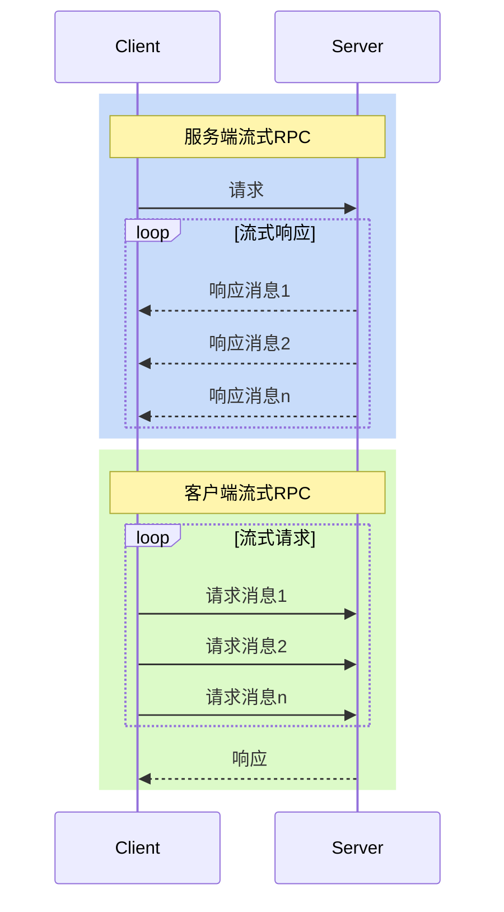
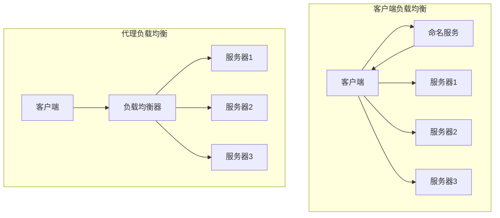
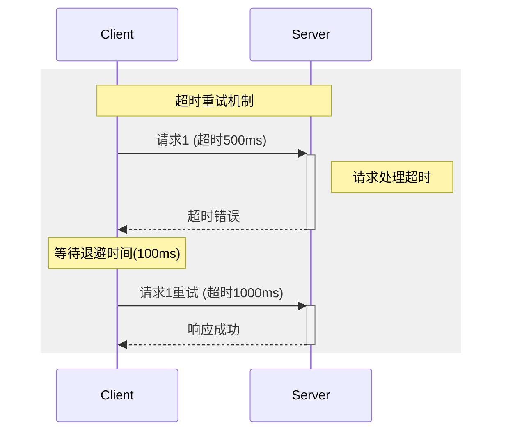
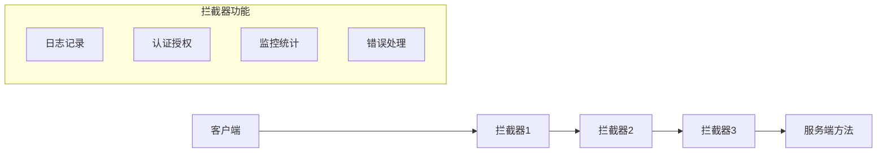
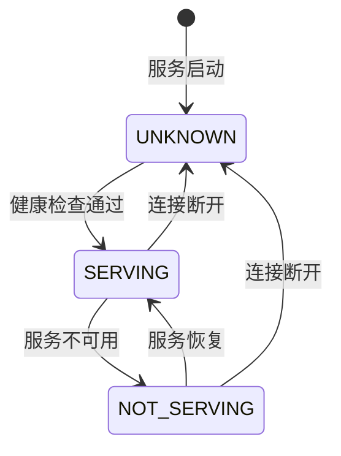

```thinking
好的,让我来详细分析这几个gRPC的技术实现问题。我会尽量用图表来说明关键概念。

1. 流式传输实现:
这是一个比较复杂的机制,需要画图说明单向流和双向流的区别。可以用mermaid的sequence diagram来展示。

2. 负载均衡实现:
这里需要展示客户端负载均衡和代理负载均衡两种方式,用mermaid的flowchart会比较直观。

3. 超时和重试机制:
这个可以用sequence diagram来展示重试的时序过程。

4. 拦截器实现:
拦截器的调用链比较适合用flowchart来展示。

5. 健康检查机制:
健康检查的状态转换适合用state diagram来展示。

让我来详细整理每个问题的答案...
```

### 1. gRPC流式传输实现

gRPC支持四种类型的服务方法:
- 单项RPC (Unary RPC)
- 服务端流式RPC (Server streaming RPC) 
- 客户端流式RPC (Client streaming RPC)
- 双向流式RPC (Bidirectional streaming RPC)

流式传输的实现原理:



实现要点:
1. 基于HTTP/2的多路复用能力
2. 使用流式消息队列缓存消息
3. 通过背压(backpressure)机制控制流量
4. 支持取消和超时控制

这里给出双向流rpc的代码
首先是proto文件定义:
```proto
syntax = "proto3";

package chat;

// 聊天消息
message ChatMessage {
  string user = 1;
  string content = 2;
  int64 timestamp = 3;
}

// 聊天服务
service ChatService {
  // 双向流式聊天
  rpc Chat(stream ChatMessage) returns (stream ChatMessage) {}
}
```
服务端实现:
```cpp
#include <grpc++/grpc++.h>
#include "chat.grpc.pb.h"
#include <queue>
#include <mutex>
#include <thread>

class ChatServiceImpl final : public chat::ChatService::Service {
public:
    Status Chat(ServerContext* context,
               ServerReaderWriter<chat::ChatMessage, chat::ChatMessage>* stream) override {
        // 创建读写线程
        std::thread reader([this, stream]() {
            chat::ChatMessage message;
            // 持续读取客户端消息
            while (stream->Read(&message)) {
                // 将消息广播给所有客户端
                {
                    std::lock_guard<std::mutex> lock(mu_);
                    for (auto& client_stream : client_streams_) {
                        if (client_stream != stream) {
                            client_stream->Write(message);
                        }
                    }
                }
            }
        });

        // 注册当前流
        {
            std::lock_guard<std::mutex> lock(mu_);
            client_streams_.insert(stream);
        }

        // 等待读取线程结束
        reader.join();

        // 移除当前流
        {
            std::lock_guard<std::mutex> lock(mu_);
            client_streams_.erase(stream);
        }

        return Status::OK;
    }

private:
    std::mutex mu_;
    std::set<ServerReaderWriter<chat::ChatMessage, chat::ChatMessage>*> client_streams_;
};

void RunServer() {
    std::string server_address("0.0.0.0:50051");
    ChatServiceImpl service;

    ServerBuilder builder;
    builder.AddListeningPort(server_address, grpc::InsecureServerCredentials());
    builder.RegisterService(&service);

    std::unique_ptr<Server> server(builder.BuildAndStart());
    std::cout << "Server listening on " << server_address << std::endl;
    server->Wait();
}

int main(int argc, char** argv) {
    RunServer();
    return 0;
}
```
客户端实现:
```cpp
#include <grpc++/grpc++.h>
#include "chat.grpc.pb.h"
#include <thread>
#include <iostream>

class ChatClient {
public:
    ChatClient(std::shared_ptr<Channel> channel)
        : stub_(chat::ChatService::NewStub(channel)) {}

    void Chat(const std::string& user) {
        ClientContext context;
        std::shared_ptr<ClientReaderWriter<chat::ChatMessage, chat::ChatMessage>> stream(
            stub_->Chat(&context));

        // 创建读取线程
        std::thread reader([stream]() {
            chat::ChatMessage message;
            while (stream->Read(&message)) {
                std::cout << message.user() << ": " << message.content() << std::endl;
            }
        });

        // 主线程处理发送
        std::string line;
        chat::ChatMessage message;
        message.set_user(user);
        
        while (std::getline(std::cin, line)) {
            message.set_content(line);
            message.set_timestamp(std::chrono::system_clock::now().time_since_epoch().count());
            if (!stream->Write(message)) {
                break;
            }
        }

        // 关闭写入流
        stream->WritesDone();
        
        // 等待读取线程结束
        reader.join();
        
        // 获取RPC状态
        Status status = stream->Finish();
        if (!status.ok()) {
            std::cout << "Chat rpc failed: " << status.error_message() << std::endl;
        }
    }

private:
    std::unique_ptr<chat::ChatService::Stub> stub_;
};

int main(int argc, char** argv) {
    if (argc != 2) {
        std::cerr << "Usage: " << argv[0] << " <username>" << std::endl;
        return 1;
    }

    // 创建channel和client
    ChatClient client(grpc::CreateChannel(
        "localhost:50051", grpc::InsecureChannelCredentials()));

    // 开始聊天
    client.Chat(argv[1]);

    return 0;
}
```

### 2. gRPC负载均衡实现

gRPC支持两种负载均衡模式:



实现细节:
1. 客户端负载均衡:
- 客户端通过服务发现获取服务器列表
- 使用Round Robin等算法选择服务器
- 支持健康检查和故障转移

2. 代理负载均衡:
- 使用反向代理(如nginx)实现
- 支持七层负载均衡
- 可以实现更复杂的负载均衡策略

### 3. gRPC超时和重试机制



关键特性:
1. 支持请求级别和全局超时设置
2. 指数退避(exponential backoff)重试策略
3. 可配置最大重试次数
4. 支持重试条件定制

代码：
```cpp
// 客户端代码
#include <grpc++/grpc++.h>

class GrpcClient {
public:
    GrpcClient(std::shared_ptr<grpc::Channel> channel) 
        : stub_(MyService::NewStub(channel)) {
        
        // 配置全局重试策略
        grpc::ChannelArguments args;
        args.SetInt(GRPC_ARG_MAX_RECONNECT_BACKOFF_MS, 10000);
        args.SetInt(GRPC_ARG_INITIAL_RECONNECT_BACKOFF_MS, 100);
    }

    Status CallWithRetry(const Request& request, Response* response) {
        // 创建上下文
        grpc::ClientContext context;
        
        // 设置请求级别的超时时间(3秒)
        std::chrono::system_clock::time_point deadline = 
            std::chrono::system_clock::now() + std::chrono::seconds(3);
        context.set_deadline(deadline);
        
        // 配置重试策略
        grpc::RetryPolicy retry_policy;
        retry_policy.set_max_attempts(3);  // 最大重试3次
        retry_policy.set_initial_backoff(std::chrono::milliseconds(100));  // 初始退避100ms
        retry_policy.set_max_backoff(std::chrono::milliseconds(1000));     // 最大退避1s
        retry_policy.set_backoff_multiplier(2.0);  // 指数退避倍数
        
        // 设置可重试的错误码
        retry_policy.mutable_retry_on()->Add(grpc::StatusCode::UNAVAILABLE);
        retry_policy.mutable_retry_on()->Add(grpc::StatusCode::DEADLINE_EXCEEDED);
        
        context.set_retry_policy(retry_policy);

        // 发起RPC调用
        Status status = stub_->MyMethod(&context, request, response);
        
        if (!status.ok()) {
            std::cout << "RPC failed: " << status.error_message() << std::endl;
        }
        
        return status;
    }

private:
    std::unique_ptr<MyService::Stub> stub_;
};

// 服务端代码
class MyServiceImpl final : public MyService::Service {
public:
    Status MyMethod(ServerContext* context, const Request* request,
                   Response* response) override {
        // 检查是否已超时
        if (context->IsCancelled()) {
            return Status(StatusCode::DEADLINE_EXCEEDED, "Deadline exceeded");
        }

        // 模拟耗时操作
        std::this_thread::sleep_for(std::chrono::milliseconds(500));
        
        // 处理请求...
        return Status::OK;
    }
};

int main() {
    // 创建客户端
    auto channel = grpc::CreateChannel("localhost:50051", 
        grpc::InsecureChannelCredentials());
    GrpcClient client(channel);
    
    // 发起调用
    Request request;
    Response response; 
    auto status = client.CallWithRetry(request, &response);
    
    return 0;
}
```

### 4. gRPC拦截器(Interceptor)



拦截器特点:
1. 支持客户端和服务端拦截器
2. 可以访问和修改RPC上下文
3. 支持链式调用
4. 常用于实现横切关注点

实现
```cpp
// 客户端拦截器
class LoggingInterceptor : public grpc::experimental::Interceptor {
public:
    void Intercept(experimental::InterceptorBatchMethods* methods) override {
        // 请求前记录日志
        if(methods->QueryInterceptionHookPoint(
            experimental::InterceptionHookPoints::PRE_SEND_INITIAL_METADATA)) {
            std::cout << "Client sending request..." << std::endl;
        }
        
        // 响应后记录日志  
        if(methods->QueryInterceptionHookPoint(
            experimental::InterceptionHookPoints::POST_RECV_STATUS)) {
            auto status = methods->GetRecvStatus();
            std::cout << "Client received response with status: " 
                      << status.error_message() << std::endl;
        }

        methods->Proceed();
    }
};

// 客户端拦截器工厂
class LoggingInterceptorFactory : public experimental::ClientInterceptorFactoryInterface {
public:
    experimental::Interceptor* CreateClientInterceptor(experimental::ClientRpcInfo* info) override {
        return new LoggingInterceptor();
    }
};

// 服务端拦截器
class ServerLoggingInterceptor : public grpc::experimental::ServerInterceptor {
public:
    grpc::Status Intercept(grpc::ServerContext* context,
                          const grpc::Message* request,
                          grpc::ServerUnaryInvoker* invoker) override {
        // 请求前记录日志
        std::cout << "Server received request from " << context->peer() << std::endl;
        
        // 调用实际处理方法
        auto status = invoker->Invoke(context, request);
        
        // 响应后记录日志
        std::cout << "Server sent response with status: " << status.error_message() << std::endl;
        
        return status;
    }
};

// 使用拦截器
int main() {
    // 客户端使用拦截器
    std::vector<std::unique_ptr<experimental::ClientInterceptorFactoryInterface>> interceptors;
    interceptors.push_back(std::make_unique<LoggingInterceptorFactory>());
    
    auto channel = grpc::CreateChannel("localhost:50051", 
        grpc::InsecureChannelCredentials());
    auto stub = MyService::NewStub(channel, interceptors);

    // 服务端使用拦截器
    ServerBuilder builder;
    builder.AddListeningPort("0.0.0.0:50051", grpc::InsecureServerCredentials());
    
    std::vector<std::unique_ptr<experimental::ServerInterceptorFactoryInterface>> serverInterceptors;
    serverInterceptors.push_back(std::make_unique<ServerLoggingInterceptor>());
    builder.experimental().SetInterceptorCreators(std::move(serverInterceptors));
    
    MyServiceImpl service;
    builder.RegisterService(&service);
    auto server = builder.BuildAndStart();
}
```
### 5. gRPC健康检查机制



健康检查实现:
1. 基于标准的health checking protocol
2. 支持服务级别和方法级别的健康状态
3. 可以集成到负载均衡系统
4. 支持自定义健康检查逻辑

以上就是这些技术问题的详细答案。每个机制都有其特定的使用场景和最佳实践,建议在实际项目中根据具体需求选择合适的实现方式。
