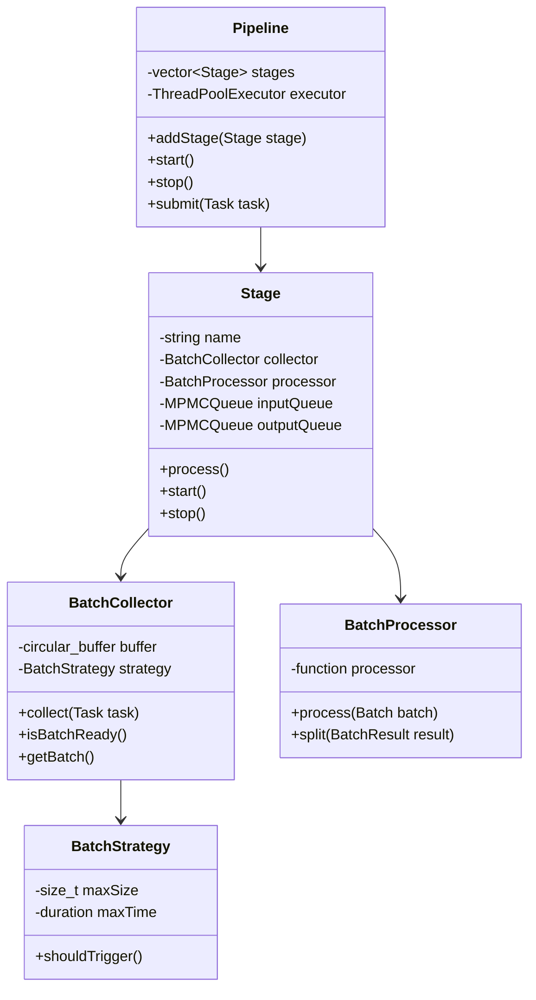
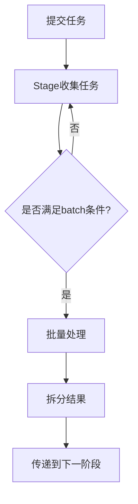
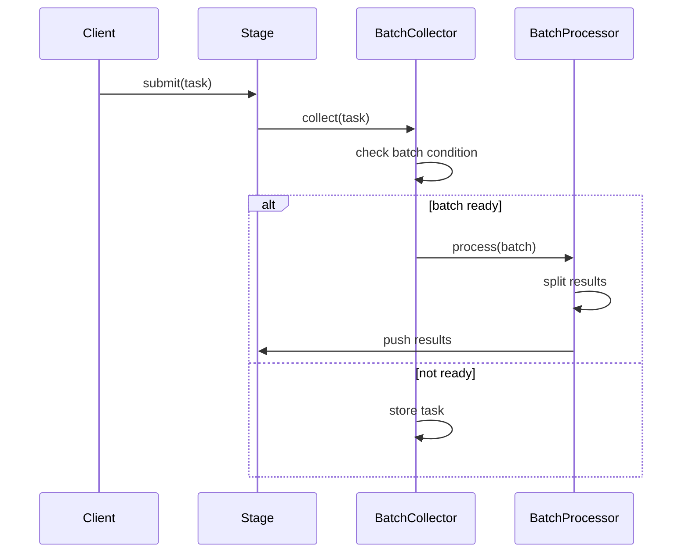

1. 使用folly/boost的数据结构和工具:
- folly::MPMCQueue 用于阶段间通信
- folly::Future/Promise 用于异步任务
- folly::ThreadPoolExecutor 用于线程池管理
- boost::circular_buffer 用于batch缓存
- boost::lockfree::queue 用于无锁队列

2. Batch处理的设计:
- 需要一个batch collector来攒批
- 支持基于时间和数量的batch策略
- batch处理完成后需要拆分结果

3. 关键组件:
- BatchCollector: 负责攒批
- BatchProcessor: 处理一个batch
- Stage: 流水线的处理阶段
- Pipeline: 整体流程控制

4. 批处理策略:
- 基于数量(达到N个任务)
- 基于时间(超过T时间)
- 混合策略(先到者触发)

# UML 类图

