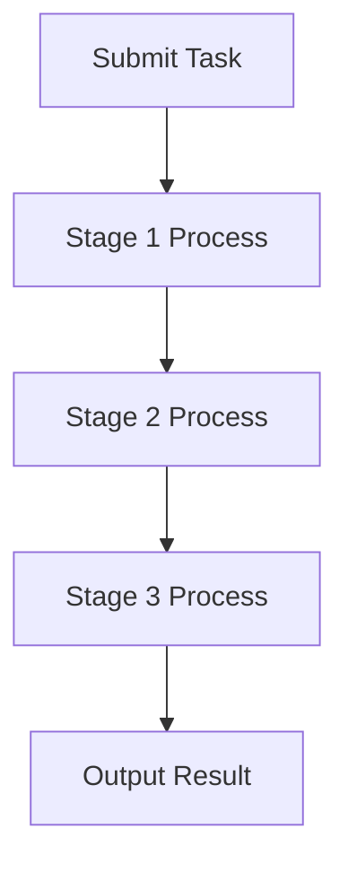
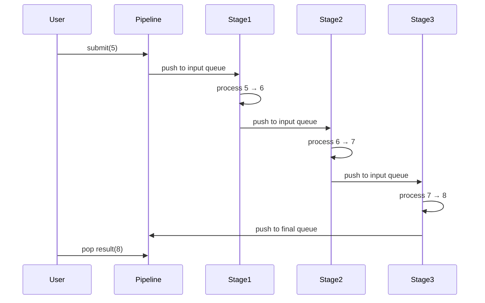

### 设计说明

#### UML类图
```mermaid
classDiagram
    class Pipeline<T> {
        - stages_: std::vector<std::unique_ptr<Stage<T>>>
        + start()
        + stop()
        + submit(T task)
        + getFinalOutputQueue() : boost::lockfree::spsc_queue<T>*
    }

    class Stage<T> {
        - processor_: std::function<T(T)>
        - input_queue_: std::unique_ptr<boost::lockfree::spsc_queue<T>>
        - output_queue_: boost::lockfree::spsc_queue<T>*
        - worker_: std::thread
        - running_: bool
        + setOutputQueue(boost::lockfree::spsc_queue<T>*)
        + getInputQueue() : boost::lockfree::spsc_queue<T>*
        + start()
        + stop()
    }

    Pipeline "1" --> "*" Stage : contains
```

#### 流程图


#### 时序图


### C++ 代码实现

```cpp
#include <iostream>
#include <vector>
#include <memory>
#include <thread>
#include <functional>
#include <atomic>
#include <boost/lockfree/spsc_queue.hpp>

template<typename T>
class Stage {
public:
    using Processor = std::function<T(T)>;

    explicit Stage(Processor processor)
        : processor_(std::move(processor)),
          input_queue_(std::make_unique<boost::lockfree::spsc_queue<T>>(1024)),
          output_queue_(nullptr),
          running_(false) {}

    void setOutputQueue(boost::lockfree::spsc_queue<T>* queue) {
        output_queue_ = queue;
    }

    boost::lockfree::spsc_queue<T>* getInputQueue() {
        return input_queue_.get();
    }

    void start() {
        running_ = true;
        worker_ = std::thread([this]() {
            while (running_) {
                T item;
                if (input_queue_->pop(item)) {
                    try {
                        T result = processor_(item);
                        if (output_queue_) {
                            while (!output_queue_->push(result) && running_) {
                                std::this_thread::yield();
                            }
                        }
                    } catch (...) {
                        // Handle exceptions
                    }
                } else {
                    std::this_thread::yield();
                }
            }
        });
    }

    void stop() {
        running_ = false;
        if (worker_.joinable()) {
            worker_.join();
        }
    }

private:
    Processor processor_;
    std::unique_ptr<boost::lockfree::spsc_queue<T>> input_queue_;
    boost::lockfree::spsc_queue<T>* output_queue_;
    std::thread worker_;
    std::atomic<bool> running_;
};

template<typename T>
class Pipeline {
public:
    template<typename... Processors>
    explicit Pipeline(Processors&&... processors) {
        (stages_.emplace_back(std::make_unique<Stage<T>>(std::forward<Processors>(processors))), ...);
        
        // Connect stages
        for (size_t i = 0; i < stages_.size() - 1; ++i) {
            stages_[i]->setOutputQueue(stages_[i + 1]->getInputQueue());
        }
    }

    void start() {
        for (auto& stage : stages_) {
            stage->start();
        }
    }

    void stop() {
        for (auto& stage : stages_) {
            stage->stop();
        }
    }

    void submit(const T& task) {
        while (!stages_.front()->getInputQueue()->push(task)) {
            std::this_thread::yield();
        }
    }

    boost::lockfree::spsc_queue<T>* getFinalOutputQueue() {
        return stages_.back()->getInputQueue();
    }

private:
    std::vector<std::unique_ptr<Stage<T>>> stages_;
};

// 示例使用
int main() {
    Pipeline<int> pipeline(
        [](int x) { return x + 1; },  // Stage 1
        [](int x) { return x * 2; },  // Stage 2
        [](int x) { return x - 3; }   // Stage 3
    );

    pipeline.start();

    // 提交任务
    pipeline.submit(5);

    // 获取结果
    auto* final_queue = pipeline.getFinalOutputQueue();
    int result;
    bool success = false;
    while (!success) {
        success = final_queue->pop(result);
        if (!success) {
            std::this_thread::sleep_for(std::chrono::milliseconds(10));
        }
    }

    std::cout << "Final result: " << result << std::endl;  // 应输出 (5+1)*2-3=9

    pipeline.stop();
    return 0;
}
```

### 关键点说明

1. **SPSC队列**：使用`boost::lockfree::spsc_queue`实现无锁单生产者单消费者队列，确保高效线程间通信。
2. **异常处理**：每个Stage的处理函数包含try-catch块防止线程崩溃。
3. **流水线连接**：通过`setOutputQueue`方法连接相邻Stage的输入输出队列。
4. **优雅停止**：通过原子变量`running_`控制线程退出，确保资源释放。

该实现展示了一个高效的单进程流水线系统，可灵活扩展处理阶段数量，适用于需要并行处理的任务场景。