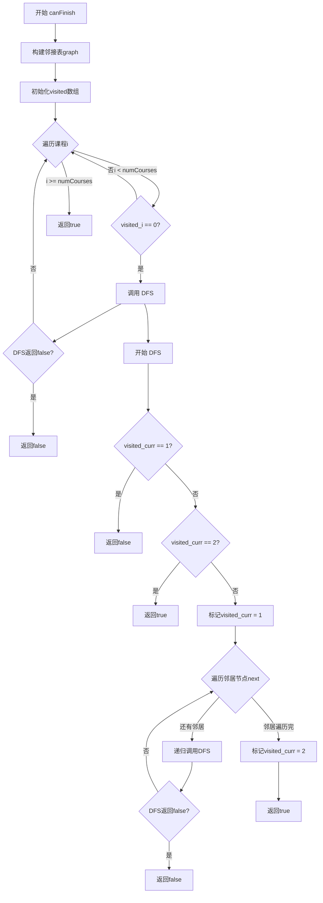

```thinking
让我思考一下如何写一篇关于课程表问题的题解...

这是一道经典的图论问题,主要考察:
1. 有向图的表示方法
2. 拓扑排序算法
3. 环检测

解题思路部分需要包含:
1. 如何构建有向图
2. 如何检测环(DFS或BFS)
3. 时间复杂度分析

代码实现我会给出C++版本,并详细注释每个部分的功能。

扩展部分可以讨论:
1. 不同的拓扑排序实现方法比较
2. 相关的图论题目
3. 实际应用场景

让我开始编写完整的题解...
```

# 课程表问题

## 问题链接
[LeetCode 207. 课程表](https://leetcode.com/problems/course-schedule/)

## 问题描述
你总共需要修 n 门课,记为 0 到 n-1。在修某些课程之前需要先修完其他课程,例如要学习课程 0,你需要先完成课程 1,表示为[0,1]。给定课程总数 n 和一个表示先修顺序的数组 prerequisites,判断是否可能完成所有课程的学习。

## 解题思路
1. 这是一个典型的图论问题。每门课程看作图中的一个节点,先修关系看作有向边。问题转化为:判断有向图中是否存在环。

2. 解决方案:
   - 构建邻接表表示有向图
   - 使用DFS或BFS检测图中是否存在环
   - 如果存在环,说明课程之间存在循环依赖,无法完成所有课程

3. DFS实现思路:
   - 维护访问状态数组(未访问/访问中/已完成)
   - 对每个未访问的节点进行DFS
   - 如果在DFS过程中遇到"访问中"的节点,说明存在环



## 代码实现

```cpp
class Solution {
public:
    bool canFinish(int numCourses, vector<vector<int>>& prerequisites) {
        // 构建邻接表表示图
        vector<vector<int>> graph(numCourses);
        for (const auto& pre : prerequisites) {
            graph[pre[0]].push_back(pre[1]);
        }
        
        // 记录节点访问状态: 0=未访问, 1=访问中, 2=已完成
        vector<int> visited(numCourses, 0);
        
        // 对每个未访问的节点进行DFS
        for (int i = 0; i < numCourses; i++) {
            if (visited[i] == 0 && !dfs(graph, visited, i)) {
                return false;
            }
        }
        return true;
    }
    
private:
    bool dfs(vector<vector<int>>& graph, vector<int>& visited, int curr) {
        // 如果当前节点在访问中,说明存在环
        if (visited[curr] == 1) return false;
        // 如果已经访问完成,无需重复访问
        if (visited[curr] == 2) return true;
        
        // 标记当前节点为访问中
        visited[curr] = 1;
        
        // 递归访问所有相邻节点
        for (int next : graph[curr]) {
            if (!dfs(graph, visited, next)) {
                return false;
            }
        }
        
        // 标记当前节点已完成访问
        visited[curr] = 2;
        return true;
    }
};
```

## 复杂度分析
- 时间复杂度：O(V + E)，其中 V 是课程数,E 是先修关系的数量
- 空间复杂度：O(V + E)，用于存储图的邻接表和访问状态数组

## 相关题目
1. 课程表 II (LeetCode 210)
2. 找到最终的安全状态 (LeetCode 802)
3. 最小高度树 (LeetCode 310)

## 扩展：其他实现方法
1. BFS实现(Kahn算法):
   - 计算每个节点的入度
   - 将入度为0的节点入队
   - 每次出队时将相邻节点的入度减1
   - 如果最终访问的节点数小于总节点数,说明存在环

2. 并查集实现:
   - 将每个课程看作并查集中的一个节点
   - 对于每个先修关系,合并对应的集合
   - 如果在合并过程中发现两个节点已经在同一个集合中,说明存在环

## 应用场景
1. 编译系统中的依赖关系检查
2. 任务调度系统
3. 工作流程管理
4. 软件包依赖管理

课程表问题是一个非常经典的图论问题,它不仅考察了对图的基本操作和算法的理解,还反映了现实生活中的许多实际应用场景。掌握这类问题的解决方法对于理解和解决其他图论问题也很有帮助。
