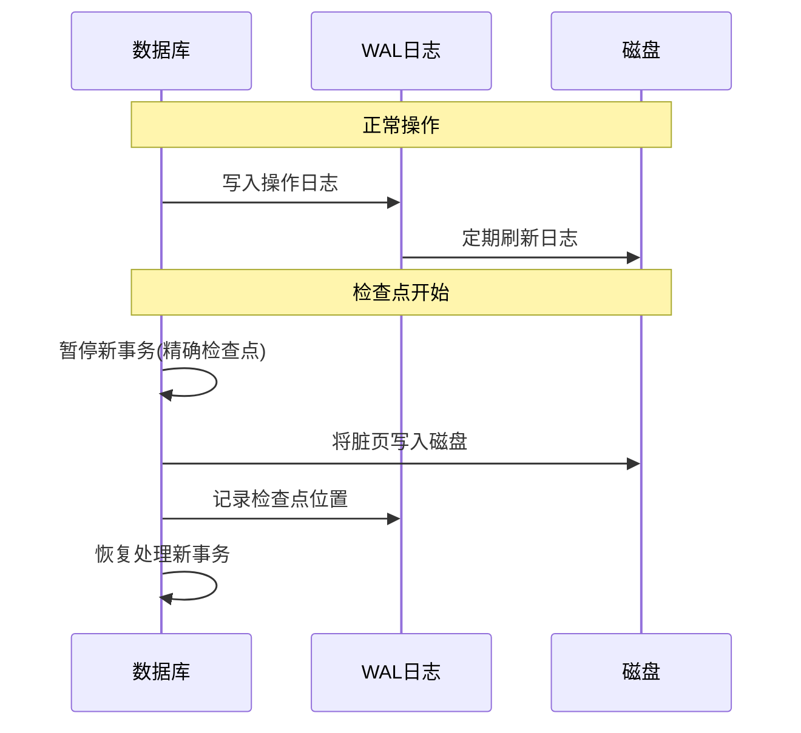
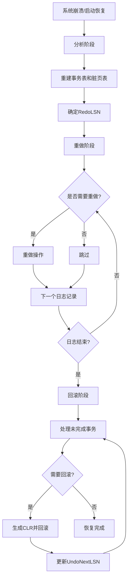

# 预写日志记录（Write-Ahead Logging, WAL）

在计算机科学中，预写日志记录 （WAL） 是一系列技术，用于在数据库系统中提供原子性和持久性（ACID 的两个属性）
预写日志是一种仅用于附加的辅助磁盘驻留结构，用于崩溃和事务恢复。更改首先记录在日志中，必须先将日志写入稳定存储，然后再将更改写入数据库

## 为什么需要WAL？

让我们通过一个简单的银行转账例子来理解WAL的重要性：

假设Alice要向Bob转账100元：
1. Alice账户余额：1000元
2. Bob账户余额：500元

**不使用WAL的情况：**
```
1. 从Alice账户扣除100元 (Alice: 900元)
2. 系统崩溃
3. Bob没有收到钱，但Alice的钱已经扣除！
```

**使用WAL的情况：**
```
1. 写入日志：[事务开始, Alice扣款100元, Bob收款100元]
2. 系统确认日志写入磁盘
3. 执行实际操作：
   - 从Alice账户扣除100元
   - 给Bob账户增加100元
4. 写入日志：[事务完成]
```

如果在任何步骤发生崩溃，系统都可以通过查看日志来恢复正确状态。

## 主要功能

预写日志的主要功能可以概括为:
1. 允许页面缓存缓冲对驻留在磁盘上的页面的更新，同时确保数据库系统更大上下文中的持久性语义
2. 将所有操作保留在磁盘上，直到受这些操作影响的页面的缓存副本在磁盘上同步。在修改关联页面上的内容之前，必须将修改数据库状态的每个操作都记录在磁盘上
3. 允许在发生崩溃时从操作日志中重建丢失的内存中更改

## 工作原理

### 详细的工作流程

1. **事务开始**
   ```sql
   -- 示例：转账操作
   BEGIN TRANSACTION;
   UPDATE accounts SET balance = balance - 100 WHERE user = 'Alice';
   UPDATE accounts SET balance = balance + 100 WHERE user = 'Bob';
   COMMIT;
   ```

2. **日志记录生成**
   ```
   LSN: 1001
   TransID: T123
   Type: BEGIN
   Timestamp: 2024-03-21 10:00:00
   
   LSN: 1002
   TransID: T123
   Type: UPDATE
   Table: accounts
   Before: {user: 'Alice', balance: 1000}
   After: {user: 'Alice', balance: 900}
   
   LSN: 1003
   TransID: T123
   Type: UPDATE
   Table: accounts
   Before: {user: 'Bob', balance: 500}
   After: {user: 'Bob', balance: 600}
   
   LSN: 1004
   TransID: T123
   Type: COMMIT
   ```

3. **恢复示例**
   如果系统在LSN 1002后崩溃：
   ```
   1. 分析日志：发现未完成的事务T123
   2. 回滚操作：将Alice的余额恢复到1000
   3. 记录回滚日志（CLR）
   ```

### 日志记录格式
典型的WAL日志记录包含以下字段：
- LSN (Log Sequence Number): 唯一标识日志记录
- 事务ID：标识产生该日志记录的事务
- 操作类型：INSERT、UPDATE、DELETE等
- 表ID：受影响的表标识
- 前镜像：修改前的数据
- 后镜像：修改后的数据
- 时间戳：日志记录的创建时间

### 示例说明
想象一下，当运行它的计算机断电时，一个程序正在执行某些操作。重新启动后，该程序可能需要知道它正在执行的操作是成功、部分成功还是失败。如果使用预写日志，程序可以检查此日志，并将意外断电时应该做什么与实际做什么进行比较。基于这种比较，程序可以决定撤消它已开始的内容、完成已开始的内容或保持原样

## 检查点机制

### 图解检查点过程


### 实际检查点示例
```
时间点1: 系统正常运行
- WAL大小：1GB
- 脏页数量：1000页
- 活跃事务：10个

时间点2: 触发检查点
- 将1000个脏页写入磁盘
- 记录10个活跃事务的状态
- 标记检查点位置

时间点3: 检查点完成
- 可以清理旧的WAL日志
- 系统恢复只需要从该检查点开始
```

### 检查点类型
1. **模糊检查点**：允许在检查点过程中继续处理新的事务
2. **精确检查点**：暂停所有新事务直到检查点完成
3. **增量检查点**：将脏页分批写入磁盘，减少I/O峰值

## WAL vs 其他方案

WAL 允许就地完成数据库的更新。实现原子更新的另一种方法是使用影子分页，它不是就地的。就地更新的主要优点是它减少了修改索引和阻止列表的需要。

### WAL的优势
1. 写入性能更好（顺序写入）
2. 空间利用率高
3. 实现相对简单
4. 支持细粒度的并发控制

### WAL的劣势
1. 需要定期执行检查点操作
2. 恢复时间可能较长
3. 日志管理的开销
4. 写放大问题

## 应用场景

### 数据库系统
1. PostgreSQL
2. SQLite
3. MySQL (InnoDB引擎)

### 分布式系统
1. 分布式一致性协议（如Raft）
2. 消息队列系统
3. 分布式缓存

### 文件系统
1. 日志结构文件系统
2. 事务性文件系统

## ARIES算法

ARIES (Algorithms for Recovery and Isolation Exploiting Semantics) 是WAL最著名的实现之一，是IBM研究院开发的一种数据库恢复算法。

### 核心原则
1. **写前日志（Write-Ahead Logging）**
   - 所有修改必须先写入日志，再写入数据页
   - 日志记录必须在事务提交前写入稳定存储
   
2. **重复历史（Repeating History）**
   - 系统崩溃后的恢复过程必须重做所有操作
   - 即使某些事务最终会被回滚，也需要先重做
   
3. **存储前后镜像（Store Before- and After-Images）**
   - 每个更新操作都记录修改前的值（前镜像）和修改后的值（后镜像）
   - 用于支持事务回滚和恢复操作

### 日志记录类型
1. **更新日志记录**
   ```
   <LSN, TransID, PageID, PrevLSN, RedoInfo, UndoInfo>
   ```
   - LSN: 日志序列号
   - TransID: 事务标识
   - PageID: 被修改的页面标识
   - PrevLSN: 同一事务的前一条日志的LSN
   - RedoInfo: 重做信息（后镜像）
   - UndoInfo: 撤销信息（前镜像）

2. **补偿日志记录(CLR)**
   ```
   <LSN, TransID, PageID, UndoNextLSN, RedoInfo>
   ```
   - UndoNextLSN: 指向下一个需要撤销的日志记录
   - CLR记录不需要被撤销，只需要在恢复时重做

### 详细恢复步骤

1. **分析阶段（Analysis Pass）**
   - 从最后一个检查点开始扫描日志
   - 重建事务表（Transaction Table）和脏页表（Dirty Page Table）
   - 确定活跃事务集合和脏页集合
   - 确定RedoLSN（重做起点）

2. **重做阶段（Redo Pass）**
   - 从RedoLSN开始扫描日志
   - 对所有日志记录（包括CLR）进行重做
   - 重做条件：
     * 页面LSN < 日志记录LSN
     * 页面在脏页表中或当前LSN >= RecLSN

3. **回滚阶段（Undo Pass）**
   - 回滚所有分析阶段确定的未完成事务
   - 从后向前处理，生成补偿日志记录（CLR）
   - 按照UndoNextLSN链进行回滚

### ARIES恢复流程图

### 示例场景

假设有以下日志记录序列：
LSN TransID Type PrevLSN PageID Data
100 T1 BEGIN NULL - -
110 T1 UPDATE 100 P1 x=10->20
120 T2 BEGIN NULL - -
130 T2 UPDATE 120 P2 y=5->15
140 T1 COMMIT 110 - -
如果在LSN 135时系统崩溃：
1. **分析阶段**：
   - T1处于提交状态
   - T2处于活跃状态
   - P1和P2在脏页表中

2. **重做阶段**：
   - 重做LSN 110和130的更新操作

3. **回滚阶段**：
   - 只需回滚T2的操作
   - 生成CLR回滚LSN 130的操作

## 最佳实践

1. **日志管理**
   - 合理配置日志大小
   - 实现日志压缩/归档机制
   - 监控日志增长速度

2. **性能优化**
   - 批量写入日志
   - 异步刷盘策略
   - 使用预写缓冲区

3. **监控与维护**
   - 监控检查点频率
   - 跟踪日志空间使用
   - 定期验证恢复功能

## 性能优化建议

### 1. 日志写入优化
```python
# 不好的做法：每个操作都刷盘
for record in records:
    write_log(record)
    flush_to_disk()

# 好的做法：批量写入
batch = []
for record in records:
    batch.append(record)
    if len(batch) >= BATCH_SIZE:
        write_log_batch(batch)
        flush_to_disk()
        batch = []
```

### 2. 检查点优化
- 根据系统负载动态调整检查点频率
- 使用增量检查点减少I/O压力
- 在系统空闲时执行检查点

### 3. 监控指标
- WAL生成速率
- 检查点耗时
- 恢复时间
- 日志空间使用率
