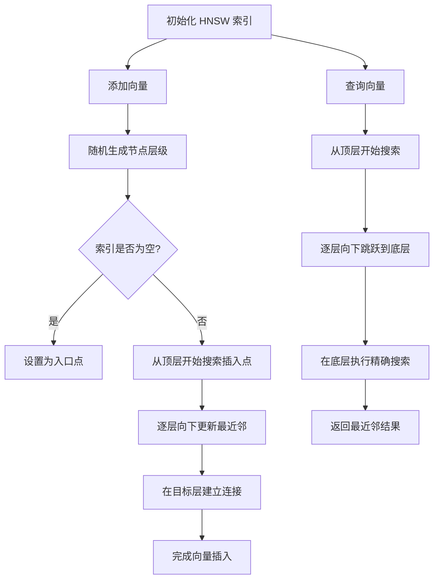
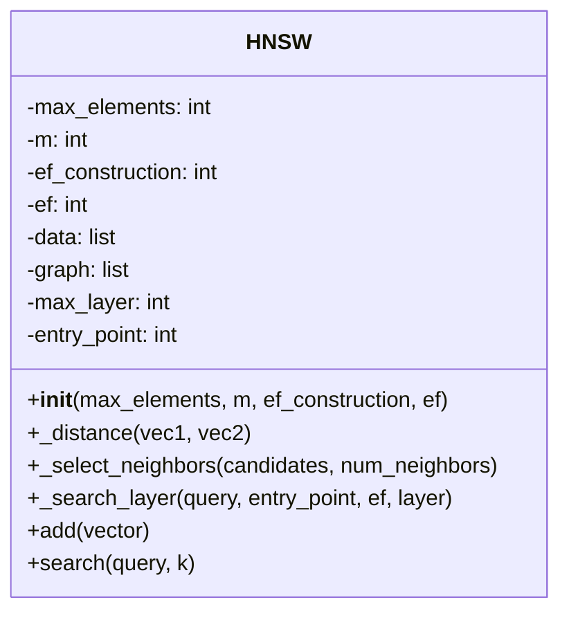

### **HNSW（Hierarchical Navigable Small World）的原理**

HNSW 是一种基于近邻图（K-Nearest Neighbor Graph, KNN-Graph）的索引结构，通过构建分层的导航图来加速最近邻搜索。它结合了高效的搜索速度和良好的检索精度，适用于大规模、高维数据的检索。

---

### **HNSW的核心流程**



---
### 流程图说明

1. **索引初始化**：
   - 创建空的 HNSW 索引，设置初始参数（最大元素数、近邻数等）。

2. **添加向量**：
   - 随机生成新节点的层级。
   - 如果索引为空，则将新节点设置为入口点；否则，从顶层开始搜索插入点。
   - 逐层向下更新最近邻连接。

3. **查询向量**：
   - 从顶层开始搜索候选点，逐层向下跳跃。
   - 到达底层后，进行精确搜索，返回最近邻结果。

---
#### **HNSW 的核心思想**

1. **分层结构：**
   - HNSW 构建多个层，每层是一个稀疏的近邻图。
   - 顶层的节点数最少，底层的节点数最多。
   - 每层中，节点与其最近的 \( M \) 个邻居连接。

2. **搜索过程：**
   - **从顶层开始搜索**：以全局视角快速找到与查询点相对接近的候选点。
   - **逐层向下跳跃**：进入下层后，从上一层的候选点开始局部搜索，逐渐收敛到最近邻。

3. **动态更新：**
   - 新的节点插入时，从顶层开始寻找插入点，并逐层向下调整图结构。

4. **跳表结构：**
   - 节点的层级由幂律分布随机生成，减少构建和搜索的计算复杂度。

---

#### **HNSW 的构建过程**

1. **初始化图结构：**
   - 图中只有一个节点，初始化其所在层级。

2. **节点插入：**
   - 对于新节点，随机生成其最大层级 \( L \)。
   - 从顶层开始，逐层寻找最近邻，并在合适的层连接到图中。

3. **近邻选择：**
   - 在每层中，选择与新节点最近的 \( M \) 个邻居。
   - 使用多边优化策略（Multi-layer Connectivity Optimization），确保连接的稀疏性和平衡性。

4. **距离计算：**
   - 每层中的邻居选择基于某种相似度度量（如欧几里得距离、余弦相似度）。

---

#### **搜索过程**

1. **层间搜索：**
   - 从顶层开始搜索，找到离查询向量最近的候选节点。
   - 利用候选节点跳转到下一层。

2. **局部搜索：**
   - 在底层密集图中，使用优先队列存储当前最近的 \( k \) 个候选点，逐步更新并收敛到最近邻。

---

### **HNSW 的实现代码**

以下代码实现了 HNSW 索引的基本功能，包括构建和搜索。使用 `numpy` 进行矩阵操作，并结合优先队列实现高效搜索。

#### **Python 实现**

```python
import numpy as np
import heapq

class HNSW:
    def __init__(self, max_elements, m=16, ef_construction=200, ef=10):
        """
        HNSW 索引初始化
        :param max_elements: 最大数据量
        :param m: 每层的最大近邻数
        :param ef_construction: 构建阶段的扩展因子
        :param ef: 搜索阶段的扩展因子
        """
        self.max_elements = max_elements
        self.m = m
        self.ef_construction = ef_construction
        self.ef = ef
        self.data = []
        self.graph = []
        self.max_layer = -1
        self.entry_point = None

    def _distance(self, vec1, vec2):
        """计算欧几里得距离"""
        return np.linalg.norm(vec1 - vec2)

    def _select_neighbors(self, candidates, num_neighbors):
        """选择最近的邻居"""
        return heapq.nsmallest(num_neighbors, candidates, key=lambda x: x[1])

    def _search_layer(self, query, entry_point, ef, layer):
        """在指定层中进行搜索"""
        visited = set()
        candidates = []
        heapq.heappush(candidates, (self._distance(query, self.data[entry_point]), entry_point))
        visited.add(entry_point)

        result = []

        while candidates:
            current_distance, current_node = heapq.heappop(candidates)
            result.append((current_distance, current_node))
            for neighbor in self.graph[layer][current_node]:
                if neighbor not in visited:
                    visited.add(neighbor)
                    heapq.heappush(candidates, (self._distance(query, self.data[neighbor]), neighbor))
            if len(result) >= ef:
                break
        return result

    def add(self, vector):
        """添加向量到 HNSW 索引"""
        self.data.append(vector)
        current_index = len(self.data) - 1
        num_layers = np.random.geometric(0.5) - 1
        self.max_layer = max(self.max_layer, num_layers)

        # 确保每层的邻居列表已经初始化
        while len(self.graph) <= num_layers:
            self.graph.append([[] for _ in range(self.max_elements)])  # 使用 max_elements 以确保可以容纳所有元素

        if self.entry_point is None:
            self.entry_point = current_index
            return

        # 从顶层开始搜索插入点
        entry_point = self.entry_point
        for layer in range(self.max_layer, num_layers, -1):
            neighbors = self._search_layer(self.data[current_index], entry_point, 1, layer)
            entry_point = neighbors[0][1]

        # 在目标层建立连接
        for layer in range(min(num_layers, self.max_layer) + 1):
            neighbors = self._search_layer(self.data[current_index], entry_point, self.ef_construction, layer)
            selected_neighbors = [n[1] for n in self._select_neighbors(neighbors, self.m)]
            self.graph[layer][current_index] = selected_neighbors
            for neighbor in selected_neighbors:
                self.graph[layer][neighbor].append(current_index)

    def search(self, query, k):
        """搜索查询向量的最近邻"""
        entry_point = self.entry_point
        for layer in range(self.max_layer, 0, -1):
            neighbors = self._search_layer(query, entry_point, 1, layer)
            entry_point = neighbors[0][1]
        
        # 在底层进行精确搜索
        neighbors = self._search_layer(query, entry_point, self.ef, 0)
        selected_neighbors = self._select_neighbors(neighbors, k)

        # 打印每个最近邻的向量和距离
        for n in selected_neighbors:
            neighbor_index = n[1]
            neighbor_vector = self.data[neighbor_index]
            distance = n[0]
            print(f"Neighbor Index: {neighbor_index}, Vector: {neighbor_vector}, Distance: {distance}")

        return [n[1] for n in selected_neighbors]

if __name__ == "__main__":
    hnsw = HNSW(max_elements=100)
    np.random.seed(42)
    for i in range(10):
        hnsw.add(np.random.rand(5))

    query = np.random.rand(5)
    print("Query:", query)
    result = hnsw.search(query, k=3)
    print("Nearest Neighbors:", result)
```

---

### **代码说明**
1. **初始化**：
   - 设置最大数据量 `max_elements`、每层最大近邻数 `m`、扩展因子 `ef_construction` 和 `ef`。
   - 使用 `numpy` 生成数据，并随机为每个节点分配层级。

2. **构建过程**：
   - `add` 方法添加向量，同时更新 HNSW 索引。
   - 从顶层搜索最近的插入点，并逐层向下构建连接。

3. **搜索过程**：
   - `search` 方法通过优先队列从顶层到底层逐层搜索。
   - 在底层精确搜索并返回最近邻结果。

---

### **HNSW 的优缺点**
- **优点**：
  - 高效的近似最近邻搜索。
  - 动态更新能力强。
- **缺点**：
  - 内存占用较高。
  - 构建索引耗时。

---

此实现展示了 HNSW 的核心构建和搜索机制，可用于小规模实验或作为更复杂实现的基础。