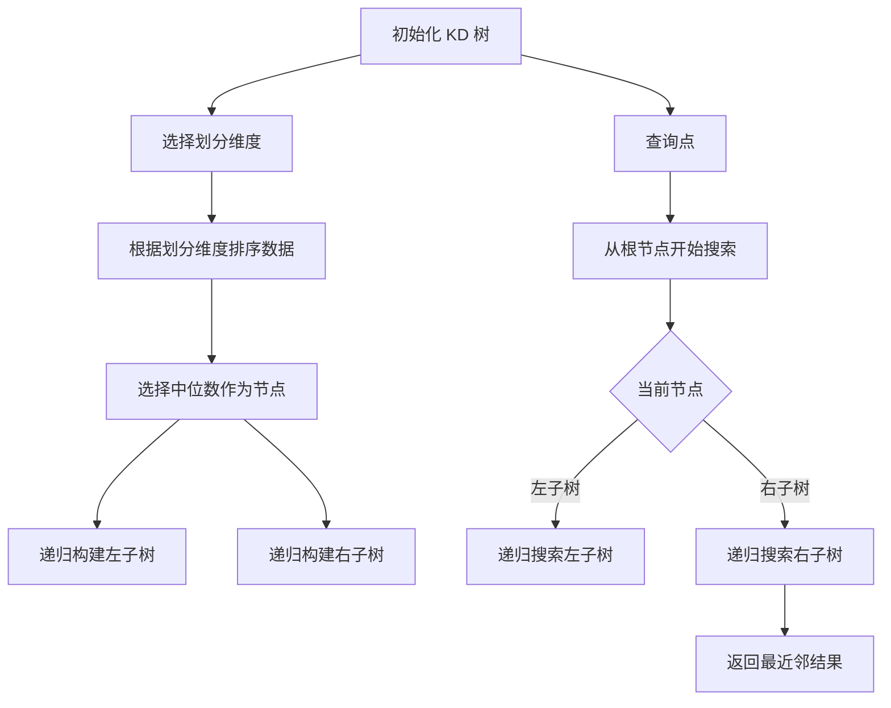
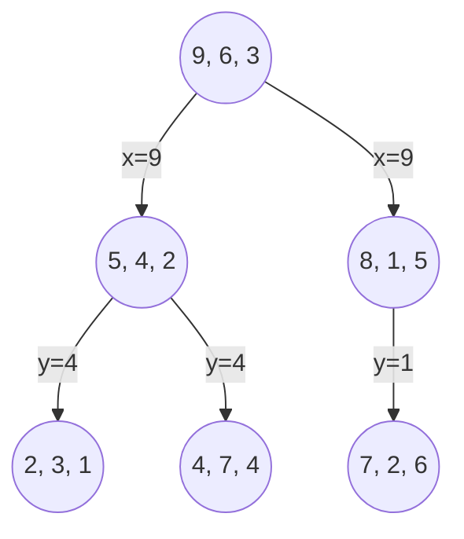

### **KD 树（k-Dimensional Tree）的原理**

KD 树是一种用于多维空间数据的高效索引结构，广泛应用于最近邻搜索和范围查询。它通过递归地将数据划分为超矩形区域，构建出一棵二叉树，从而实现快速检索。

---

### **KD 树的核心流程**

---
### 流程图说明

1. **初始化 KD 树**：
   - 创建空的 KD 树，准备插入数据。

2. **选择划分维度**：
   - 在每次递归中，选择当前维度作为划分依据，通常采用循环方式（例如，依次选择 x、y、z 维度）。

3. **根据划分维度排序数据**：
   - 将数据点按当前维度的值进行排序，以便选择中位数。

4. **选择中位数作为节点**：
   - 选择排序后的中位数作为当前节点，左侧为小于中位数的子树，右侧为大于中位数的子树。

5. **递归构建子树**：
   - 对左子树和右子树分别递归执行上述步骤，直到所有数据点都被插入。

6. **查询点**：
   - 从根节点开始，递归搜索 KD 树以找到最近邻。

7. **返回最近邻结果**：
   - 在搜索过程中，维护当前找到的最近邻，并在遍历完成后返回结果。

---

#### **KD 树的核心思想**

1. **空间划分**：
   - KD 树通过选择不同的维度进行空间划分，将数据点分布在不同的超矩形区域中。

2. **递归构建**：
   - 通过递归的方式构建树结构，确保每个节点都能有效地代表其对应的空间区域。

3. **高效搜索**：
   - 在查询时，利用树的结构快速排除不可能的区域，从而减少搜索范围。

---

#### **KD 树的构建过程**

1. **初始化树结构**：
   - 创建空的 KD 树，准备插入数据。

2. **插入数据**：
   - 对于每个数据点，选择当前维度进行划分，递归插入到合适的子树中。

3. **选择中位数**：
   - 在每次插入时，选择当前维度的中位数作为节点，以确保树的平衡性。

4. **维护树的平衡**：
   - 通过选择中位数，确保树的高度尽可能低，从而提高搜索效率。

---

#### **搜索过程**

1. **从根节点开始搜索**：
   - 根据查询点的值，决定向左子树或右子树递归搜索。

2. **维护候选最近邻**：
   - 在搜索过程中，维护当前找到的最近邻，并在必要时更新。

3. **回溯搜索**：
   - 在搜索完成后，回溯检查可能的其他区域，以确保找到全局最近邻。

---

### **KD 树的优缺点**

- **优点**：
  - 对低维数据检索效率高，构建和维护简单。
  - 支持快速的范围查询和最近邻搜索。

- **缺点**：
  - 在高维数据（>20维）中，性能会显著下降，退化为暴力搜索（维度灾难）。
  - 适用于欧几里得距离，不适合其他度量方式。

## KDTree 主要是为欧几里得距离（Euclidean distance）设计的，原因如下：

### 1. **分割方式的有效性**：
   - KDTree 的构建过程是通过选择中位数来分割数据点，这种方法在欧几里得空间中能够有效地将数据划分为相对均匀的区域。对于欧几里得距离，数据点之间的距离是基于直线距离计算的，因此中位数的选择能够确保每个子树的点数大致相等，从而提高搜索效率。

### 2. **维度的影响**：
   - 在高维空间中，数据的分布可能会变得稀疏，KDTree 的分割方式在处理欧几里得距离时仍然能够保持较好的性能。然而，对于其他度量方式（如曼哈顿距离、切比雪夫距离等），这种基于中位数的分割可能不再有效，因为这些度量方式的性质与欧几里得距离不同，可能导致不均匀的区域划分。

### 3. **距离计算的性质**：
   - 欧几里得距离具有平移不变性和缩放不变性，这意味着在空间中移动或缩放数据点不会改变它们之间的相对距离。这种性质使得 KDTree 在处理欧几里得距离时能够保持一致性和稳定性。
   - 其他度量方式可能不具备这些性质。例如，曼哈顿距离在某些情况下可能会导致不同的搜索路径和结果。

### 4. **搜索效率**：
   - KDTree 的搜索效率依赖于分割的有效性。对于欧几里得距离，KDTree 能够通过分割线快速排除不相关的区域，从而减少搜索空间。然而，对于其他度量方式，分割线的选择可能无法有效地排除不相关的区域，导致搜索效率下降。

### 5. **高维问题**：
   - 在高维空间中，KDTree 的性能会受到“维度诅咒”的影响。虽然 KDTree 在处理欧几里得距离时仍然表现良好，但对于其他度量方式，尤其是在高维空间中，KDTree 的优势可能会减弱。

### 结论：
虽然 KDTree 在处理欧几里得距离时非常有效，但对于其他度量方式，可能需要使用不同的数据结构或算法，例如球树（Ball Tree）或其他基于距离的索引结构，这些结构能够更好地适应不同的距离度量方式。

### **适用场景**

- 低维数值型数据的最近邻搜索。
- 适合需要快速范围查询的应用场景。

---

### **优化建议**

- 可结合近似搜索策略，如限制树的搜索深度，以提高高维数据的检索效率。
- 在构建过程中，可以考虑使用平衡树的策略，确保树的高度尽可能低。

---

此文档详细介绍了 KD 树的原理、构建和搜索过程，以及其优缺点和适用场景，为理解和应用 KD 树提供了基础知识。