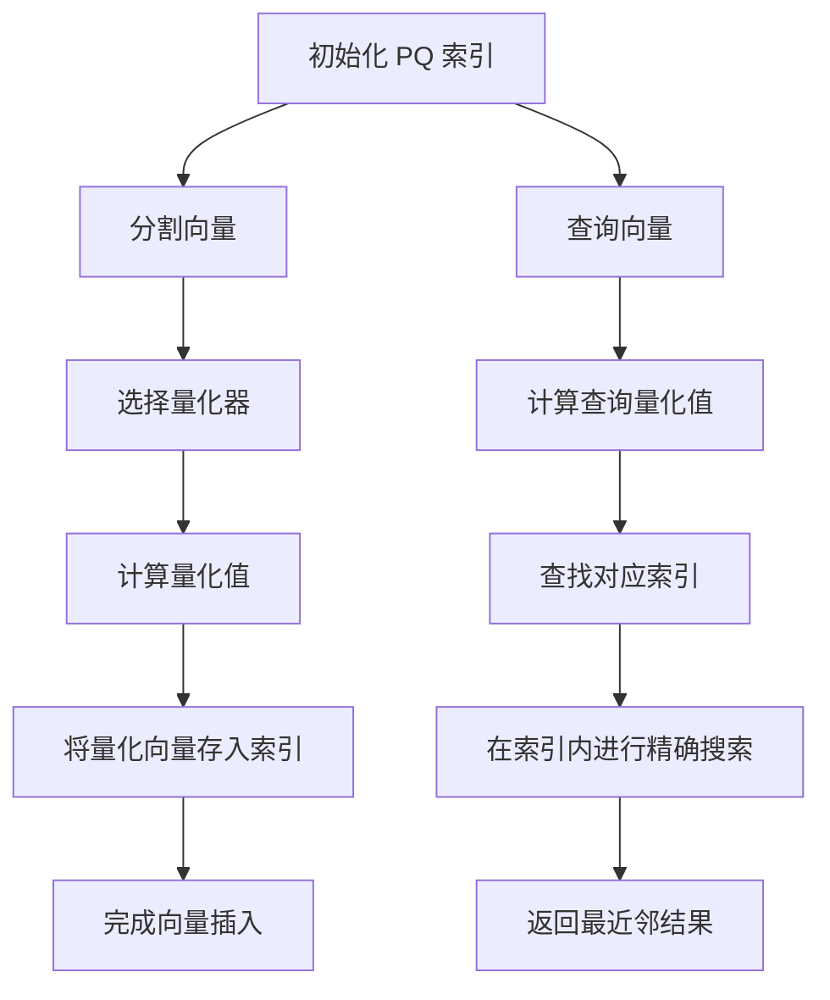
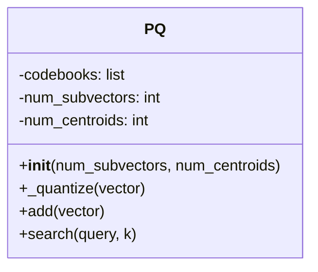

### **产品量化（PQ）的原理**

产品量化（Product Quantization, PQ）是一种用于高维数据的压缩和近似最近邻搜索的技术。它通过将高维向量分解为多个低维子向量，并对每个子向量进行量化，从而减少存储空间和加速相似性搜索。PQ 特别适用于处理大规模、高维数据集，如图像、文本和音频等。

---

### **PQ的核心流程**



---
### 流程图说明

1. **索引初始化**：
   - 创建空的 PQ 索引，设置初始参数（子向量数量、每个子向量的质心数量等）。

2. **分割向量**：
   - 将高维向量分割为多个低维子向量。
   - 选择合适的量化器，对每个子向量进行量化。

3. **查询向量**：
   - 计算查询向量的量化值。
   - 查找对应的索引，并在索引内进行精确搜索，返回最近邻结果。

---
#### **PQ 的核心思想**

1. **子向量分割**：
   - PQ 将高维向量分割为多个低维子向量，以减少计算复杂度和存储需求。
   - 通过对每个子向量进行独立量化，可以有效地压缩数据。

2. **量化器**：
   - 每个子向量使用一个量化器（如 K-means）来生成质心。
   - 量化器将子向量映射到离其最近的质心，从而生成量化值。

3. **多重量化**：
   - 为了提高检索的准确性，PQ 通常使用多个子向量和量化器。
   - 通过组合多个量化器的结果，可以进一步降低误判的概率。

---

#### **PQ 的构建过程**

1. **初始化量化表**：
   - 根据设定的子向量数量和质心数量，初始化量化表。

2. **向量插入**：
   - 对于每个新向量，分割为子向量并计算其量化值，存入对应索引中。

3. **量化值计算**：
   - 量化器的选择和设计至关重要，常用的量化器包括 K-means、产品量化等。

---

#### **搜索过程**

1. **量化值计算**：
   - 对查询向量进行分割和量化，确定其对应的索引。

2. **索引内搜索**：
   - 在对应的索引内进行精确搜索，找到与查询向量最相似的向量。

---

### **PQ 的实现代码**

以下代码实现了 PQ 索引的基本功能，包括构建和搜索。使用 `numpy` 进行矩阵操作，并结合量化器实现高效搜索。

#### **Python 实现**

```python
import numpy as np
from sklearn.cluster import KMeans

class PQ:
    def __init__(self, num_subvectors, num_centroids):
        """
        PQ 索引初始化
        :param num_subvectors: 子向量数量
        :param num_centroids: 每个子向量的质心数量
        """
        self.num_subvectors = num_subvectors
        self.num_centroids = num_centroids
        self.codebooks = [None] * num_subvectors

    def _quantize(self, vector):
        """计算量化值"""
        quantized = []
        for i in range(self.num_subvectors):
            subvector = vector[i * (len(vector) // self.num_subvectors):(i + 1) * (len(vector) // self.num_subvectors)]
            kmeans = KMeans(n_clusters=self.num_centroids)
            kmeans.fit(subvector.reshape(-1, 1))
            quantized.append(kmeans.predict(subvector.reshape(-1, 1)))
            self.codebooks[i] = kmeans.cluster_centers_
        return quantized

    def add(self, vector):
        """添加向量到 PQ 索引"""
        quantized_vector = self._quantize(vector)
        # 存储量化向量的逻辑可以在这里实现

    def search(self, query, k):
        """搜索查询向量的最近邻"""
        quantized_query = self._quantize(query)
        # 在量化索引中进行搜索的逻辑可以在这里实现
        return []  # 返回最近邻结果的占位符

if __name__ == "__main__":
    pq = PQ(num_subvectors=4, num_centroids=256)
    np.random.seed(42)
    for i in range(10):
        pq.add(np.random.rand(20))

    query = np.random.rand(20)
    result = pq.search(query, k=3)
    print("Query:", query)
    print("Nearest Neighbors:", result)
```

---

### **代码说明**
1. **初始化**：
   - 设置子向量数量 `num_subvectors` 和每个子向量的质心数量 `num_centroids`。

2. **构建过程**：
   - `add` 方法添加向量，同时分割为子向量并计算量化值。

3. **搜索过程**：
   - `search` 方法通过计算查询向量的量化值，查找对应索引并进行精确搜索。

---

### **PQ 的优缺点**
- **优点**：
  - 有效的高维数据压缩。
  - 加速近似最近邻搜索。
- **缺点**：
  - 量化器的设计复杂。
  - 可能存在误判，影响检索精度。

---

此实现展示了 PQ 的核心构建和搜索机制，可用于小规模实验或作为更复杂实现的基础。 