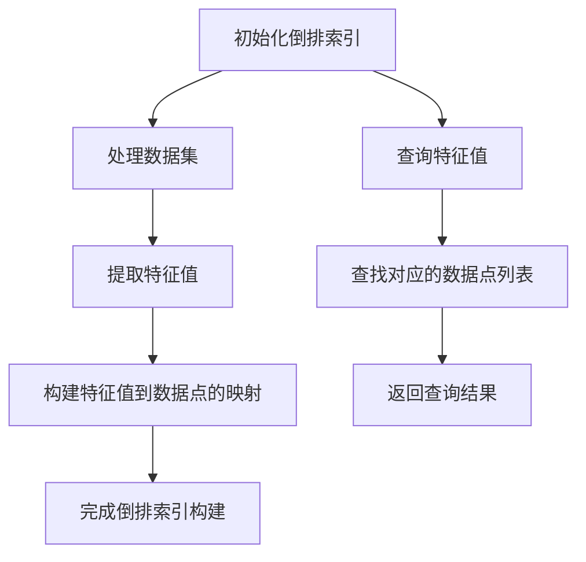

### **倒排索引（Inverted Index）**

倒排索引是一种从信息检索领域借鉴的技术，旨在提高数据检索的效率。它通过将每个特征值映射到包含该特征值的数据点列表中，从而加速查询过程。倒排索引广泛应用于搜索引擎、推荐系统和数据挖掘等领域。

---

### **倒排索引的核心流程**

---
### 流程图说明

1. **初始化倒排索引**：
   - 创建空的倒排索引结构，准备存储特征值与数据点的映射关系。此步骤确保后续操作的高效性。

2. **处理数据集**：
   - 遍历数据集，提取每个数据点的特征值。特征值的选择对索引的性能和准确性至关重要。

3. **构建特征值到数据点的映射**：
   - 对于每个特征值，将其映射到包含该特征值的数据点列表中。此步骤是倒排索引的核心，确保快速检索。

4. **查询特征值**：
   - 当接收到查询请求时，查找对应的特征值在倒排索引中的数据点列表。此步骤实现了高效的数据检索。

5. **返回查询结果**：
   - 将找到的数据点返回给用户。结果的准确性和响应时间是用户体验的关键。

---

#### **倒排索引的核心思想**

1. **特征值映射**：
   - 每个特征值对应一个数据点列表，便于快速检索。通过这种映射关系，可以显著减少查询时间。

2. **高效检索**：
   - 通过直接查找特征值，快速获取相关数据点，避免全表扫描。此特性使得倒排索引在大规模数据集中的应用尤为重要。

3. **存储优化**：
   - 适合稀疏数据，存储需求相对较小。倒排索引能够有效利用内存，降低存储成本。

---

#### **倒排索引的构建过程**

1. **初始化结构**：
   - 创建一个空的字典或哈希表，用于存储特征值与数据点的映射。选择合适的数据结构可以提高索引的性能。

2. **特征提取**：
   - 遍历数据集，提取每个数据点的特征值，并更新倒排索引。特征提取的质量直接影响到索引的效果。

3. **映射建立**：
   - 对于每个特征值，维护一个列表，记录所有包含该特征值的数据点。确保列表的更新是高效的，以支持快速查询。

4. **离散化步骤**：
   - 对于连续向量数据，需先进行特征量化（如局部敏感哈希 LSH 或产品量化 PQ），再建立倒排索引。离散化步骤是处理连续数据的关键。

---

### **倒排索引的优缺点**

- **优点**：
  - 检索速度快，尤其适合稀疏数据。通过直接查找特征值，显著提高了查询效率。
  - 存储需求较小，适合大规模数据集。倒排索引能够有效压缩存储空间。

- **缺点**：
  - 对连续向量数据需要额外的离散化步骤，增加了复杂性。离散化可能导致信息损失。
  - 在特征值变化频繁的情况下，维护成本较高。频繁更新可能导致索引失效。

---

### **适用场景**

- 文本数据（如 TF-IDF 特征）的检索。倒排索引在搜索引擎中被广泛应用。
- 稀疏特征向量的场景，如推荐系统和广告投放。能够快速匹配用户特征与商品特征。

---

此实现展示了倒排索引的核心构建和查询机制，适用于高效的数据检索任务。通过合理的设计和优化，倒排索引能够在大规模数据环境中提供快速、准确的查询服务。