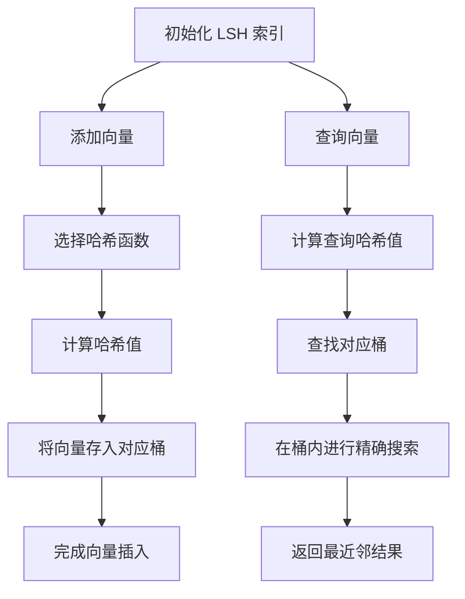
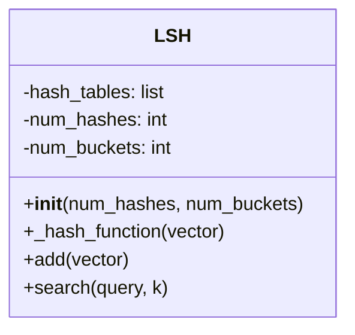

### **局部敏感哈希（LSH）的原理**

局部敏感哈希（Locality-Sensitive Hashing, LSH）是一种用于高维数据的近似最近邻搜索的技术。它通过将相似的对象映射到同一个桶中，从而加速相似性搜索。LSH 特别适用于处理大规模、高维数据集，如图像、文本和音频等。

---

### **LSH的核心流程**



---
### 流程图说明

1. **索引初始化**：
   - 创建空的 LSH 索引，设置初始参数（哈希函数数量、桶的数量等）。

2. **添加向量**：
   - 选择合适的哈希函数。
   - 计算向量的哈希值，并将其存入对应的桶中。

3. **查询向量**：
   - 计算查询向量的哈希值。
   - 查找对应的桶，并在桶内进行精确搜索，返回最近邻结果。

---
#### **LSH 的核心思想**

1. **哈希函数**：
   - LSH 使用一组局部敏感哈希函数，这些函数能够将相似的输入映射到相同的哈希值。
   - 通过设计合适的哈希函数，可以确保相似的向量在哈希表中有更高的概率被映射到同一个桶中。

2. **桶结构**：
   - 每个哈希值对应一个桶，桶中存储具有相同哈希值的向量。
   - 通过减少需要比较的向量数量，LSH 能够显著加速相似性搜索。

3. **多重哈希**：
   - 为了提高检索的准确性，LSH 通常使用多个哈希函数和桶。
   - 通过组合多个哈希函数的结果，可以进一步降低误判的概率。

---

#### **LSH 的构建过程**

1. **初始化哈希表**：
   - 根据设定的哈希函数数量和桶的数量，初始化哈希表。

2. **向量插入**：
   - 对于每个新向量，计算其哈希值，并将其存入对应的桶中。

3. **哈希值计算**：
   - 哈希函数的选择和设计至关重要，常用的哈希函数包括随机投影、MinHash 等。

---

#### **搜索过程**

1. **哈希值计算**：
   - 对查询向量计算哈希值，确定其对应的桶。

2. **桶内搜索**：
   - 在对应的桶内进行精确搜索，找到与查询向量最相似的向量。

---

### **LSH 的实现代码**

以下代码实现了 LSH 索引的基本功能，包括构建和搜索。使用 `numpy` 进行矩阵操作，并结合哈希函数实现高效搜索。

#### **Python 实现**

```python
import numpy as np
import random

class LSH:
    def __init__(self, num_hashes, num_buckets):
        """
        LSH 索引初始化
        :param num_hashes: 哈希函数数量
        :param num_buckets: 桶的数量
        """
        self.num_hashes = num_hashes
        self.num_buckets = num_buckets
        self.hash_tables = [[] for _ in range(num_buckets)]
        self.random_vectors = [np.random.randn(5) for _ in range(num_hashes)]  # 生成随机投影向量

    def _hash_function(self, vector):
        """计算哈希值"""
        # 使用随机投影计算哈希值
        hash_value = sum((np.dot(vector, rv) > 0) for rv in self.random_vectors)  # 计算投影
        return hash_value % self.num_buckets

    def add(self, vector):
        """添加向量到 LSH 索引"""
        hash_value = self._hash_function(vector)
        self.hash_tables[hash_value].append(vector)

    def search(self, query, k):
        """搜索查询向量的最近邻"""
        hash_value = self._hash_function(query)
        candidates = self.hash_tables[hash_value]

        # 在候选向量中进行精确搜索
        distances = [(np.linalg.norm(query - candidate), candidate) for candidate in candidates]
        distances.sort(key=lambda x: x[0])
        
        return [distances[i][1] for i in range(min(k, len(distances)))]

if __name__ == "__main__":
    lsh = LSH(num_hashes=10, num_buckets=100)
    np.random.seed(42)
    for i in range(10):
        lsh.add(np.random.rand(5))

    query = np.random.rand(5)
    print("Query:", query)
    result = lsh.search(query, k=3)
    print("Nearest Neighbors:", result)
```

---

### **代码说明**
1. **初始化**：
   - 设置哈希函数数量 `num_hashes` 和桶的数量 `num_buckets`。

2. **构建过程**：
   - `add` 方法添加向量，同时计算哈希值并存入对应桶。

3. **搜索过程**：
   - `search` 方法通过计算查询向量的哈希值，查找对应桶并进行精确搜索。

---

### **LSH 的优缺点**
- **优点**：
  - 高效的近似最近邻搜索。
  - 适用于高维数据。
- **缺点**：
  - 哈希函数的设计复杂。
  - 可能存在误判，影响检索精度。

---

此实现展示了 LSH 的核心构建和搜索机制，可用于小规模实验或作为更复杂实现的基础。
