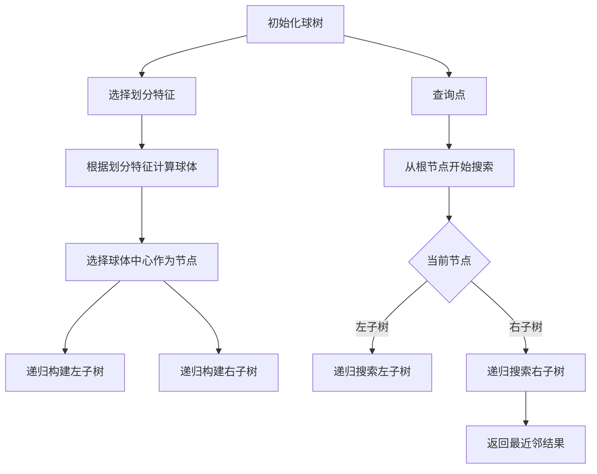

### **球树（Ball Tree）的原理**

球树是一种用于多维空间数据的高效索引结构，广泛应用于最近邻搜索和范围查询。它通过递归地将数据划分为球体区域，构建出一棵二叉树，从而实现快速检索。

---

### **球树的核心流程**

---
### 流程图说明

1. **初始化球树**：
   - 创建空的球树，准备插入数据。

2. **选择划分特征**：
   - 在每次递归中，选择当前特征作为划分依据，通常采用循环方式（例如，依次选择不同的特征）。

3. **根据划分特征计算球体**：
   - 计算当前特征的球体中心和半径，以便将数据点划分到相应的球体中。

4. **选择球体中心作为节点**：
   - 选择计算得到的球体中心作为当前节点，左侧为包含在左子球体中的数据点，右侧为包含在右子球体中的数据点。

5. **递归构建子树**：
   - 对左子树和右子树分别递归执行上述步骤，直到所有数据点都被插入。

6. **查询点**：
   - 从根节点开始，递归搜索球树以找到最近邻。

7. **返回最近邻结果**：
   - 在搜索过程中，维护当前找到的最近邻，并在遍历完成后返回结果。

---

### **球树的核心思想**

1. **空间划分**：
   - 球树通过选择不同的特征进行空间划分，将数据点分布在不同的球体区域中。

2. **递归构建**：
   - 通过递归的方式构建树结构，确保每个节点都能有效地代表其对应的空间区域。

3. **高效搜索**：
   - 在查询时，利用树的结构快速排除不可能的区域，从而减少搜索范围。

---

### **球树的构建过程**

1. **初始化树结构**：
   - 创建空的球树，准备插入数据。

2. **插入数据**：
   - 对于每个数据点，选择当前特征进行划分，递归插入到合适的子树中。

3. **选择球体中心**：
   - 在每次插入时，选择当前特征的中心作为节点，以确保树的平衡性。

4. **维护树的平衡**：
   - 通过选择球体中心，确保树的高度尽可能低，从而提高搜索效率。

---

### **搜索过程**

1. **从根节点开始搜索**：
   - 根据查询点的值，决定向左子树或右子树递归搜索。

2. **维护候选最近邻**：
   - 在搜索过程中，维护当前找到的最近邻，并在必要时更新。

3. **回溯搜索**：
   - 在搜索完成后，回溯检查可能的其他区域，以确保找到全局最近邻。

---

### **球树的优缺点**

- **优点**：
  - 支持任意距离度量（如曼哈顿距离、余弦相似度）。
  - 对中等维度数据性能优于 KD 树。

- **缺点**：
  - 构建复杂度高于 KD 树。
  - 高维数据仍面临性能退化问题。

### **适用场景**

- 中维度数据（10-30 维）和非欧几里得度量的场景。
- 适合需要快速范围查询的应用场景。

---

### **优化建议**

- 使用分层球体索引减少无效搜索范围。
- 在构建过程中，可以考虑使用平衡树的策略，确保树的高度尽可能低。

---

此文档详细介绍了球树的原理、构建和搜索过程，以及其优缺点和适用场景，为理解和应用球树提供了基础知识。